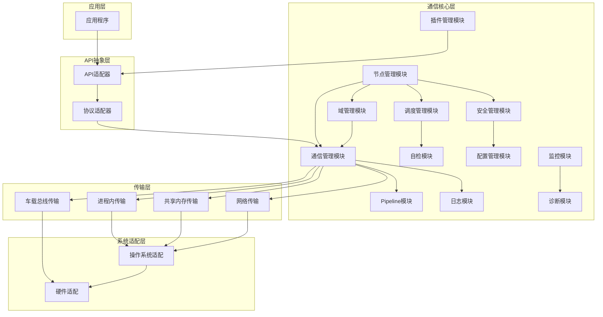

# AuroraRT 项目概述

## 1. 项目简介

AuroraRT 是一款面向车载自动驾驶、工业控制、边缘计算三大核心场景的实时消息中间件，核心目标是解决现有中间件在动态消息零拷贝、实时性确定性、高吞吐可靠传输、安全合规等场景的痛点，提供"高性能 + 高可靠 + 高安全 + 易扩展"的分布式通信解决方案。

同时，AuroraRT 还配套了自研的编译系统 AuroraBuild 和完整的工具系统，形成了一套完整的中间件解决方案。

### 1.1 核心目标
  - **实时可预测**：延迟抖动控制在 10μs 以内，满足车载系统的硬实时性要求
  - **轻量级**：内存占用不超过 10MB，适用于资源受限的车载环境
  - **高性能**：支持每秒数百万条消息的传输速率
  - **多节点进程管理**：提供节点注册、自动发现、健康状态监测、热重启等完整功能
  - **跨平台兼容性**：同时支持 QNX、Linux、Windows、VxWorks、AUTOSAR 等主流操作系统平台
  - **多协议支持**：集成 TCP、UDP、QUIC、TSN、CAN FD、共享内存等多种传输协议，灵活适配不同通信场景
  - **多语言支持**：通过 AuroraBuild 编译系统支持 C++、C、Python、Java 等多种语言混合编译
  - **完整工具链**：提供从开发、测试到部署的全流程工具支持

### 1.2 技术亮点
  - **零拷贝技术**：基于 Iceoryx2 实现高效的共享内存通信机制，通过直接内存映射和无锁队列，实现数据在进程间的零拷贝传输，显著降低通信延迟
  - **无锁设计**：核心通信路径采用无锁队列（Lock-Free Queue）实现，有效减少线程间同步开销，提升系统并发性能和实时性
  - **实时调度**：参考 CyberRT 的实时调度策略，集成协程调度、优先级调度和时间触发调度机制，确保关键任务优先执行，满足硬实时性要求
  - **智能协议切换**：根据通信场景自动选择最优传输协议，支持进程内直接访问、共享内存通信、网络传输等多种方式，实现传输效率的最优化
  - **故障自愈**：融合 Kubernetes 健康检查机制，实现节点异常的自动检测与恢复，提高系统可靠性和可用性
  - **统一通信 API**：参考 ZMQ 设计理念，提供统一的通信接口，支持发布-订阅、请求-响应、事件等多种通信模式，简化上层应用开发
  - **自研编译系统**：AuroraBuild 支持多语言混合编译，提高开发效率
  - **完整工具系统**：提供从命令行工具到可视化调试工具的完整工具链
  - **跨平台适配**：支持 QNX、Linux、Windows、VxWorks、AUTOSAR 等多种平台

## 2. 技术映射

AuroraRT 融合了多种开源库的核心技术，构建了一个高性能、实时可预测的中间件架构

### 2.1 核心目标与技术库对应关系

| 核心目标         | 关键技术要求                         | 核心依赖架构                     |
|------------------|---------------------------------------|-------------------------------------|
| 实时可预测      | 零拷贝、内存池、硬实时调度、低抖动    | Iceoryx2、CyberRT、FastDDS |
| 轻量级             | 裁剪冗余、统一 API、低资源占用         | ZMQ、asio（独立版）|
| 高性能           | 无锁队列、多协议并行、流优先级       | FastDDS（QoS）、Iceoryx2 |
| 多节点进程管理  | 节点注册/发现、健康检查、热重启       | CyberRT、Kubernetes（健康检查）、ROS2（生态） |
| 跨平台兼容      | QNX/Linux/Windows/VxWorks 统一适配、跨平台网络 I/O      | asio、boost、Iceoryx2                |
| 多协议支持      | TCP/UDP/QUIC/TSN/CAN FD/共享内存 共存、智能切换           | asio、ZMQ、自定义SHM协议            |
| 多语言支持      | 多语言混合编译、跨语言依赖管理         | AuroraBuild、CMake、pybind11        |
| 完整工具链      | 开发、测试、部署全流程工具支持         | AuroraCLI、AuroraViz、AuroraTest    |

### 2.2 技术库分类

#### 2.2.1 核心必学/必整合

| 架构          | 核心价值                                 | 关联度 | 学习重点                          |
|------------------|-------------------------------------------|--------|-----------------------------------|
| Iceoryx2          | 零拷贝共享内存、内存池、实时 IPC           | 100%   | 共享内存管理、无锁队列、实时调度 |
| CyberRT          | 节点管理、实时调度、健康检查、热重启      | 100%   | 节点生命周期、进程监控、拓扑管理 |
| FastDDS      | QoS策略、分布式通信、流优先级           | 90%    | QoS调度、多节点发现               |
| asio（独立版）| 跨平台网络 I/O（TCP/UDP）、异步通信        | 90%    | 跨平台socket、异步I/O模型          |
| ZMQ              | 轻量级inproc/IPC/TCP API、无锁通信        | 80%    | 统一通信API、多模式（Pub/Sub）|
| Agnocast         | 动态消息零拷贝、共享内存管理              | 80%    | 动态容器、内核级优化             |

#### 2.2.2 辅助可参考整合

| 架构          | 核心价值                                 | 关联度 | 学习重点                          |
|------------------|-------------------------------------------|--------|-----------------------------------|
| Protobuf         | 结构化消息序列化、跨平台兼容              | 80%    | 消息定义、高效序列化/反序列化     |
| FlatBuffers      | 零拷贝序列化、大消息优化                | 80%    | 直接内存访问、大消息处理         |
| YAS              | 轻量级高性能序列化、实时场景优化          | 80%    | 极致性能、轻量化实现             |
| boost/boost.asio | 跨平台线程、内存、工具类                  | 70%    | 跨平台抽象层、线程调度             |
| ROS/ROS2         | 生态兼容、API设计、工具链                | 70%    | ROS2通信API、生态适配逻辑         |
| spdlog/glog      | 异步高性能日志、跨平台                   | 70%    | 日志异步写入、分级日志           |
| Kubernetes/Docker       | 容器化部署、健康检查、集群管理          | 60%    | 健康检查策略、容器编排           |
| MQTT             | 轻量级物联网通信、发布订阅                | 50%    | 轻量级协议设计、低功耗通信          |
| RabbitMQ         | 企业级消息队列、灵活路由                  | 50%    | 复杂路由、可靠性保证             |
| RocketMQ         | 分布式消息队列、事务消息                  | 50%    | 事务支持、高可靠性               |
| vsomeip          | SOME/IP协议实现、车载SOA                 | 50%    | 车载协议、服务发现               |

## 3. 整体架构概览

AuroraRT 采用五层架构设计，从底层硬件到上层应用，每一层都有明确的职责和边界。这种设计使得系统具有良好的可维护性、可扩展性和可移植性

### 3.1 核心架构分层

### 3.2 各层职责说明

1. **系统适配层**：实现对不同操作系统和硬件平台的适配，提供统一的底层接口，屏蔽平台差异，包含操作系统适配和硬件适配两个核心模块

2. **传输层**：实现多种传输方式，包括共享内存、网络传输和车载总线，提供统一的传输接口，支持动态切换传输方式，实现零拷贝通信，提高传输性能

3. **通信核心层**：实现消息路由、内存管理、QoS管理和安全管理，提供可靠的消息传输机制，确保消息的及时送达，实现智能调度，提高系统的实时性和可靠性

4. **API抽象层**：提供统一的API接口，支持发布-订阅、服务调用、动作通信等多种通信模式，实现与 DDS、SOME/IP等协议的兼容，简化上层应用的开发，提高开发效率

5. **应用层**：实现开发工具、监控诊断、配置管理等功能，提供系统的开发、部署和维护工具，支持系统的监控和故障诊断

6. **编译系统**：AuroraBuild 负责多语言混合编译，支持C++、C、Python、Java等多种语言，提供并行构建和依赖管理功能

7. **工具系统**：提供完整的开发工具链，包括命令行工具、可视化调试工具、测试工具和仿真工具，支持开发、测试、部署全流程

## 4. 应用场景

AuroraRT 适用于多种场景，为不同应用提供可靠的通信基础

### 4.1 自动驾驶
  - **传感器数据分发**：实时传输摄像头、雷达、激光雷达等传感器数据
  - **感知决策交互**：确保感知系统与决策系统之间的低延迟通信
  - **控制指令传输**：从决策系统到执行机构的实时控制指令传输
  - **数据融合**：多传感器数据的实时融合和处理

### 4.2 工业控制
  - **PLC间通信**：工业控制系统中不同PLC之间的实时通信
  - **传感器与控制器通信**：传感器数据到控制器的实时传输
  - **工业机器人控制**：机器人控制指令的低延迟传输
  - **设备状态监控**：工业设备状态的实时监控和数据采集

### 4.3 边缘计算
  - **边缘节点间通信**：边缘计算节点之间的高效数据传输
  - **边缘与云端通信**：边缘设备与云端服务的可靠通信
  - **边缘计算集群**：边缘计算集群内部的协同工作
  - **实时数据处理**：边缘端的实时数据处理和分析

### 4.4 智能座舱
  - **多媒体数据传输**：音频、视频等多媒体数据的高效传输
  - **人机交互响应**：确保触控、语音等交互的实时性响应
  - **多屏协同**：仪表、中控、后座娱乐等多屏之间的协同

### 4.5 医疗设备
  - **医疗传感器数据传输**：医疗传感器数据的实时采集和传输
  - **设备控制**：医疗设备控制指令的可靠传输
  - **远程医疗**：远程医疗数据的安全传输

## 5. 部署架构

AuroraRT 支持多种部署架构，适应不同的系统配置

### 5.1 单节点部署

适用于简单的系统，所有功能运行在单个节点上

### 5.2 多节点部署

适用于复杂的系统，分布在多个节点上，通过网络协议通信

### 5.3 混合部署

结合单节点和多节点部署的优势，根据功能重要性和实时性要求进行合理分配

### 5.4 容器化部署

使用AuroraDocker工具进行容器化部署，提高部署的一致性和可移植性

### 5.5 边缘部署

使用AuroraEdgeDeploy工具进行边缘设备部署，优化资源使用和网络带宽

## 6. 发展路线图

### 6.1 近期目标（3个月）
  - 完成核心通信模块开发（inproc/IPC/TCP/UDP）
  - 实现基础节点管理功能
  - 支持 Linux 平台部署
  - 开发 AuroraBuild 编译系统基础功能
  - 实现核心命令行工具（AuroraCLI）

### 6.2 中期目标（6个月）
  - 集成 QUIC、TSN、CAN FD 协议支持
  - 实现 QNX、Windows、VxWorks 平台适配
  - 完成故障自愈和热重启功能
  - 支持 ROS2 生态兼容
  - 完善 AuroraBuild 多语言支持
  - 开发可视化调试工具（AuroraViz、AuroraDebug）
  - 实现自动化测试框架（AuroraTest）
  - 完成安全框架（AuroraSecure）开发

### 6.3 远期目标（12个月）
  - 实现容器化部署支持
  - 提供完整的监控和告警系统
  - 支持更多车载总线协议（CAN、LIN等）
  - 完善车规级认证
  - 开发物理仿真引擎（AuroraSim）
  - 实现数字孪生工具（AuroraDigitalTwin）
  - 支持 AUTOSAR 架构适配
  - 完善多机器人协同工具（AuroraSwarm）
  - 开发运动规划框架（AuroraMove）
  - 实现导航框架（AuroraNav）
  - 集成计算机视觉库（AuroraVision）
  - 开发点云处理库（AuroraPointCloud）
  - 集成深度学习框架（AuroraAI）

## 7. 总结

AuroraRT 是一款面向车载自动驾驶、工业控制、边缘计算三大核心场景的实时消息中间件，它融合了多种开源库的核心技术，构建了一个轻量级、可靠的通信基础。同时，AuroraRT 还配套了自研的编译系统 AuroraBuild 和完整的工具系统，形成了一套完整的中间件解决方案。

通过分层架构设计和技术融合，AuroraRT 能够满足车载系统、工业控制系统和边缘计算系统对实时性、可靠性、安全性的严格要求，为自动驾驶、工业控制、边缘计算等应用提供强大的通信支持。AuroraBuild 编译系统支持多语言混合编译，提高开发效率；完整的工具系统则为开发、测试、部署全流程提供了有力支持。

AuroraRT 的设计理念是"取各家之长，避各家之短"，通过精心的架构设计和技术整合，打造了一个既保留各开源库优势，又规避各自短板的中间件解决方案。未来，AuroraRT 将继续演进，不断提升性能和可靠性，为更多应用场景提供更加完善的通信服务和工具支持。

