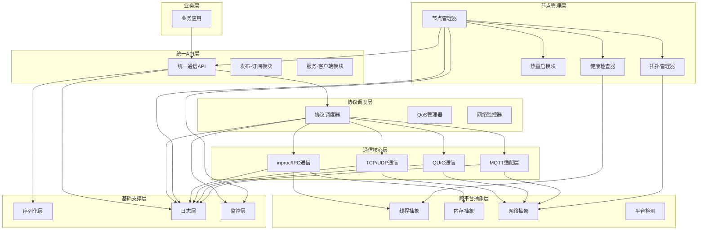
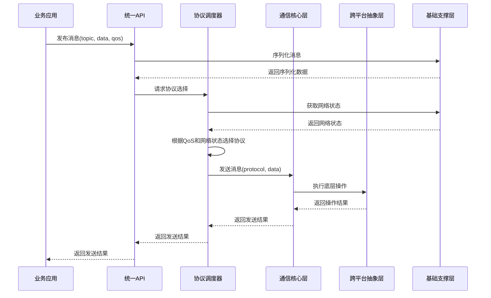
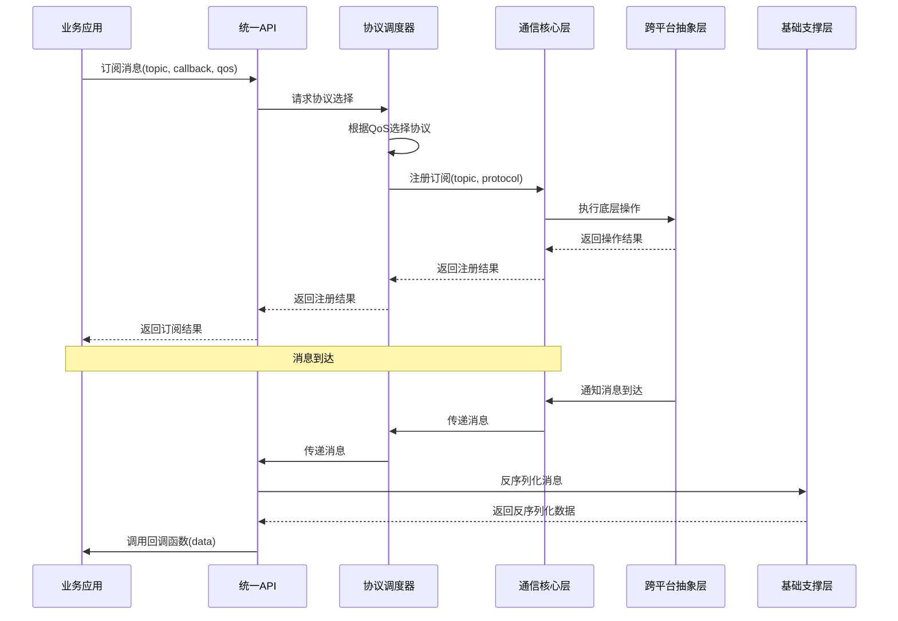
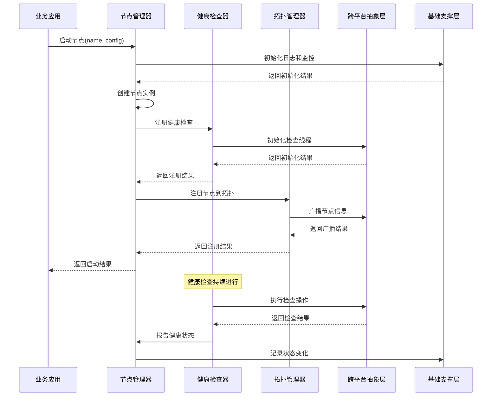

# 层级设计

## 1. 层级设计概述

AuroraRT采用分层架构设计，将系统划分为多个清晰的层级，每一层都有明确的职责和边界。这种设计方式有助于提高系统的可维护性、可扩展性和可靠性，同时也便于团队协作开发。本文档详细描述AuroraRT的层级设计、各层级的职责以及层级间的交互关系。

### 1.1 设计原则
  - **职责分离**：每一层只负责特定的功能，避免职责混淆
  - **接口清晰**：层级间通过明确的接口进行通信，减少耦合
  - **可替换性**：各层级内部实现可以独立替换，不影响其他层级
  - **可测试性**：每一层都可以独立测试，便于问题定位和质量保证
  - **性能优化**：各层级可以根据自身特点进行针对性优化

## 2. 层级结构

### 2.1 层级结构

### 2.2 层级详细说明

| 层级 | 层级名称       | 主要职责                                  | 核心组件                          | 技术实现                         | 关键特性                         |
|------|----------------|------------------------------------------|-----------------------------------|-----------------------------------|-----------------------------------|
| L7   | **业务层**     | 应用业务逻辑实现                          | 业务应用                          | 业务代码                          | 与中间件解耦                     |
| L6   | **统一API层**  | 提供统一的通信接口                        | 统一通信API、发布订阅模块、服务客户端模块| 参考ZMQ API设计                   | 屏蔽底层协议差异                  |
| L5   | **协议调度层** | 根据QoS和网络条件选择最优协议            | 协议调度器、QoS管理器、网络监控器 | 自研+参考FastDDS QoS              | 智能协议选择                      |
| L4   | **通信核心层** | 实现多种通信模式                          | inproc/IPC、TCP/UDP、QUIC、MQTT   | Iceoryx+asio+quiche               | 多协议支持                       |
| L3   | **节点管理层** | 节点注册、发现、健康检查、热重启          | 节点管理器、健康检查器、拓扑管理器、热重启模块 | CyberRT核心+自研                  | 高可靠性、热重启                  |
| L2   | **跨平台抽象层** | 屏蔽QNX和Ubuntu的系统差异              | 线程抽象、内存抽象、网络抽象、平台检测| boost+asio+自研                   | 双平台兼容                       |
| L1   | **基础支撑层** | 提供序列化、日志、监控等基础功能          | 序列化层、日志层、监控层          | Protobuf+spdlog+自研              | 高效、低开销                      |

## 3. 各层级详细设计

### 3.1 基础支撑层（L1）

#### 3.1.1 层级职责
  - 提供消息序列化和反序列化功能
  - 提供高性能异步日志
  - 提供系统性能和状态监控
  - 为其他层级提供基础服务

#### 3.1.2 核心组件

##### 3.1.2.1 序列化层
  - **功能**：实现消息的序列化和反序列化
  - **组件**
    - `ProtobufSerializer`：基于Protobuf的序列化器，适用于大多数场景
    - `FlatBufferSerializer`：基于FlatBuffers的序列化器，适用于大消息场景
    - `SerializerFactory`：序列化器工厂，根据消息类型选择合适的序列化器
  - **技术要求**
    - 支持不同大小消息的高效序列化
    - 跨平台兼容
    - 序列化性能优化

##### 3.1.2.2 日志层
  - **功能**：提供异步高性能日志
  - **组件**
    - `AsyncLogger`：基于spdlog的异步日志器
    - `LogManager`：日志管理器，负责日志配置和管理
    - `LogSink`：日志输出目标，支持文件、控制台
  - **技术要求**
    - 异步日志写入，减少对核心通信的影响
    - 分级日志（DEBUG/INFO/WARN/ERROR）
    - 日志轮转和裁剪
    - 跨平台兼容

##### 3.1.2.3 监控层
  - **功能**：提供系统性能和状态监控
  - **组件**
    - `PerformanceMonitor`：性能监控器，收集系统性能指标
    - `StatusMonitor`：状态监控器，收集系统状态信息
    - `MetricsCollector`：指标收集器，统一收集和上报监控数据
  - **技术要求**
    - 低开销监控，不影响系统性能
    - 实时监控和统计
    - 支持监控数据导出
    - 异常检测和告警

### 3.2 跨平台抽象层（L2）

#### 3.2.1 层级职责
  - 屏蔽不同平台的系统差异
  - 提供统一的线程、内存、网络等抽象接口
  - 实现平台特定的优化
  - 确保核心逻辑在不同平台上的一致性

#### 3.2.2 核心组件

##### 3.2.2.1 线程抽象
  - **功能**：屏蔽不同平台的线程实现差异
  - **组件**
    - `PlatformThread`：平台线程抽象类
    - `ThreadFactory`：线程工厂，根据平台创建合适的线程实现
    - `RealTimeThread`：实时线程，支持实时调度策略
  - **技术要求**
    - 线程优先级映射（Ubuntu 1-99 ↔ QNX 1-63）
    - 支持CPU核心绑定
    - 支持实时调度策略（SCHED_FIFO）
    - 跨平台线程同步原语

##### 3.2.2.2 内存抽象
  - **功能**：屏蔽不同平台的内存管理差异
  - **组件**
    - `PlatformMemory`：平台内存抽象类
    - `MemoryPool`：内存池，基于Iceoryx的内存池设计
    - `SharedMemory`：共享内存，支持跨进程通信
  - **技术要求**
    - 内存分配和释放的统一接口
    - 内存池管理，避免内存碎片
    - 共享内存的跨平台实现
    - 内存锁定（mlock/mlockall）的平台适配

##### 3.2.2.3 网络抽象
  - **功能**：屏蔽不同平台的网络I/O差异
  - **组件**
    - `PlatformSocket`：平台socket抽象
    - `IoContext`：I/O上下文，基于asio的事件循环
    - `NetworkUtils`：网络工具类，提供通用网络功能
  - **技术要求**
    - 跨平台socket接口
    - 异步I/O模型
    - 网络地址和端口的统一表示
    - 平台特定网络选项的适配

##### 3.2.2.4 平台检测
  - **功能**：检测当前运行平台，提供平台特定的配置
  - **组件**
    - `PlatformDetector`：平台检测器，识别当前运行平台
    - `PlatformConfig`：平台配置，提供平台特定的参数
  - **技术要求**
    - 编译时和运行时平台检测
    - 条件编译，隔离平台差异代码
    - 平台特定优化的自动启用

### 3.3 节点管理层（L3）

#### 3.3.1 层级职责
  - 管理节点的生命周期
  - 实现节点的注册和发现
  - 监控节点的健康状态
  - 提供节点的热重启能力
  - 管理节点间的拓扑关系

#### 3.3.2 核心组件

##### 3.3.2.1 节点管理器
  - **功能**：管理节点的生命周期
  - **组件**
    - `Node`：节点类，代表一个运行实例
    - `NodeFactory`：节点工厂，创建和管理节点
    - `NodeRegistry`：节点注册表，存储节点信息
  - **技术要求**
    - 节点创建和销毁
    - 节点状态管理
    - 节点信息维护
    - 节点间通信管理

##### 3.3.2.2 健康检查器
  - **功能**：监控节点的健康状态
  - **组件**
    - `HealthChecker`：健康检查器，执行健康检查
    - `HealthProbe`：健康探针，实现具体的检查逻辑
    - `HealthStatus`：健康状态，表示节点的健康程度
  - **技术要求**
    - 多维度健康检查（心跳、资源、实时性）
    - 健康状态评估和报告
    - 故障检测和告警
    - 健康检查策略配置

##### 3.3.2.3 拓扑管理器
  - **功能**：管理节点间的拓扑关系
  - **组件**
    - `TopoManager`：拓扑管理器，维护节点拓扑
    - `NodeDiscovery`：节点发现，自动发现网络中的节点
    - `ConnectionManager`：连接管理器，管理节点间的连接
  - **技术要求**
    - 节点自动发现
    - 拓扑结构维护
    - 连接状态管理
    - 拓扑变化通知

##### 3.3.2.4 热重启模块
  - **功能**：实现节点的热重启
  - **组件**
    - `HotRestartManager`：热重启管理器，协调整个重启过程
    - `StateSaver`：状态保存器，保存节点状态
    - `StateRestorer`：状态恢复器，恢复节点状态
  - **技术要求**
    - 毫秒级热重启
    - 状态保存和恢复
    - 无丢包保证
    - 平滑过渡

### 3.4 通信核心层（L4）

#### 3.4.1 层级职责
  - 实现多种通信模式
  - 提供高效的消息传输
  - 支持不同的网络协议
  - 处理底层通信细节

#### 3.4.2 核心组件

##### 3.4.2.1 inproc/IPC通信
  - **功能**：实现进程内和跨进程通信
  - **组件**
    - `InprocSocket`：进程内通信socket
    - `IpcSocket`：跨进程通信socket
    - `SharedMemoryManager`：共享内存管理器
    - `MPMCQueue`：无锁多生产者多消费者队列
  - **技术要求**
    - 基于Iceoryx的零拷贝共享内存
    - 无锁队列，减少锁竞争
    - 高性能进程内通信
    - 跨进程通信的安全性和可靠性

##### 3.4.2.2 TCP/UDP通信
  - **功能**：实现基于TCP和UDP的网络通信
  - **组件**
    - `TcpSocket`：TCP socket
    - `UdpSocket`：UDP socket
    - `SocketManager`：socket管理器
    - `QoSScheduler`：QoS调度器，参考FastDDS的QoS策略
  - **技术要求**
    - 基于asio的跨平台网络I/O
    - TCP的可靠性保证
    - UDP的低延迟特性
    - QoS策略的实现

##### 3.4.2.3 QUIC通信
  - **功能**：实现基于QUIC协议的网络通信
  - **组件**
    - `QuicSocket`：QUIC socket
    - `QuicConnection`：QUIC连接
    - `QuicStream`：QUIC流
    - `ConnectionManager`：连接管理器
  - **技术要求**
    - 基于quiche的轻量级QUIC协议
    - 0-RTT握手，减少连接建立时间
    - 连接迁移，支持移动场景
    - 多路复用，提高带宽利用率

##### 3.4.2.4 MQTT适配层
  - **功能**：提供MQTT协议支持，兼容传统IoT设备
  - **组件**
    - `MqttClient`：MQTT客户端
    - `MqttAdapter`：MQTT适配器，将MQTT消息转换为内部格式
  - **技术要求**
    - 基于asio的轻量级MQTT实现
    - 支持MQTT 3.1.1协议
    - 与内部消息格式的转换
    - 低功耗设计，适合IoT设备

### 3.5 协议调度层（L5）

#### 3.5.1 层级职责
  - 根据QoS和网络条件选择最优协议
  - 管理和执行QoS策略
  - 监控网络状态
  - 实现协议的智能切换

#### 3.5.2 核心组件

##### 3.5.2.1 协议调度器
  - **功能**：选择最优通信协议
  - **组件**
    - `ProtocolSelector`：协议选择器，根据条件选择协议
    - `ProtocolManager`：协议管理器，管理可用协议
    - `ProtocolSwitcher`：协议切换器，实现协议的动态切换
  - **技术要求**
    - 多维度协议评估
    - 智能协议选择算法
    - 协议切换的平滑过渡
    - 协议性能统计和分析

##### 3.5.2.2 QoS管理器
  - **功能**：管理和执行QoS策略
  - **组件**
    - `QoSProfile`：QoS配置文件，定义QoS策略
    - `QoSEngine`：QoS引擎，执行QoS策略
    - `QoSMonitor`：QoS监控器，监控QoS执行情况
  - **技术要求**
    - 支持多种QoS策略（可靠性、优先级、延迟等）
    - QoS策略的动态调整
    - QoS违反的检测和处理
    - 参考FastDDS的QoS实现

##### 3.5.2.3 网络监控器
  - **功能**：监控网络状态
  - **组件**
    - `NetworkDetector`：网络检测器，检测网络状态变化
    - `LatencyMonitor`：延迟监控器，测量网络延迟
    - `BandwidthMonitor`：带宽监控器，测量网络带宽
  - **技术要求**
    - 实时网络状态检测
    - 网络质量评估
    - 网络异常检测
    - 网络状态预测

### 3.6 统一API层（L6）

#### 3.6.1 层级职责
  - 提供统一的通信接口
  - 实现发布-订阅模式
  - 实现服务-客户端模式
  - 屏蔽底层协议差异
  - 提供友好的编程接口

#### 3.6.2 核心组件

##### 3.6.2.1 统一通信API
  - **功能**：提供统一的通信接口
  - **组件**
    - `Socket`：统一socket接口
    - `Message`：统一消息
    - `Endpoint`：统一端点
  - **技术要求**
    - 参考ZMQ的Socket抽象
    - 统一的API设计
    - 屏蔽底层协议细节
    - 支持多种通信模式

##### 3.6.2.2 发布-订阅模块
  - **功能**：实现发布订阅模式
  - **组件**
    - `Publisher`：发布者
    - `Subscriber`：订阅者
    - `TopicManager`：话题管理器
    - `MessageFilter`：消息过滤器
  - **技术要求**
    - 话题的分层命名
    - 消息的发布和订阅
    - 消息过滤
    - QoS策略的应用

##### 3.6.2.3 服务-客户端模块
  - **功能**：实现服务-客户端模式
  - **组件**
    - `Service`：服务端
    - `Client`：客户端
    - `Request`：请求消息
    - `Response`：响应消息
  - **技术要求**
    - 同步和异步调用
    - 请求-响应模式
    - 服务发现
    - 负载均衡

### 3.7 业务层（L7）

#### 3.7.1 层级职责
  - 实现业务逻辑
  - 利用AuroraRT提供的API进行通信
  - 处理业务数据和业务流程
  - 与其他业务系统集成

#### 3.7.2 核心组件
  - **业务应用**：具体的业务实现，如车载控制系统、娱乐系统等
  - **业务模块**：业务逻辑的模块化实现
  - **业务流程**：业务流程的定义和执行

## 4. 层级间交互

### 4.1 消息发布交互流程

### 4.2 消息订阅交互流程

### 4.3 节点启动交互流程

## 5. 层级优化策略

### 5.1 基础支撑层优化
  - **序列化优化**：根据消息大小选择合适的序列化方式，大消息使用FlatBuffers
  - **日志优化**：异步日志写入，批量刷新，减少I/O操作
  - **监控优化**：采样监控，减少对系统的影响

### 5.2 跨平台抽象层优化
  - **线程优化**：核心线程绑定到专用CPU核心，避免线程迁移
  - **内存优化**：预分配内存池，减少内存分配开销
  - **网络优化**：平台特定的网络选项优化

### 5.3 节点管理层优化
  - **健康检查优化**：分级健康检查，减少检查开销
  - **拓扑管理优化**：增量更新拓扑，减少广播开销
  - **热重启优化**：优化状态保存和恢复流程，减少重启时间

### 5.4 通信核心层优化
  - **inproc/IPC优化**：无锁设计，零拷贝传输
  - **TCP/UDP优化**：连接池管理，减少连接建立开销
  - **QUIC优化**：连接复用，减少握手开销

### 5.5 协议调度层优化
  - **协议选择优化**：缓存协议选择结果，减少计算开销
  - **QoS优化**：动态调整QoS策略，适应网络变化
  - **网络监控优化**：预测网络状态，提前调整策略

### 5.6 统一API层优化
  - **API设计优化**：简洁易用的接口，减少使用复杂度
  - **消息处理优化**：批量消息处理，减少函数调用开销
  - **错误处理优化**：统一的错误处理机制，简化错误处理

## 6. 层级测试策略

### 6.1 单元测试
  - **测试目标**：测试各层级内部组件的功能
  - **测试方法**：使用单元测试框架，如gtest
  - **测试重点**：组件的功能正确性，边界条件处理

### 6.2 集成测试
  - **测试目标**：测试层级间的交互
  - **测试方法**：模拟层级间的调用，验证交互是否正确
  - **测试重点**：接口兼容性，数据传递正确性

### 6.3 系统测试
  - **测试目标**：测试整个系统的功能和性能
  - **测试方法**：端到端测试，模拟真实场景
  - **测试重点**：系统功能完整性，性能指标达标

### 6.4 性能测试
  - **测试目标**：测试各层级的性能
  - **测试方法**：使用性能测试工具，如benchmark
  - **测试重点**：延迟、吞吐量、资源占用

### 6.5 可靠性测试
  - **测试目标**：测试各层级的可靠性
  - **测试方法**：故障注入，长时间运行
  - **测试重点**：故障恢复能力，系统稳定性

## 7. 层级扩展性策略

### 7.1 横向扩展性
  - **协议扩展性**：添加新的通信协议，如gRPC、WebSocket
  - **序列化扩展性**：添加新的序列化方式，如JSON、XML
  - **监控扩展性**：添加新的监控指标和监控方式

### 7.2 纵向扩展性
  - **功能扩展性**：在现有层级上添加新功能，如消息加密、流量控制等
  - **性能扩展性**：优化现有实现，提高性能
  - **可靠性扩展性**：增强现有功能的可靠性，如冗余设计、错误处理等

### 7.3 扩展性原则
  - **接口兼容**：扩展性不应破坏现有接口
  - **性能无损**：扩展性不应显著影响系统性能
  - **可选择性**：扩展性功能应可配置，用户可以选择是否启用
  - **可测试性**：扩展性功能应易于测试

## 8. 结论

AuroraRT的层级设计采用了清晰的分层架构，将系统划分为七个层级，每一层都有明确的职责和边界。这种设计方式具有以下优势：

1. **模块化**：各层级功能独立，便于开发和维护
2. **可扩展性**：各层级可以独立扩展，不影响其他层级
3. **性能优化**：各层级可以根据自身特点进行针对性优化
4. **可靠性**：层级间的隔离减少了故障传播
5. **跨平台兼容**：通过跨平台抽象层实现了QNX和Ubuntu的无缝支持

通过这种层级设计，AuroraRT实现了实时可预测、轻量级高效、高性能的车载消息中间件，满足了车载场景的特殊需求。未来的扩展和优化也将基于这种层级结构进行，确保系统的稳定性和可持续发展。