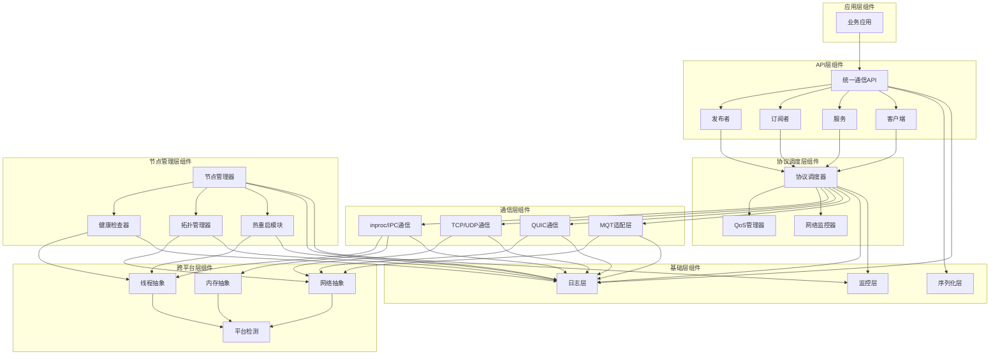
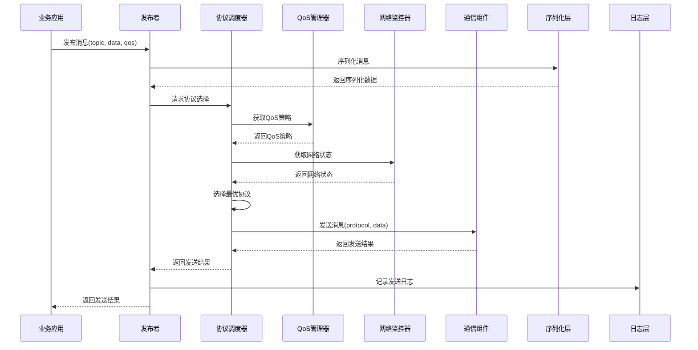
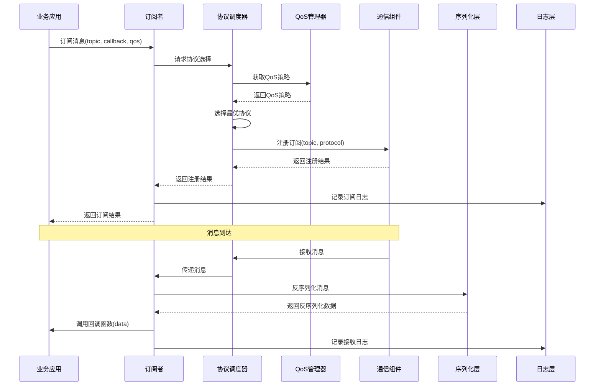
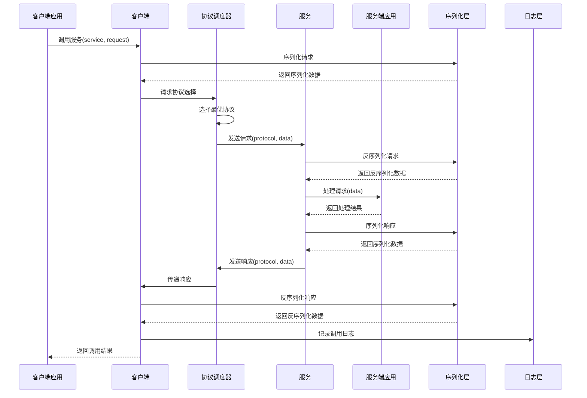
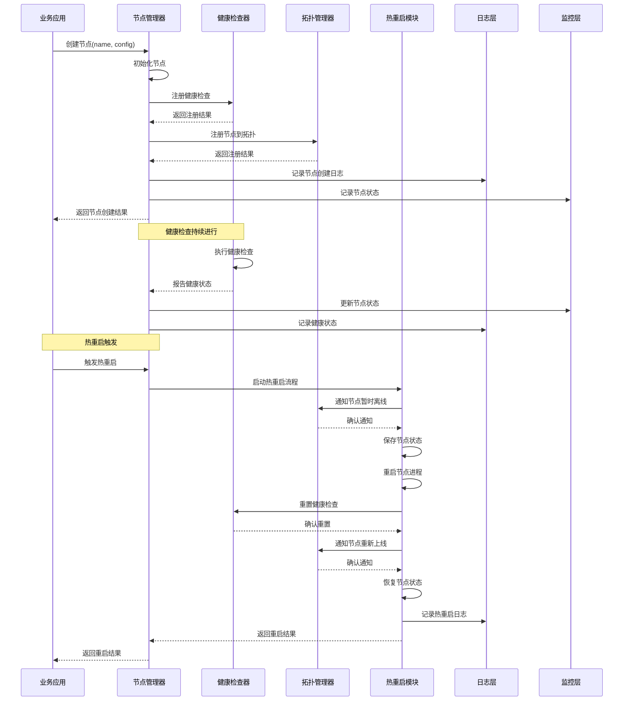
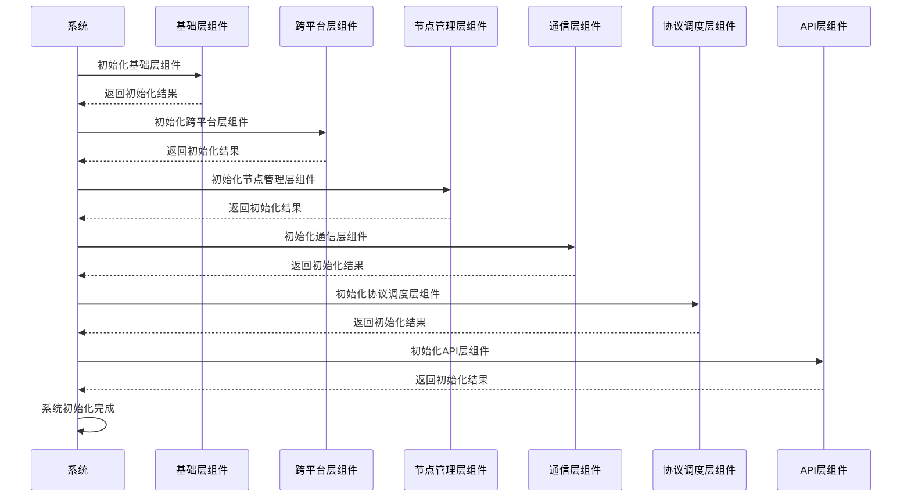
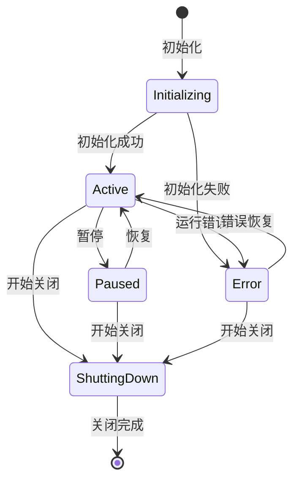
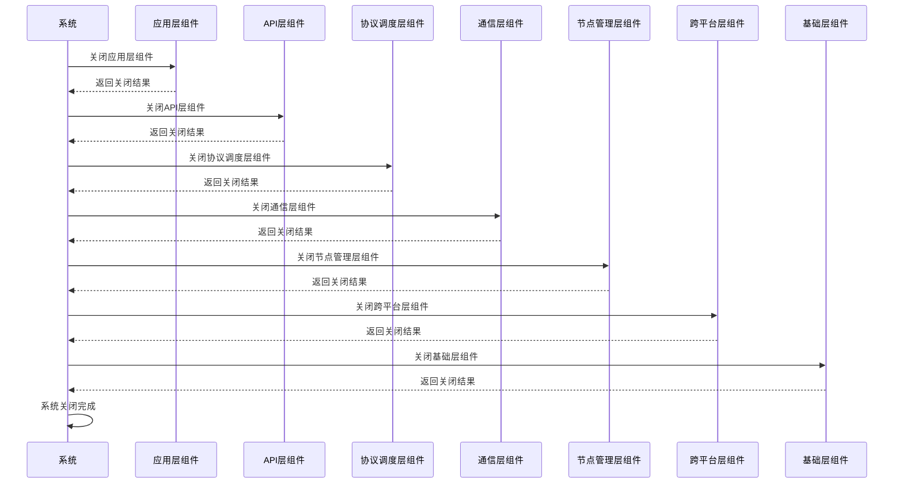

# 组件关系

## 1. 组件关系概述

AuroraRT由多个核心组件组成，这些组件之间存在复杂的依赖和交互关系。理解组件之间的关系对于系统的设计、开发、测试和维护都非常重要。本文档详细描述AuroraRT各组件之间的关系、交互方式以及依赖关系，帮助开发人员更好地理解系统架构。

### 1.1 设计原则
- **高内聚**：每个组件只负责特定的功能，内部实现高度相关
- **低耦合**：组件之间通过明确的接口进行通信，减少直接依赖
- **可替换性**：组件可以独立替换，不影响其他组件的功能
- **可测试性**：组件可以独立测试，便于问题定位和质量保证

## 2. 组件关系

### 2.1 核心组件关系

### 2.2 组件依赖关系
| 组件 | 依赖组件 | 依赖类型 | 说明 |
|------|---------|----------|------|
| 统一通信API | 发布者、订阅者、服务、客户端、序列化层、日志层 | 强依赖 | 提供统一的通信接口 |
| 发布者 | 协议调度器、序列化层 | 强依赖 | 发布消息到指定话题 |
| 订阅者 | 协议调度器、序列化层 | 强依赖 | 订阅指定话题的消息 |
| 服务 | 协议调度器、序列化层 | 强依赖 | 提供服务接口 |
| 客户端 | 协议调度器、序列化层 | 强依赖 | 调用服务接口 |
| 协议调度器 | QoS管理器、网络监控器、通信层组件 | 强依赖 | 选择最优通信协议 |
| QoS管理器 | | 独立组件 | 管理和执行QoS策略 |
| 网络监控器 | 监控层 | 强依赖 | 监控网络状态 |
| inproc/IPC通信 | 线程抽象、内存抽象、日志层 | 强依赖 | 进程内和跨进程通信 |
| TCP/UDP通信 | 网络抽象、日志层 | 强依赖 | 基于TCP和UDP的网络通信 |
| QUIC通信 | 网络抽象、日志层 | 强依赖 | 基于QUIC协议的网络通信 |
| MQT适配层 | 网络抽象、日志层 | 强依赖 | 提供MQT协议支持 |
| 节点管理器 | 健康检查器、拓扑管理器、热重启模块、日志层、监控层 | 强依赖 | 管理节点的生命周期 |
| 健康检查器 | 线程抽象、日志层 | 强依赖 | 监控节点的健康状态 |
| 拓扑管理器 | 网络抽象、日志层 | 强依赖 | 管理节点间的拓扑关系 |
| 热重启模块 | 线程抽象、日志层 | 强依赖 | 实现节点的热重启 |
| 线程抽象 | 平台检测 | 强依赖 | 屏蔽不同平台的线程差异 |
| 内存抽象 | 平台检测 | 强依赖 | 屏蔽不同平台的内存差异 |
| 网络抽象 | 平台检测 | 强依赖 | 屏蔽不同平台的网络差异 |
| 平台检测 | | 独立组件 | 检测当前运行平台 |
| 序列化层 | | 独立组件 | 实现消息的序列化和反序列化 |
| 日志层 | | 独立组件 | 提供异步高性能日志 |
| 监控层 | | 独立组件 | 提供系统性能和状态监控 |

## 3. 组件交互

### 3.1 消息发布交互

### 3.2 消息订阅交互

### 3.3 服务调用交互

### 3.4 节点管理交互

## 4. 组件依赖分析

### 4.1 核心组件依赖分析

#### 4.1.1 统一API层依赖
- **依赖组件**：序列化层、日志层、协议调度层
- **依赖原因**：
  - 需要序列化层将业务数据转换为可传输的格式
  - 需要日志层记录API调用和错误信息
  - 需要协议调度层选择最优的通信协议
- **影响分析**：
  - 序列化层的性能直接影响API层的性能
  - 协议调度层的选择策略直接影响通信质量

#### 4.1.2 协议调度层依赖
- **依赖组件**：QoS管理器、网络监控器、通信层组件
- **依赖原因**：
  - 需要QoS管理器获取和执行QoS策略
  - 需要网络监控器获取网络状态
  - 需要通信层组件执行实际的通信操作
- **影响分析**：
  - QoS管理器的策略直接影响协议选择
  - 网络监控器的准确性直接影响协议选择的正确性
  - 通信层组件的性能直接影响整体通信性能

#### 4.1.3 通信层依赖
- **依赖组件**：跨平台抽象层、日志层
- **依赖原因**：
  - 需要跨平台抽象层屏蔽不同平台的差异
  - 需要日志层记录通信相关的信息和错误
- **影响分析**：
  - 跨平台抽象层的实现质量直接影响通信层的性能和可靠性
  - 不同通信组件的实现质量直接影响对应协议的性能

#### 4.1.4 节点管理层依赖
- **依赖组件**：跨平台抽象层、日志层、监控层
- **依赖原因**：
  - 需要跨平台抽象层实现线程和网络操作
  - 需要日志层记录节点管理相关的信息和错误
  - 需要监控层收集节点的性能和状态信息
- **影响分析**：
  - 跨平台抽象层的实现质量直接影响节点管理层的性能和可靠性
  - 健康检查器的实现质量直接影响节点故障检测的准确性
  - 热重启模块的实现质量直接影响节点重启的速度和可靠性

### 4.2 依赖优化

#### 4.2.1 减少依赖耦合
- **策略**：使用接口隔离原则，定义最小化的接口
- **实现**：
  - 为每个组件定义清晰的接口
  - 组件之间通过接口通信，而不是直接依赖实现
  - 使用依赖注入，减少硬编码依赖

#### 4.2.2 优化依赖顺序
- **策略**：合理安排组件的初始化顺序，避免循环依赖
- **实现**：
  - 按照依赖关系的顺序初始化组件
  - 使用延迟初始化，避免循环依赖
  - 对于复杂的依赖关系，使用依赖注入容器

#### 4.2.3 监控依赖状态
- **策略**：监控组件之间的依赖状态，及时发现问题
- **实现**：
  - 记录组件的初始化和依赖状态
  - 监控组件之间的通信状态
  - 对依赖失败的情况进行告警和处理

## 5. 组件生命周期

### 5.1 组件初始化

#### 5.1.1 初始化顺序
1. **基础层组件**：序列化层、日志层、监控层
2. **跨平台层组件**：平台检测、线程抽象、内存抽象、网络抽象
3. **节点管理层组件**：节点管理器、健康检查器、拓扑管理器、热重启模块
4. **通信层组件**：inproc/IPC通信、TCP/UDP通信、QUIC通信、MQT适配层
5. **协议调度层组件**：QoS管理器、网络监控器、协议调度器
6. **API层组件**：统一通信API、发布者、订阅者、服务、客户端
7. **应用层组件**：业务应用

#### 5.1.2 初始化流程

### 5.2 组件运行

#### 5.2.1 运行状态
- **活跃状态**：组件正常运行，处理请求和任务
- **暂停状态**：组件暂时停止处理请求，但保持初始化状态
- **错误状态**：组件遇到错误，需要进行恢复
- **关闭状态**：组件正在关闭，释放资源

#### 5.2.2 状态转换

### 5.3 组件关闭

#### 5.3.1 关闭顺序
1. **应用层组件**：业务应用
2. **API层组件**：统一通信API、发布者、订阅者、服务、客户端
3. **协议调度层组件**：协议调度器、网络监控器、QoS管理器
4. **通信层组件**：MQT适配层、QUIC通信、TCP/UDP通信、inproc/IPC通信
5. **节点管理层组件**：热重启模块、拓扑管理器、健康检查器、节点管理器
6. **跨平台层组件**：网络抽象、内存抽象、线程抽象、平台检测
7. **基础层组件**：监控层、日志层、序列化层

#### 5.3.2 关闭流程

## 6. 组件配置

### 6.1 配置管理

#### 6.1.1 配置层次
- **全局配置**：适用于整个系统的配置
- **组件配置**：适用于特定组件的配置
- **运行时配置**：可以在运行时调整的配置

#### 6.1.2 配置格式
- **配置文件**：JSON或YAML格式的配置文件
- **环境变量**：通过环境变量覆盖配置文件中的设置
- **命令行参数**：通过命令行参数覆盖配置文件中的设置

### 6.2 关键配置
| 组件 | 配置项 | 说明 | 默认值 |
|------|--------|------|--------|
| 统一通信API | max_message_size | 最大消息大小 | 1MB |
| 发布者 | queue_size | 发布队列大小 | 1024 |
| 订阅者 | queue_size | 订阅队列大小 | 1024 |
| 协议调度器 | protocol_selection_strategy | 协议选择策略 | "adaptive" |
| QoS管理器 | default_reliability | 默认可靠性级别 | "reliable" |
| 网络监控器 | monitor_interval | 监控间隔(ms) | 10 |
| inproc/IPC通信 | shared_memory_size | 共享内存大小 | 10MB |
| TCP/UDP通信 | max_connections | 最大连接数 | 1024 |
| QUIC通信 | max_streams | 最大流数 | 128 |
| 节点管理器 | max_nodes | 最大节点数 | 64 |
| 健康检查器 | check_interval | 检查间隔(ms) | 10 |
| 拓扑管理器 | discovery_interval | 发现间隔(ms) | 50 |
| 热重启模块 | state_save_path | 状态保存路径 | "/tmp/AuroraRT_state" |
| 序列化层 | default_serializer | 默认序列化器 | "Protobuf" |
| 日志层 | log_level | 日志级别 | "info" |
| 监控层 | metrics_interval | 指标收集间隔(ms) | 10 |

## 7. 组件测试

### 7.1 单元测试

#### 7.1.1 测试目标
- 测试组件的功能正确性
- 测试组件的边界条件
- 测试组件的错误处理
- 测试组件的性能特性

#### 7.1.2 测试方法
- **模拟依赖**：使用mock对象模拟组件的依赖
- **隔离测试**：将组件与其他组件隔离，单独测试
- **自动化测试**：使用测试框架进行自动化测试

### 7.2 集成测试

#### 7.2.1 测试目标
- 测试组件之间的交互正确性
- 测试组件之间的接口兼容性
- 测试组件之间的依赖关系
- 测试组件集成后的整体功能

#### 7.2.2 测试方法
- **端到端测试**：测试完整的功能流程
- **场景测试**：测试特定场景下的组件行为
- **压力测试**：测试组件集成后的性能和稳定性

### 7.3 测试工具

| 测试类型 | 工具 | 说明 |
|----------|------|------|
| 单元测试 | Google Test | C++单元测试框架 |
| 性能测试 | Google Benchmark | C++性能测试框架 |
| 代码覆盖率 | gcov/lcov | 代码覆盖率分析工具 |
| 静态分析 | Clang-Tidy | 静态代码分析工具 |
| 动态分析 | Valgrind | 内存和性能分析工具 |

## 8. 组件扩展性

### 8.1 扩展点
| 组件 | 扩展点 | 扩展方式 |
|------|--------|----------|
| 统一通信API | 通信模式 | 添加新的通信模式 |
| 协议调度器 | 协议选择策略 | 添加新的协议选择策略 |
| QoS管理器 | QoS策略 | 添加新的QoS策略 |
| 通信组件 | 通信协议 | 添加新的通信协议 |
| 节点管理器 | 节点类型 | 添加新的节点类型 |
| 健康检查器 | 健康探针 | 添加新的健康探针 |
| 序列化层 | 序列化器 | 添加新的序列化器 |
| 日志层 | 日志输出 | 添加新的日志输出目标 |
| 监控层 | 监控指标 | 添加新的监控指标 |

### 8.2 扩展方法

#### 8.2.1 插件化扩展
- **策略**：使用插件机制，动态加载扩展组件
- **实现**：
  - 定义插件接口
  - 实现插件加载机制
  - 提供插件开发指南

#### 8.2.2 继承扩展
- **策略**：使用继承机制，扩展现有组件
- **实现**：
  - 设计可继承的基类
  - 提供扩展点和钩子函数
  - 文档化扩展方法

#### 8.2.3 组合扩展
- **策略**：使用组合机制，组合现有组件创建新功能
- **实现**：
  - 设计可组合的组件
  - 提供组件组合的示例
  - 文档化组合方法

## 9. 结论

AuroraRT的组件关系设计遵循高内聚、低耦合的原则，通过清晰的组件划分和接口定义，实现了系统的模块化和可扩展性。各组件之间的关系明确，交互流程清晰，便于理解和维护。

通过合理的组件依赖管理和生命周期管理，AuroraRT实现了系统的可靠性和稳定性。同时，通过提供扩展点和扩展方法，AuroraRT具备了良好的可扩展性，可以根据不同的应用场景进行定制和扩展。

组件关系设计是AuroraRT架构设计的重要组成部分，它为系统的开发、测试、维护和扩展提供了坚实的基础。未来的系统演进和功能扩展也将基于这种组件关系设计进行，确保系统的一致性和可持续发展。

