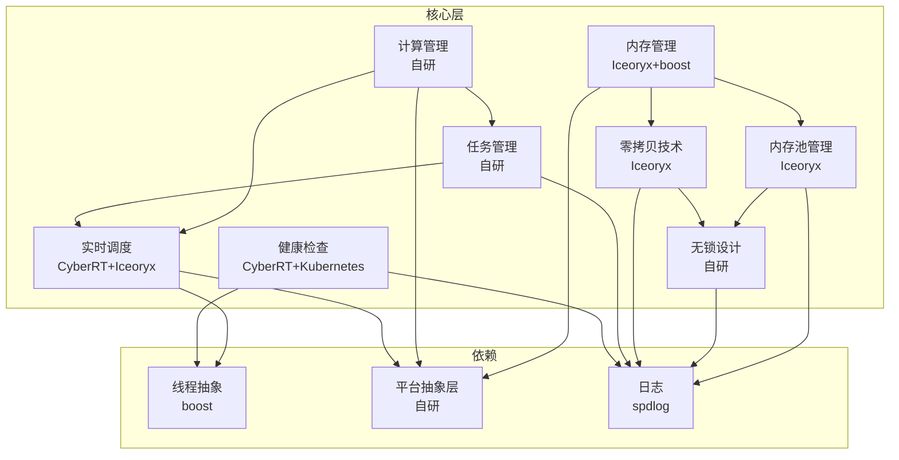
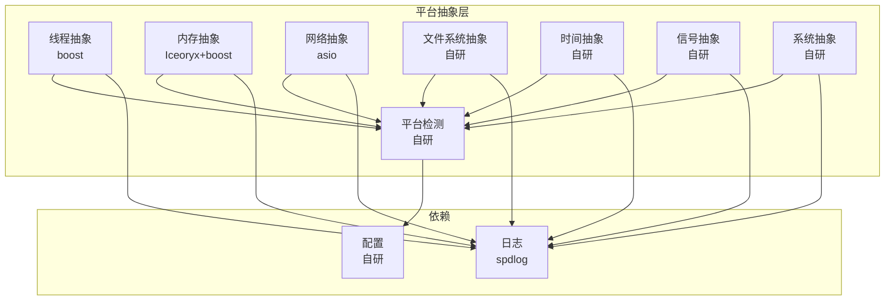

# 分层详细设计

## 1. 核心层详细设计

### 1.1 核心层概述
核心层是AuroraRT的基础核心，负责提供最底层的通信和系统服务。它包含了内存管理、计算管理、实时调度、内存池管理、无锁设计、零拷贝技术、任务管理和健康检查等关键功能。这些功能是实现AuroraRT实时可预测、轻量级高效、高性能特性的基础。

### 1.2 核心层架构

### 1.3 核心层模块

#### 1.3.1 内存管理
- **设计目标**：预分配内存、内存池管理、内存使用监控、跨平台兼容
- **核心组件**：内存管理器、内存池、共享内存
- **关键特性**：预分配内存区域、内存使用统计、内存泄漏检测、跨平台内存锁定

#### 1.3.2 计算管理
- **设计目标**：资源管理、负载均衡、优先级调度、实时保证
- **核心组件**：计算资源管理器、任务调度器、线程池
- **关键特性**：CPU核心绑定、负载监控、动态资源调整、跨平台兼容

#### 1.3.3 实时调度
- **设计目标**：硬实时保证、优先级管理、调度延迟最小化、跨平台兼容
- **核心组件**：实时调度器、实时线程、调度监控
- **关键特性**：实时任务调度、优先级管理、调度延迟监控、跨平台兼容

#### 1.3.4 内存池管理
- **设计目标**：无内存碎片、快速内存分配、内存使用监控、可配置
- **核心组件**：内存池管理器、内存池、内存块
- **关键特性**：无内存碎片、快速内存分配、内存块复用、内存使用监控

#### 1.3.5 无锁设计
- **设计目标**：无锁竞争、高并发、内存序正确、ABA问题解决、性能优化
- **核心组件**：无锁队列、无锁栈、无锁哈希表
- **关键特性**：高并发、无锁竞争、内存序正确、错误处理

#### 1.3.6 零拷贝技术
- **设计目标**：减少数据拷贝、提高性能、降低延迟、支持大消息
- **核心组件**：零拷贝管理器、共享内存、零拷贝传输
- **关键特性**：零拷贝、高带宽、低延迟、大消息支持

#### 1.3.7 任务管理
- **设计目标**：任务生命周期管理、任务优先级、任务依赖、任务监控、异常处理
- **核心组件**：任务管理器、任务、任务队列
- **关键特性**：任务优先级管理、任务依赖解析、任务状态监控、异常处理

#### 1.3.8 健康检查
- **设计目标**：实时监控、多维度检查、故障检测、自动恢复、告警机制
- **核心组件**：健康检查器、健康探针、健康状态管理器
- **关键特性**：多维度检查、实时监控、故障检测、告警机制

## 2. 平台抽象层详细设计

### 2.1 平台抽象层概述
平台抽象层是AuroraRT的关键组成部分，负责屏蔽不同平台（主要是QNX和Ubuntu）之间的系统差异，为上层提供统一的抽象接口。它确保了AuroraRT的核心逻辑在不同平台上的一致性，同时也为平台特定的优化提供了扩展点。

### 2.2 平台抽象层架构

### 2.3 平台抽象层模块

#### 2.3.1 平台检测
- **设计目标**：准确检测、编译时检测、运行时检测、可扩展
- **核心组件**：平台检测器、平台信息
- **关键特性**：准确、高效、可扩展性、错误处理

#### 2.3.2 线程抽象
- **设计目标**：跨平台线程、统一接口、优先级支持、核心绑定、实时调度
- **核心组件**：线程抽象、互斥量抽象、条件变量抽象
- **关键特性**：跨平台兼容、统一接口、优先级支持、核心绑定

#### 2.3.3 内存抽象
- **设计目标**：跨平台内存、统一接口、内存锁定、内存保护、共享内存
- **核心组件**：内存抽象、共享内存抽象、内存池抽象
- **关键特性**：跨平台兼容、统一接口、内存锁定、内存保护

#### 2.3.4 网络抽象
- **设计目标**：跨平台网络、统一接口、Socket抽象、异步I/O、网络工具
- **核心组件**：网络抽象、Socket抽象、I/O上下文抽象
- **关键特性**：跨平台兼容、统一接口、异步I/O支持、网络工具

#### 2.3.5 文件系统抽象
- **设计目标**：跨平台文件系统、统一接口、路径处理、文件操作、目录操作
- **核心组件**：文件系统抽象、文件抽象、目录抽象
- **关键特性**：跨平台兼容、统一接口、路径处理、文件操作

#### 2.3.6 时间抽象
- **设计目标**：跨平台时间、统一接口、高精度时间、定时器、时间转换
- **核心组件**：时间抽象、定时器抽象
- **关键特性**：跨平台兼容、统一接口、高精度时间、时间转换

#### 2.3.7 信号抽象
- **设计目标**：跨平台信号、统一接口、信号注册、信号屏蔽
- **核心组件**：信号抽象
- **关键特性**：跨平台兼容、统一接口、信号注册、信号屏蔽

#### 2.3.8 系统抽象
- **设计目标**：跨平台系统、统一接口、进程管理、系统信息、环境变量
- **核心组件**：系统抽象
- **关键特性**：跨平台兼容、统一接口、进程管理、系统信息

## 3. 传输层详细设计

### 3.1 传输层概述
传输层负责AuroraRT的消息传输，支持多种传输方式，包括进程内通信、共享内存通信和网络通信。它为上层提供统一的传输接口，屏蔽底层传输细节，确保消息的可靠传输。

### 3.2 传输层架构

### 3.3 传输层模块

#### 3.3.1 进程内通信
- **设计目标**：高效进程内通信、低延迟、高吞吐
- **核心组件**：进程内传输、消息队列
- **关键特性**：零拷贝、低延迟、高吞吐

#### 3.3.2 共享内存通信
- **设计目标**：高效跨进程通信、零拷贝、高吞吐
- **核心组件**：共享内存传输、消息队列
- **关键特性**：零拷贝、高吞吐、跨进程通信

#### 3.3.3 网络通信
- **设计目标**：跨节点通信、可靠传输、多协议支持
- **核心组件**：网络传输、协议管理
- **关键特性**：多协议支持、可靠传输、跨节点通信

## 4. 通信层详细设计

### 4.1 通信层概述
通信层负责AuroraRT的通信模式实现，支持发布-订阅、请求-响应、事件和推送-拉取等多种通信模式。它为上层应用提供统一的通信接口，屏蔽底层通信细节。

### 4.2 通信层架构

### 4.3 通信层模块

#### 4.3.1 发布-订阅模式
- **设计目标**：基于话题的消息发布和订阅、多对多通信
- **核心组件**：发布者、订阅者、话题管理器
- **关键特性**：多对多通信、话题过滤、QoS支持

#### 4.3.2 请求-响应模式
- **设计目标**：基于服务的请求和响应、点对点通信
- **核心组件**：客户端、服务端、请求处理器
- **关键特性**：点对点通信、同步/异步调用、错误处理

#### 4.3.3 事件模式
- **设计目标**：基于事件的消息通知、一对多通信
- **核心组件**：通知器、监听器、事件管理器
- **关键特性**：一对多通信、事件过滤、异步通知

#### 4.3.4 推送-拉取模式
- **设计目标**：基于队列的消息推送和拉取、负载均衡
- **核心组件**：推送器、拉取器、队列管理器
- **关键特性**：负载均衡、消息队列、异步处理

## 5. 服务层详细设计

### 5.1 服务层概述
服务层负责AuroraRT的核心服务，包括节点管理、域管理、安全框架和诊断系统等。它为上层应用提供高级服务，确保系统的可靠性、安全性和可管理性。

### 5.2 服务层架构

### 5.3 服务层模块

#### 5.3.1 节点管理
- **设计目标**：节点生命周期管理、节点发现、健康检查、故障自愈
- **核心组件**：节点管理器、节点、健康检查器
- **关键特性**：自动发现、实时监控、故障自愈、负载均衡

#### 5.3.2 域管理
- **设计目标**：域和分区管理、资源隔离、访问控制
- **核心组件**：域管理器、域、分区
- **关键特性**：资源隔离、访问控制、动态管理

#### 5.3.3 安全框架
- **设计目标**：身份认证、数据加密、访问控制、安全策略
- **核心组件**：安全管理器、认证模块、加密模块、访问控制模块
- **关键特性**：身份认证、数据加密、访问控制、安全策略

#### 5.3.4 诊断系统
- **设计目标**：故障检测、根因分析、故障恢复、故障记录
- **核心组件**：诊断管理器、故障检测器、根因分析器、故障恢复器
- **关键特性**：实时检测、智能分析、自动恢复、故障记录

## 6. 应用适配层详细设计

### 6.1 应用适配层概述
应用适配层负责AuroraRT与上层应用的接口适配，提供友好的编程接口和工具，简化应用开发。它为不同类型的应用提供定制化的适配方案，确保应用能够高效地使用AuroraRT的功能。

### 6.2 应用适配层架构

### 6.3 应用适配层模块

#### 6.3.1 API适配
- **设计目标**：提供友好的编程接口、简化应用开发
- **核心组件**：API适配器、SDK
- **关键特性**：友好接口、简化开发、多语言支持

#### 6.3.2 工具适配
- **设计目标**：提供开发和调试工具、提高开发效率
- **核心组件**：开发工具、调试工具、监控工具
- **关键特性**：开发辅助、调试支持、监控管理

#### 6.3.3 框架适配
- **设计目标**：与主流框架集成、扩展应用场景
- **核心组件**：框架适配器、集成模块
- **关键特性**：框架集成、场景扩展、生态融合
