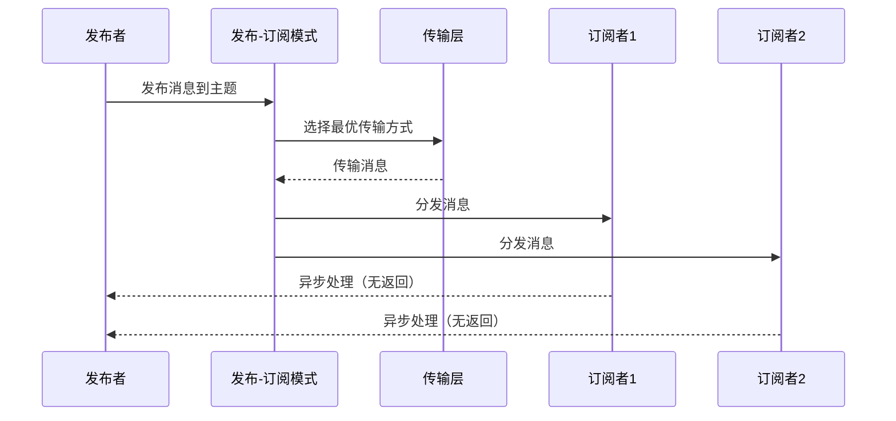
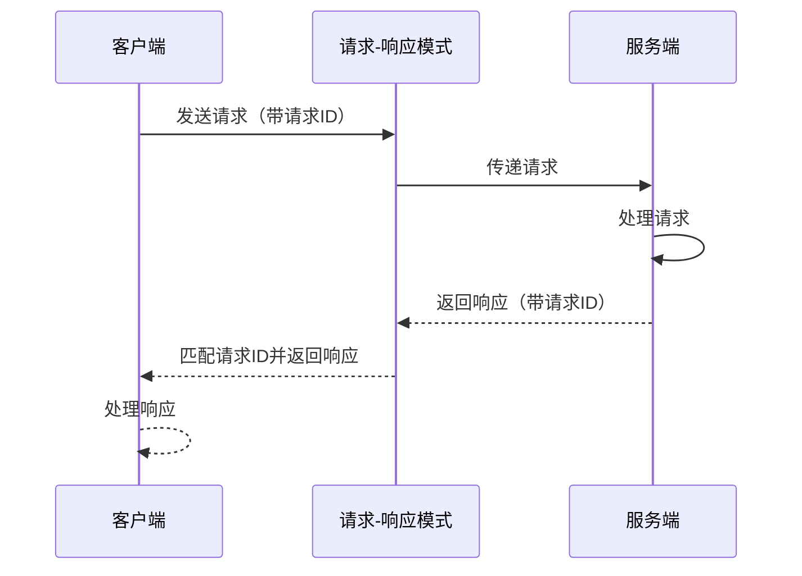

# 实时通信

## 1. 模块概述

实时通信是AuroraRT 车载实时消息中间件的核心功能之一，旨在提供低延迟、高吞吐量、可预测的消息传递能力，满足车载场景对实时性的严格要求

## 2. 设计理念

### 2.1 核心设计目标
  - **低延迟**：进程内通信延迟 < 30μs，跨进程通信延迟 < 1ms
  - **高吞吐量**：支持百万级消息/秒的传输速率
  - **可预测**：延迟抖动 < 10μs，确保实时任务的确定性
  - **高可靠**：确保消息的可靠传递，避免丢包

### 2.2 设计原则
  - **零拷贝技术**：减少数据传输过程中的内存拷贝次数
  - **无锁设计**：避免使用互斥锁等同步原语，减少线程竞争
  - **内存池管理**：预分配内存，避免动态内存分配带来的不确定性
  - **实时调度**：使用高优先级调度策略，确保关键任务优先执行

## 3. 技术实现

### 3.1 零拷贝技术

#### 3.1.1 进程内通信零拷贝
  - **实现方式**：使用无锁队列实现进程内通信的零拷贝
  - **核心组件**：`MPMCQueue`（无锁多生产者多消费者队列）
  - **技术要点**
    - 使用原子操作和内存屏障实现无锁入队和出队
    - 内存对齐优化，避免伪共享
    - 批量操作支持，减少原子操作次数
    - 支持多种数据类型的模板实现

#### 3.1.2 跨进程通信零拷贝
  - **实现方式**：基于共享内存的零拷贝实现
  - **核心组件**：`SharedMemoryManager`、`MemoryPool`、`MPMCQueue`
  - **技术要点**
    - 预分配共享内存区域，支持不同大小的内存块
    - 使用多级内存池管理消息缓冲区
    - 无锁队列实现消息传输
    - 直接指针传递，避免数据拷贝
    - 支持内存池的动态扩展和收缩
    - 引用计数管理，确保内存安全释放

### 3.2 发布-订阅模式实现
  - **核心组件**：`PubSubPattern`、`ConcretePublisher`、`Subscriber`
  - **技术要点**
    - 模板化设计，支持多种数据类型（int、float、double、std::string等）
    - 发布者和订阅者的生命周期管理（创建、启动、停止）
    - 消息的异步处理和队列管理（使用条件变量和互斥锁）
    - 支持QoS策略的消息传递
    - 多线程安全的消息发布和订阅
    - 智能传输选择（根据消息大小和类型选择最优传输方式）
    - 本地和网络传输的双重发布机制

  **实现细节**：
  - `PubSubPattern`负责管理发布者和订阅者，提供创建发布者和订阅者的接口
  - `ConcretePublisher`负责消息的发布，支持本地和网络传输
  - `Subscriber`负责消息的接收和处理，使用线程池异步处理消息
  - 支持显式实例化常用类型，提高编译效率

### 3.3 请求-响应模式实现
  - **核心组件**：`ReqRespPattern`、`Client`、`Server`
  - **技术要点**
    - 同步和异步请求响应支持
    - 请求ID管理，确保响应与请求匹配
    - 超时处理机制（默认5秒超时）
    - 错误处理和异常捕获
    - 模板化设计，支持多种数据类型
    - 基于发布-订阅模式实现底层通信

  **实现细节**：
  - `ReqRespPattern`使用`PubSubPattern`作为底层通信机制
  - `Client`负责发送请求并等待响应，支持超时处理
  - `Server`负责接收请求并处理，支持异常捕获和错误处理
  - 使用带ID的请求和响应结构，确保请求和响应的正确匹配
  - 支持显式实例化常用类型（int、float、std::string等）
  - 请求和响应通过主题（service.request和service.response）进行传递

### 3.4 事件模式实现
  - **核心组件**：`EventPattern`、`EventNotifier`、`EventListener`
  - **技术要点**
    - 基于事件的消息通知
    - 事件的异步处理
    - 基于发布-订阅模式实现底层通信
    - 简单轻量的事件通知机制

  **实现细节**：
  - `EventPattern`使用`PubSubPattern`作为底层通信机制
  - `EventNotifier`负责发送事件通知
  - `EventListener`负责接收事件通知并执行回调
  - 使用简单的int类型作为事件通知的载体
  - 事件通过主题进行传递，每个事件对应一个主题

### 3.5 推送-拉取模式实现
  - **核心组件**：`PushPullPattern`、`PushNotifier`、`PullListener`
  - **技术要点**
    - 基于队列的消息推送和拉取
    - 消息的批量处理
    - 基于发布-订阅模式实现底层通信
    - 支持二进制数据传输

  **实现细节**：
  - `PushPullPattern`使用`PubSubPattern`作为底层通信机制
  - `PushNotifier`负责推送数据，支持二进制数据
  - `PullListener`负责拉取数据并执行回调
  - 使用`std::vector<uint8_t>`作为数据传输的载体
  - 数据通过通道（channel）进行传递，每个通道对应一个主题

### 3.6 无锁设计

#### 3.6.1 无锁队列实现
  - **技术原理**：基于原子操作和内存屏障，避免使用互斥锁
  - **核心算法**
    - 使用`std::atomic`实现无锁操作
    - 内存序优化（`memory_order_acquire`/`memory_order_release`）
    - 避免ABA问题
    - 无锁数据结构的正确性验证

#### 3.6.2 性能优化
  - **内存对齐**：使用`alignas(64)`避免伪共享
  - **内存屏障优化**：合理使用内存序，减少内存屏障开销
  - **批量操作**：支持批量入队和出队，减少原子操作次数

### 3.7 实时调度

#### 3.7.1 线程优先级设置
  - **实现方式**：设置线程优先级和调度策略，确保关键任务优先执行
  - **调度策略**
    - 核心线程使用`SCHED_FIFO`调度策略
    - 线程优先级映射（Ubuntu 1-9，QNX 1-63）
    - CPU核心绑定，避免线程迁移

#### 3.7.2 调度策略

| 线程类型 | 优先级 | 调度策略 | CPU亲和性 |
|---------|--------|----------|----------|
| 核心通信线程 | 90-99 | SCHED_FIFO | 独占CPU核心 |
| 调度线程 | 80-89 | SCHED_FIFO | 独占CPU核心 |
| 健康检查线程 | 70-79 | SCHED_RR | 共享CPU核心 |
| 日志线程 | 10-19 | SCHED_OTHER | 共享CPU核心 |

### 3.8 内存池管理

#### 3.8.1 实现方式
  - **预分配内存**：启动时预分配内存，避免运行时动态分配
  - **内存块复用**：释放的内存块重新加入空闲列表，实现复用
  - **无锁分配**：使用无锁队列管理空闲内存块，提高并发性能
  - **动态调整**：根据内存使用情况动态调整内存池大小

#### 3.8.2 核心组件
  - **MemoryPool**：内存池实现，管理固定大小的内存
  - **SharedMemoryManager**：共享内存管理，支持跨进程内存共享
  - **MultiLevelMemoryPool**：多级内存池，管理不同大小的内存块

## 4. 通信模式

### 4.1 进程内通信
  - **适用场景**：同一进程内不同模块之间的通信
  - **实现方式**：无锁队列
  - **性能指标**：延迟 < 30μs，吞吐量 > 100万消息/秒

### 4.2 跨进程通信
  - **适用场景**：同一主机上不同进程之间的通信
  - **实现方式**：共享内存 + 无锁队列
  - **性能指标**：延迟 < 1ms，吞吐量 > 100万消息/秒

### 4.3 跨节点通信
  - **适用场景**：不同主机之间的通信
  - **实现方式**：TCP/UDP/QUIC协议
  - **性能指标**：延迟 < 10ms（局域网），吞吐量 > 10万消息/秒

## 5. 消息传递模型

### 5.1 发布-订阅模式
  - **实现方式**：基于主题的消息发布和订阅
  - **特点**
    - 松耦合：发布者和订阅者互不感知
    - 多对多：一个发布者可以对应多个订阅者，一个订阅者可以订阅多个发布者
    - 异步：发布者发送消息后不需要等待订阅者处理
  - **流程图**：



### 5.2 请求-响应模式
  - **实现方式**：基于服务的请求和响应
  - **特点**
    - 同步或异步：支持同步和异步请求响应
    - 一对一：一个请求对应一个响应
    - 可靠性：确保请求和响应的可靠传输
  - **流程图**：



## 6. 性能优化策略

### 6.1 内存优化
  - **内存池预分配**：根据消息大小和数量预分配内存池
  - **内存对齐**：合理对齐内存，提高缓存命中率
  - **内存屏障优化**：减少内存屏障开销，提高并发性能

### 6.2 计算优化
  - **无锁设计**：避免使用互斥锁，减少线程竞争
  - **批量操作**：支持批量消息处理，减少系统调用次数
  - **编译器优化**：启用编译器优化，提高代码执行效率

### 6.3 网络优化
  - **多协议支持**：根据场景选择最优协议
  - **流量控制**：实现流量控制，避免网络拥塞
  - **拥塞控制**：使用先进的拥塞控制算法，提高网络利用率

## 7. 性能指标

### 7.1 延迟指标

| 通信类型 | 平均延迟 | 最大延迟 | 延迟抖动 |
|---------|---------|---------|----------|
| 进程内通信 | < 30μs | < 50μs | < 5μs |
| 跨进程通信 | < 1ms | < 5ms | < 10μs |
| 跨节点通信（局域网） | < 10ms | < 50ms | < 20μs |

### 7.2 吞吐量指标

| 通信类型 | 最大吞吐量 | 稳定吞吐量 |
|---------|-----------|------------|
| 进程内通信 | > 100万消息/秒 | > 80万消息/秒 |
| 跨进程通信 | > 100万消息/秒 | > 70万消息/秒 |
| 跨节点通信（局域网） | > 10万消息/秒 | > 8万消息/秒 |

### 7.3 资源占用
  - **内存占用**：< 10MB
  - **CPU占用**：1%（空闲状态），10%（满负荷状态）

## 8. 使用方法

### 8.1 发布-订阅模式

#### 8.1.1 发布者示例

```cpp
// 创建发布-订阅模式实例
auto pubSubPattern = std::make_shared<aurorart::communication::PubSubPattern>();
pubSubPattern->init();
pubSubPattern->start();

// 创建发布者
auto publisher = pubSubPattern->createPublisher<std::string>("topic_name");

// 发布消息
std::string message = "Hello, AuroraRT!";
publisher->publish(&message, sizeof(message));

// 停止发布-订阅模式
pubSubPattern->stop();
```

#### 8.1.2 订阅者示例

```cpp
// 创建发布-订阅模式实例
auto pubSubPattern = std::make_shared<aurorart::communication::PubSubPattern>();
pubSubPattern->init();
pubSubPattern->start();

// 创建订阅者
auto subscriber = pubSubPattern->createSubscriber<std::string>("topic_name", [](const std::string& message) {
    std::cout << "Received message: " << message << std::endl;
});

// 运行一段时间
std::this_thread::sleep_for(std::chrono::seconds(5));

// 停止发布-订阅模式
pubSubPattern->stop();
```

### 8.2 请求-响应模式

#### 8.2.1 服务端示例

```cpp
// 创建请求-响应模式实例
auto reqRespPattern = std::make_shared<aurorart::communication::ReqRespPattern>();
reqRespPattern->init();
reqRespPattern->start();

// 创建服务
auto service = reqRespPattern->createServer<std::string, std::string>("service_name", [](const std::string& request) {
    std::cout << "Received request: " << request << std::endl;
    return "Processed: " + request;
});

// 运行一段时间
std::this_thread::sleep_for(std::chrono::seconds(5));

// 停止请求-响应模式
reqRespPattern->stop();
```

#### 8.2.2 客户端示例

```cpp
// 创建请求-响应模式实例
auto reqRespPattern = std::make_shared<aurorart::communication::ReqRespPattern>();
reqRespPattern->init();
reqRespPattern->start();

// 创建客户端
auto client = reqRespPattern->createClient<std::string, std::string>("service_name");

// 发送请求
std::string request = "Hello, Service!";
std::string response;
client->sendRequest(&request, sizeof(request), &response, sizeof(response));

// 处理响应
std::cout << "Received response: " << response << std::endl;

// 停止请求-响应模式
reqRespPattern->stop();
```

### 8.3 事件模式示例

```cpp
// 创建事件模式实例
auto eventPattern = std::make_shared<aurorart::communication::EventPattern>();
eventPattern->init();
eventPattern->start();

// 创建事件监听器
auto listener = eventPattern->createListener("event_name", []() {
    std::cout << "Event received!" << std::endl;
});
listener->start();

// 创建事件通知器
auto notifier = eventPattern->createNotifier("event_name");

// 发送事件通知
notifier->notify();

// 运行一段时间
std::this_thread::sleep_for(std::chrono::seconds(1));

// 停止事件模式
eventPattern->stop();
```

### 8.4 推送-拉取模式示例

```cpp
// 创建推送-拉取模式实例
auto pushPullPattern = std::make_shared<aurorart::communication::PushPullPattern>();
pushPullPattern->init();
pushPullPattern->start();

// 创建拉取器
auto puller = pushPullPattern->createPuller<std::vector<uint8_t>>("channel_name", [](const std::vector<uint8_t>& data) {
    std::cout << "Received data of size: " << data.size() << std::endl;
});
puller->start();

// 创建推送器
auto pusher = pushPullPattern->createPusher("channel_name");

// 推送数据
std::string data = "Hello, Push-Pull!";
pusher->push(data.c_str(), data.size());

// 运行一段时间
std::this_thread::sleep_for(std::chrono::seconds(1));

// 停止推送-拉取模式
pushPullPattern->stop();
```

## 9. 最佳实践

### 9.1 消息设计
  - **消息大小**：尽量减小消息大小，避免传输大型消息
  - **消息频率**：合理控制消息发送频率，避免网络拥塞
  - **消息优先级**：为重要消息设置高优先级，确保及时处理

### 9.2 内存管理
  - **内存池配置**：根据实际消息大小和数量配置内存池
  - **内存使用监控**：定期监控内存使用情况，避免内存泄漏
  - **内存优化**：合理使用内存，避免内存浪费

### 9.3 线程管理
  - **线程数量**：合理控制线程数量，避免线程过多导致系统负载过高
  - **线程优先级**：为关键线程设置高优先级，确保及时执行
  - **CPU亲和性**：为核心线程设置CPU亲和性，避免线程迁移

## 10. 故障排查

### 10.1 常见问题
  - **消息延迟过高**：检查线程优先级、内存池配置和网络状态
  - **消息丢失**：检查网络连接、服务状态和错误处理
  - **内存泄漏**：检查内存分配和释放，确保内存正确管理
  - **CPU占用过高**：检查线程数量、消息频率和算法效率

### 10.2 排查工具
  - **日志**：使用分级日志，记录关键操作和错误信息
  - **监控**：使用性能监控工具，实时监控系统状态
  - **分析**：使用性能分析工具，定位性能瓶颈

## 11. 总结

实时通信模块是AuroraRT 车载实时消息中间件的核心功能之一，通过零拷贝技术、无锁设计、内存池管理和实时调度等技术，实现了低延迟、高吞吐量、可预测的消息传递能力。该模块支持进程内、跨进程和跨节点通信，提供发布订阅和请求响应两种消息传递模型，满足车载场景对实时性的严格要求

通过合理的性能优化策略和最佳实践，实时通信模块能够在资源受限的车载环境中提供高效、可靠的消息传递服务，为自动驾驶、车载信息娱乐、车载控制等系统提供有力的通信支持

