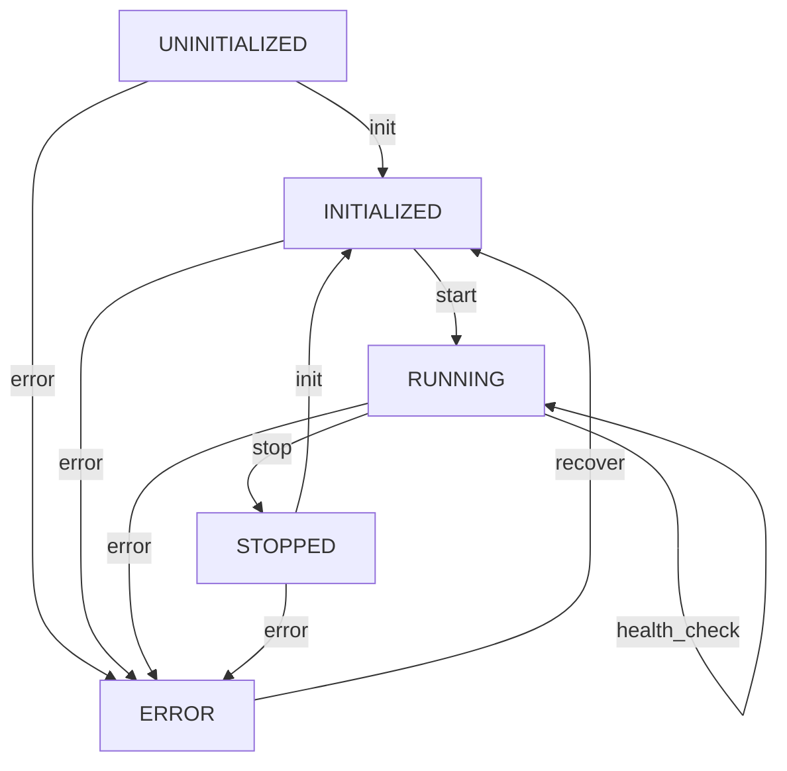
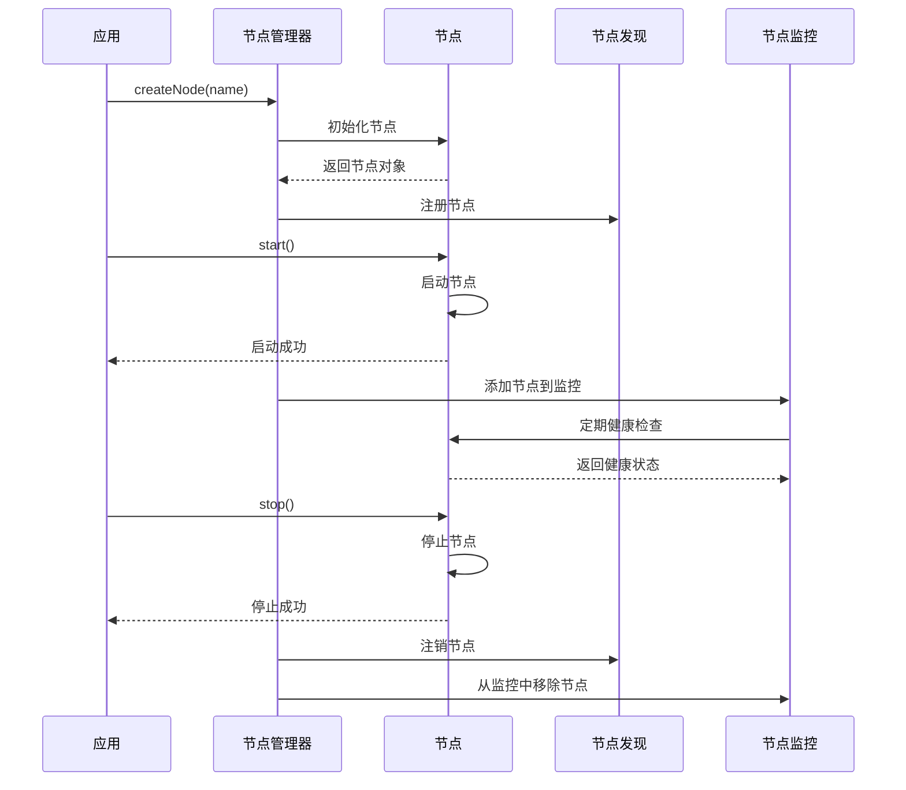

# 多节点管理
## 1. 模块概述

多节点管理是AuroraRT 车载实时消息中间件的核心功能之一，旨在提供节点的自动发现、健康监控、故障恢复和热重启能力，确保分布式车载系统的高可靠性和可用性

## 2. 设计理念

### 2.1 核心设计目标
  - **自动发现**：自动发现网络中的节点，支持动态拓扑
  - **健康监控**：实时监控节点状态，及时发现异常
  - **故障恢复**：当节点异常时，自动执行故障恢复策略
  - **热重启**：支持节点热重启，最小化服务中断
  - **高可靠**：确保节点管理的可靠性，避免单点故障

### 2.2 设计原则
  - **分布式架构**：采用分布式节点管理架构，避免单点故障
  - **实时监控**：实时监控节点状态，确保及时发现异常
  - **自愈能力**：具备故障自动检测和恢复能力
  - **低开销**：节点管理开销小，不影响核心业务性能

## 3. 技术实现

### 3.1 节点注册与发现

#### 3.1.1 实现方式
  - **自研实现**：基于发布-订阅模式的节点发现机制
  - **支持多播**：可选的多播发现机制，提高大规模集群的发现效率

#### 3.1.2 核心组件
  - **DefaultNode**：节点的默认实现，管理节点的生命周期和状态
  - **DefaultNodeDiscovery**：节点发现的默认实现，负责节点的注册和发现
  - **NodeManager**：节点管理器，单例模式，管理所有节点

#### 3.1.3 技术要点
  - **节点ID生成**：基于时间戳和随机数生成唯一的节点ID
  - **心跳机制**：通过心跳机制检测节点存活状态，心跳过期时间为30秒
  - **节点事件监听**：支持节点添加、移除、状态变化等事件的监听
  - **多播支持**：可选的多播发现机制，适用于大规模集群

### 3.2 健康检查

#### 3.2.1 实现方式
  - **自研实现**：基于线程的定期健康检查机制
  - **多维度检查**：包括节点可用性、CPU负载、内存使用等多维度检查

#### 3.2.2 核心组件
  - **DefaultNodeMonitor**：节点监控的默认实现，执行健康检查
  - **NodeEventListener**：节点事件监听器，处理节点状态变化事件

#### 3.2.3 技术要点
  - **心跳检查**：检查节点的心跳是否过期
  - **负载检查**：监控节点的CPU和内存使用情况
  - **阈值设置**：可配置的CPU和内存阈值，超过阈值时发出警告
  - **健康状态评估**：根据检查结果评估节点的健康状态

### 3.3 故障检测与处理

#### 3.3.1 实现方式
  - **自研实现**：基于健康检查的故障检测机制
  - **事件驱动**：通过事件机制处理节点故障

#### 3.3.2 核心组件
  - **NodeEventListener**：节点事件监听器，处理节点故障事件
  - **NodeManager**：节点管理器，协调故障处理

#### 3.3.3 技术要点
  - **故障检测**：通过健康检查和心跳机制检测节点故障
  - **故障通知**：当节点故障时，通知相关组件
  - **故障处理**：根据故障类型执行相应的处理策略

### 3.4 节点生命周期管理

#### 3.4.1 实现方式
  - **自研实现**：基于状态机的节点生命周期管理
  - **状态转换**：定义清晰的节点状态转换流程

#### 3.4.2 核心组件
  - **DefaultNode**：管理节点的状态和生命周期
  - **NodeManager**：协调节点的生命周期管理

#### 3.4.3 技术要点
  - **状态定义**：定义节点的多种状态，如UNINITIALIZED、INITIALIZED、RUNNING、STOPPED、ERROR
  - **状态转换**：管理节点状态之间的转换
  - **生命周期控制**：提供节点的初始化、启动、停止等操作
  - **元数据管理**：支持节点元数据的设置和获取

## 4. 节点状态管理

### 4.1 节点状态定义

| 节点状态 | 描述 | 转换条件 |
|---------|------|----------|
| UNINITIALIZED | 未初始化 | 节点刚创建 |
| INITIALIZED | 已初始化 | 节点初始化完成 |
| RUNNING | 运行中 | 节点启动成功，正常提供服务 |
| STOPPED | 已停止 | 节点停止运行 |
| ERROR | 错误 | 节点发生错误 |

### 4.2 状态转换流程

1. **启动流程**：UNINITIALIZED → INITIALIZED → RUNNING
2. **正常运行**：RUNNING → RUNNING（健康检查通过）
3. **停止流程**：RUNNING → STOPPED
4. **错误流程**：任何状态 → ERROR（发生错误）
5. **重启流程**：STOPPED → INITIALIZED → RUNNING

### 4.3 状态转换流程图



### 4.4 节点生命周期管理流程图



## 5. 节点管理功能

### 5.1 节点创建与初始化
  - **功能**：创建和初始化节点
  - **参数**：节点名称
  - **返回**：节点对象
  - **实现**：`NodeManager::createNode()`方法

### 5.2 节点注册
  - **功能**：将节点注册到节点发现服务
  - **实现**：`DefaultNodeDiscovery::registerNode()`方法
  - **过程**：生成唯一节点ID，注册节点信息

### 5.3 节点发现
  - **功能**：发现网络中的节点
  - **实现**：`DefaultNodeDiscovery::discoverNodes()`方法
  - **返回**：节点ID列表
  - **机制**：定期执行节点发现，清理过期节点

### 5.4 健康检查
  - **功能**：检查节点的健康状态
  - **实现**：`DefaultNodeMonitor::checkNodeHealth()`方法
  - **检查项**：
    - 心跳检查：检查节点心跳是否过期（30秒）
    - 负载检查：监控节点CPU和内存使用情况
  - **频率**：每10秒执行一次

### 5.5 节点状态管理
  - **功能**：管理节点的状态和生命周期
  - **实现**：`DefaultNode`类的状态管理方法
  - **操作**：初始化、启动、停止、获取状态

### 5.6 节点元数据管理
  - **功能**：管理节点的元数据
  - **实现**：`DefaultNode::setMetadata()`和`DefaultNode::getMetadata()`方法
  - **操作**：设置和获取节点元数据

### 5.7 节点负载管理
  - **功能**：管理节点的负载信息
  - **实现**：`DefaultNode::updateLoad()`方法
  - **操作**：更新节点的CPU和内存使用情况

## 6. 性能指标

### 6.1 节点发现时间
  - **初始发现**：1s（网络中的所有节点）
  - **动态发现**：10ms（新加入的节点）

### 6.2 健康检查延迟
  - **检查延迟**：10ms
  - **故障检测时间**：50ms（从故障发生到检测到）

### 6.3 故障恢复时间
  - **故障自愈时间**：10ms
  - **服务中断时间**：10ms（热重启）

### 6.4 资源占用
  - **内存占用**：1MB（每节点）
  - **CPU占用**：0.5%（每节点）

## 7. 使用方法

### 7.1 节点创建与初始化

```cpp
// 初始化节点管理器
aurorart::node::NodeManager::instance().init();

// 启动节点管理器
aurorart::node::NodeManager::instance().start();

// 创建节点
auto node = aurorart::node::NodeManager::instance().createNode("sensor_node");

// 启动节点
node->start();
```

### 7.2 节点发现

```cpp
// 发现节点
std::vector<aurorart::node::NodeId> node_ids = aurorart::node::NodeManager::instance().discoverNodes();

// 遍历节点信息
for (const auto& node_id : node_ids) {
    auto node = aurorart::node::NodeManager::instance().getNode(node_id);
    if (node) {
        std::cout << "Node: " << node->getName() << ", ID: " << node->getID() << ", Status: " << node->getStatus() << std::endl;
    }
}
```

### 7.3 健康检查

```cpp
// 获取节点健康状态
std::map<aurorart::node::NodeId, bool> health_status = aurorart::node::NodeManager::instance().getNodeHealthStatus();

// 遍历健康状态
for (const auto& [node_id, is_healthy] : health_status) {
    std::cout << "Node " << node_id << " is " << (is_healthy ? "HEALTHY" : "UNHEALTHY") << std::endl;
}
```

### 7.4 节点状态管理

```cpp
// 获取节点状态
std::string status = node->getStatus();
std::cout << "Node status: " << status << std::endl;

// 停止节点
node->stop();

// 检查节点是否可用
bool is_available = node->isAvailable();
std::cout << "Node is available: " << is_available << std::endl;
```

### 7.5 节点元数据管理

```cpp
// 设置节点元数据
node->setMetadata("type", "sensor");
node->setMetadata("version", "1.0.0");

// 获取节点元数据
std::string node_type = node->getMetadata("type");
std::string version = node->getMetadata("version");
std::cout << "Node type: " << node_type << ", Version: " << version << std::endl;
```

### 7.6 节点负载管理

```cpp
// 更新节点负载
node->updateLoad(10.5, 25.3); // CPU负载10.5%，内存使用25.3%

// 获取节点负载
std::cout << "CPU load: " << node->getCpuLoad() << "%" << std::endl;
std::cout << "Memory usage: " << node->getMemoryUsage() << "%" << std::endl;
std::cout << "Uptime: " << node->getUptime() << " seconds" << std::endl;
```

### 7.7 停止节点管理器

```cpp
// 停止节点管理器
aurorart::node::NodeManager::instance().stop();
```

## 8. 最佳实践

### 8.1 节点设计
  - **节点职责**：节点职责明确，功能单一
  - **节点依赖**：最小化节点间依赖，提高系统稳定性
  - **节点冗余**：关键节点配置冗余，提高系统可用性

### 8.2 健康检查配置
  - **检查频率**：根据节点重要性配置合适的检查频率
  - **检查项**：根据节点类型配置合适的检查项
  - **阈值设置**：合理设置健康检查阈值，避免误报

### 8.3 故障恢复策略
  - **策略选择**：根据故障类型选择合适的恢复策略
  - **恢复顺序**：按照节点重要性顺序恢复节点
  - **降级策略**：制定合理的降级策略，确保核心功能可用

### 8.4 热重启配置
  - **状态保存**：只保存必要的状态，减少重启时间
  - **重启频率**：避免频繁热重启，影响系统稳定性
  - **重启验证**：重启后验证节点状态，确保恢复正常

## 9. 故障排查

### 9.1 常见问题
  - **节点无法发现**：检查网络连接、防火墙设置和节点配置
  - **节点频繁故障**：检查节点资源使用、健康检查配置和应用代码
  - **热重启失败**：检查状态保存和恢复逻辑、节点配置和依赖服务
  - **健康检查误报**：检查健康检查阈值设置和节点性能

### 9.2 排查工具
  - **节点状态监控**：使用节点状态监控工具，查看节点状态
  - **日志分析**：分析节点日志，查找故障原因
  - **网络诊断**：使用网络诊断工具，检查网络连接
  - **性能分析**：使用性能分析工具，定位性能瓶颈

## 10. 总结

多节点管理模块是AuroraRT 车载实时消息中间件的核心功能之一，通过节点注册/发现、健康检查、故障自愈和热重启等机制，确保分布式车载系统的高可靠性和可用性。该模块采用分布式架构设计，具备实时监控和自愈能力，能够在节点故障时自动执行恢复策略，最小化服务中断

通过合理的节点管理配置和最佳实践，可以显著提高分布式车载系统的可靠性和可用性，为自动驾驶、车载信息娱乐、车载控制等系统提供有力的支持

