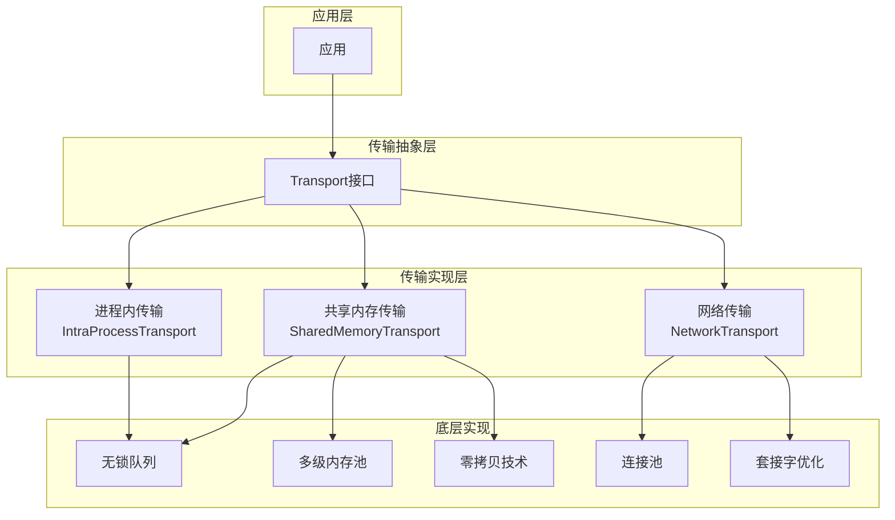
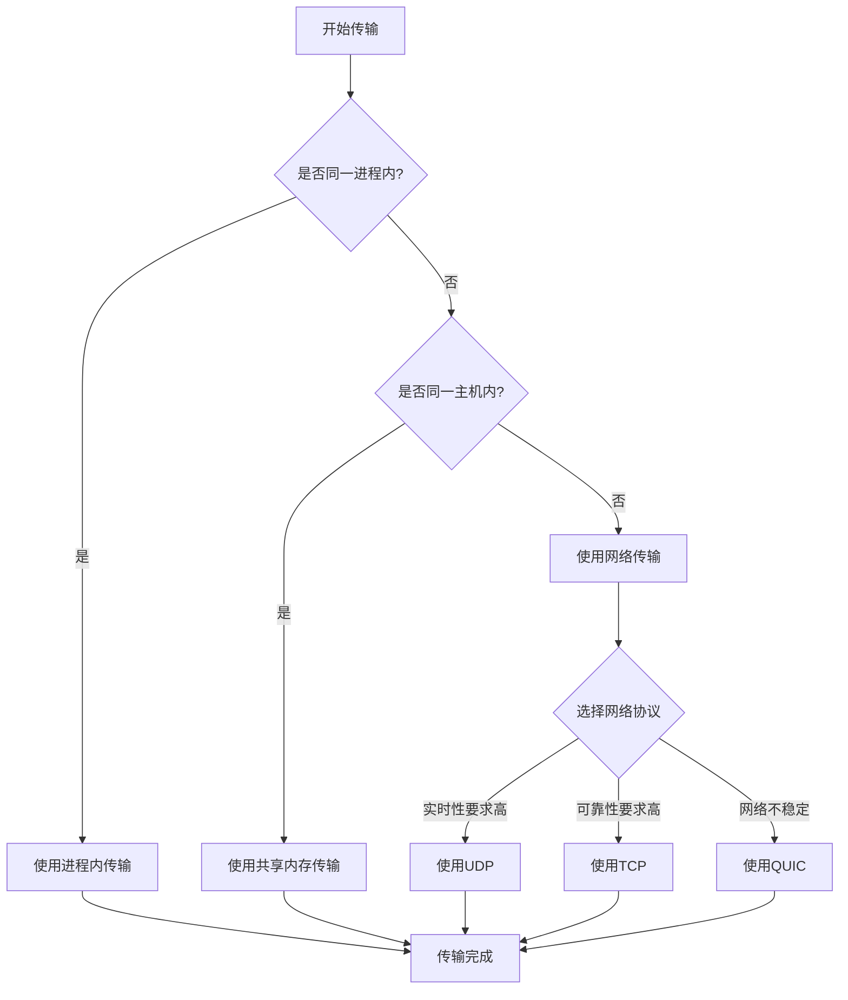

# 多协议支持

## 1. 模块概述

多协议支持是AuroraRT 车载实时消息中间件的核心功能之一，旨在提供多种传输方式的支持，包括进程内通信、共享内存通信和网络通信，根据不同的应用场景和通信需求选择最优的传输方式，确保消息传递的可靠性和高效性。

## 2. 设计理念

### 2.1 核心设计目标
  - **多传输方式支持**：同时支持进程内通信、共享内存通信和网络通信
  - **统一接口**：为上层应用提供统一的API接口，屏蔽底层传输差异
  - **性能优先**：根据场景选择性能最优的传输方式
  - **可靠性保证**：确保关键消息的可靠传输

### 2.2 设计原则
  - **传输抽象**：通过抽象层隔离不同传输方式的实现细节
  - **模块化设计**：每种传输方式作为独立模块实现，便于扩展和维护
  - **零拷贝优先**：在可能的情况下使用零拷贝技术提高性能
  - **批量操作**：支持批量发送和接收，减少系统开销

## 3. 技术实现

### 3.1 传输抽象

AuroraRT实现了统一的Transport接口，所有传输方式都继承自该接口，提供一致的API：

```cpp
class Transport {
public:
    virtual void init() = 0;
    virtual void start() = 0;
    virtual void stop() = 0;
    virtual bool send(const void* data, size_t size) = 0;
    virtual bool receive(void* data, size_t size) = 0;
    virtual TransportStatus getStatus() const = 0;
    virtual void printStats() const = 0;
};
```

### 3.2 传输架构



### 3.3 传输方式实现

#### 3.3.1 进程内传输 (IntraProcessTransport)
  - **实现方式**：基于无锁队列的进程内通信
  - **核心功能**：
    - 无锁队列实现（基于Michael-Scott算法）
    - 批量操作支持
    - 统计信息收集
  - **应用场景**：同一进程内不同模块之间的通信，超低延迟

#### 3.3.2 共享内存传输 (SharedMemoryTransport)
  - **实现方式**：基于共享内存和无锁队列的进程间通信
  - **核心功能**：
    - 多级内存池管理
    - 零拷贝数据传输
    - CRC校验确保数据完整性
    - 批量发送和接收
    - 共享内存自动扩展
  - **应用场景**：同一主机内不同进程之间的通信，低延迟高吞吐量

#### 3.3.3 网络传输 (NetworkTransport)
  - **实现方式**：支持TCP、UDP和QUIC三种网络协议
  - **核心功能**：
    - 连接池管理
    - 套接字优化
    - 超时设置
    - 重连机制
    - 协议智能切换
  - **应用场景**：不同主机之间的通信，支持跨网络边界
  - **协议特性**：
    - **UDP**：低延迟，适合实时数据传输
    - **TCP**：可靠传输，适合需要确保数据完整性的场景
    - **QUIC**：低延迟、可靠传输、连接迁移，适合不稳定网络环境

### 3.4 关键技术实现

#### 3.4.1 无锁队列
  - **实现方式**：基于Michael-Scott算法的增强版无锁队列
  - **核心特性**：
    - 无锁设计，高并发性能
    - 支持批量入队和出队
    - 原子操作保证线程安全
    - 统计信息收集

#### 3.4.2 多级内存池
  - **实现方式**：基于不同块大小的多级内存池
  - **核心特性**：
    - 块大小指数增长（128B, 256B, 512B, 1KB, 2KB, 4KB, 8KB, 16KB, 32KB, 64KB）
    - 无锁设计，高并发性能
    - 批量分配和释放
    - 内存使用统计

#### 3.4.3 零拷贝技术
  - **实现方式**：直接访问共享内存数据
  - **核心特性**：
    - 避免数据拷贝，提高性能
    - 支持类型化缓冲区访问
    - 安全的内存管理

## 4. 传输方式选择策略

### 4.1 传输方式选择流程



### 4.2 基于通信场景的选择

| 通信场景 | 推荐传输方式 | 选择理由 |
|---------|-------------|----------|
| 同一进程内通信 | 进程内传输 | 超低延迟，无系统调用开销 |
| 同一主机内进程间通信 | 共享内存传输 | 低延迟，高吞吐量，零拷贝 |
| 不同主机间通信（实时性要求高） | 网络传输（UDP） | 低延迟，适合实时数据传输 |
| 不同主机间通信（可靠性要求高） | 网络传输（TCP） | 可靠传输，确保数据完整性 |
| 不同主机间通信（网络不稳定） | 网络传输（QUIC） | 低延迟、可靠传输、连接迁移 |
| 实时控制指令 | 进程内/共享内存传输 | 超低延迟，确保控制指令及时执行 |
| 大文件传输 | 共享内存/网络传输（TCP） | 高吞吐量，可靠传输 |
| 传感器数据 | 共享内存/网络传输（UDP） | 高吞吐量，适合实时数据采集 |

### 4.3 基于性能要求的选择

| 性能要求 | 推荐传输方式 | 选择理由 |
|---------|-------------|----------|
| 最低延迟 | 进程内传输 | 无系统调用，直接内存操作 |
| 高吞吐量 | 共享内存传输 | 零拷贝，批量操作 |
| 跨网络通信（低延迟） | 网络传输（UDP） | 低延迟，适合实时数据传输 |
| 跨网络通信（可靠） | 网络传输（TCP） | 可靠传输，确保数据完整性 |
| 跨网络通信（不稳定网络） | 网络传输（QUIC） | 低延迟、可靠传输、连接迁移 |
| 可靠性要求高 | 共享内存/网络传输（TCP） | 支持CRC校验和可靠传输 |

## 5. 核心功能

### 5.1 传输管理
  - **功能**：管理所有支持的传输方式，提供传输的初始化、启动和停止
  - **使用方式**：
    ```cpp
    // 创建进程内传输
    auto intraProcessTransport = std::make_unique<IntraProcessTransport>();
    intraProcessTransport->init();
    intraProcessTransport->start();
    
    // 创建共享内存传输
    auto sharedMemoryTransport = std::make_unique<SharedMemoryTransport>("test_shm", 1024 * 1024);
    sharedMemoryTransport->init();
    sharedMemoryTransport->start();
    
    // 创建网络传输
    auto networkTransport = std::make_unique<NetworkTransport>("192.168.1.1", 8080);
    networkTransport->init();
    networkTransport->start();
    ```

### 5.2 数据发送
  - **功能**：支持单条和批量数据发送
  - **使用方式**：
    ```cpp
    // 单条数据发送
    std::string data = "Hello, AuroraRT!";
    transport->send(data.data(), data.size());
    
    // 批量数据发送
    std::vector<std::pair<const void*, size_t>> dataItems;
    dataItems.push_back({data1.data(), data1.size()});
    dataItems.push_back({data2.data(), data2.size()});
    transport->sendBatch(dataItems);
    ```

### 5.3 数据接收
  - **功能**：支持单条和批量数据接收
  - **使用方式**：
    ```cpp
    // 单条数据接收
    char buffer[1024];
    transport->receive(buffer, sizeof(buffer));
    
    // 批量数据接收
    std::vector<std::pair<void*, size_t>> dataItems;
    dataItems.push_back({buffer1, sizeof(buffer1)});
    dataItems.push_back({buffer2, sizeof(buffer2)});
    transport->receiveBatch(dataItems);
    ```

### 5.4 零拷贝操作
  - **功能**：支持零拷贝数据访问
  - **使用方式**：
    ```cpp
    // 零拷贝写入
    void* writeBuffer = transport->getWriteBuffer(1024);
    if (writeBuffer) {
        memcpy(writeBuffer, data.data(), data.size());
        transport->commitWrite(data.size());
    }
    
    // 零拷贝读取
    const void* readBuffer = transport->getReadBuffer();
    if (readBuffer) {
        // 使用readBuffer
        transport->commitRead();
    }
    ```

### 5.5 统计信息
  - **功能**：提供传输统计信息
  - **使用方式**：
    ```cpp
    transport->printStats();
    ```

## 6. 性能优化策略

### 6.1 传输特定优化

#### 6.1.1 进程内传输优化
  - **无锁设计**：使用无锁队列，避免线程竞争
  - **批量操作**：支持批量入队和出队，减少操作次数
  - **移动语义**：使用移动语义减少数据拷贝

#### 6.1.2 共享内存传输优化
  - **多级内存池**：根据数据大小选择合适的内存块
  - **零拷贝**：直接访问共享内存数据，避免拷贝
  - **CRC校验**：确保数据完整性，减少错误处理开销
  - **共享内存自动扩展**：根据需求动态扩展共享内存

#### 6.1.3 网络传输优化
  - **连接池**：预创建连接，减少连接建立开销
  - **套接字优化**：设置合适的缓冲区大小和超时时间
  - **非阻塞模式**：使用非阻塞I/O，提高并发性能

### 6.2 通用优化
  - **批量操作**：支持批量发送和接收，减少系统调用次数
  - **内存管理**：优化内存分配和释放，减少内存碎片
  - **统计信息**：收集传输统计信息，为优化提供依据

## 7. 性能指标

### 7.1 延迟指标

| 传输方式 | 传输延迟 | 特点 |
|---------|---------|------|
| 进程内传输 | < 1μs | 超低延迟，无系统调用 |
| 共享内存传输 | ~1-5μs | 低延迟，零拷贝 |
| 网络传输 | ~100μs-1ms | 依赖网络条件 |

### 7.2 吞吐量指标

| 传输方式 | 最大吞吐量 | 特点 |
|---------|-----------|------|
| 进程内传输 | > 10GB/s | 内存带宽限制 |
| 共享内存传输 | > 5GB/s | 内存带宽限制 |
| 网络传输 | 取决于网络带宽 | 网络带宽限制 |

### 7.3 可靠性指标

| 传输方式 | 可靠性 | 特点 |
|---------|---------|------|
| 进程内传输 | 100% | 内存操作，无网络丢包 |
| 共享内存传输 | 99.99% | CRC校验，确保数据完整性 |
| 网络传输 | 99%+ | 依赖网络质量，UDP可能丢包 |

## 8. 使用方法

### 8.1 进程内传输使用

```cpp
// 创建进程内传输
auto intraProcessTransport = std::make_unique<IntraProcessTransport>();

// 初始化和启动
intraProcessTransport->init();
intraProcessTransport->start();

// 发送数据
std::string data = "Hello, IntraProcess!";
intraProcessTransport->send(data.data(), data.size());

// 接收数据
char buffer[1024];
if (intraProcessTransport->receive(buffer, sizeof(buffer))) {
    std::cout << "Received: " << std::string(buffer) << std::endl;
}

// 打印统计信息
intraProcessTransport->printStats();

// 停止
intraProcessTransport->stop();
```

### 8.2 共享内存传输使用

```cpp
// 创建共享内存传输（1MB大小）
auto sharedMemoryTransport = std::make_unique<SharedMemoryTransport>("test_shm", 1024 * 1024);

// 初始化和启动
sharedMemoryTransport->init();
sharedMemoryTransport->start();

// 发送数据
std::string data = "Hello, SharedMemory!";
sharedMemoryTransport->send(data.data(), data.size());

// 零拷贝发送
void* writeBuffer = sharedMemoryTransport->getWriteBuffer(data.size());
if (writeBuffer) {
    memcpy(writeBuffer, data.data(), data.size());
    sharedMemoryTransport->commitWrite(data.size());
}

// 接收数据
char buffer[1024];
if (sharedMemoryTransport->receive(buffer, sizeof(buffer))) {
    std::cout << "Received: " << std::string(buffer) << std::endl;
}

// 零拷贝读取
const void* readBuffer = sharedMemoryTransport->getReadBuffer();
if (readBuffer) {
    // 假设知道数据大小
    std::string receivedData(static_cast<const char*>(readBuffer), data.size());
    std::cout << "Received (zero-copy): " << receivedData << std::endl;
    sharedMemoryTransport->commitRead();
}

// 批量发送
std::vector<std::pair<const void*, size_t>> dataItems;
dataItems.push_back({"Message 1", 9});
dataItems.push_back({"Message 2", 9});
sharedMemoryTransport->sendBatch(dataItems);

// 打印统计信息
sharedMemoryTransport->printStats();

// 停止
sharedMemoryTransport->stop();
```

### 8.3 网络传输使用

#### 8.3.1 UDP协议使用

```cpp
// 创建网络传输（UDP）
auto udpTransport = std::make_unique<NetworkTransport>("192.168.1.1", 8080, NetworkProtocol::UDP);

// 初始化和启动
udpTransport->init();
udpTransport->start();

// 发送数据
std::string data = "Hello, UDP!";
udpTransport->send(data.data(), data.size());

// 接收数据
char buffer[1024];
if (udpTransport->receive(buffer, sizeof(buffer))) {
    std::cout << "Received: " << std::string(buffer) << std::endl;
}

// 打印统计信息
udpTransport->printStats();

// 停止
udpTransport->stop();
```

#### 8.3.2 TCP协议使用

```cpp
// 创建网络传输（TCP）
auto tcpTransport = std::make_unique<NetworkTransport>("192.168.1.1", 8080, NetworkProtocol::TCP);

// 初始化和启动
tcpTransport->init();
tcpTransport->start();

// 发送数据
std::string data = "Hello, TCP!";
tcpTransport->send(data.data(), data.size());

// 接收数据
char buffer[1024];
if (tcpTransport->receive(buffer, sizeof(buffer))) {
    std::cout << "Received: " << std::string(buffer) << std::endl;
}

// 打印统计信息
tcpTransport->printStats();

// 停止
tcpTransport->stop();
```

#### 8.3.3 QUIC协议使用

```cpp
// 创建网络传输（QUIC）
auto quicTransport = std::make_unique<NetworkTransport>("192.168.1.1", 8080, NetworkProtocol::QUIC);

// 初始化和启动
quicTransport->init();
quicTransport->start();

// 发送数据
std::string data = "Hello, QUIC!";
quicTransport->send(data.data(), data.size());

// 接收数据
char buffer[1024];
if (quicTransport->receive(buffer, sizeof(buffer))) {
    std::cout << "Received: " << std::string(buffer) << std::endl;
}

// 打印统计信息
quicTransport->printStats();

// 停止
quicTransport->stop();
```

## 9. 最佳实践

### 9.1 传输方式选择
  - **同一进程内**：使用进程内传输，获得最低延迟
  - **同一主机内**：使用共享内存传输，获得低延迟和高吞吐量
  - **不同主机间**：使用网络传输，支持跨网络通信
  - **实时控制**：优先使用进程内或共享内存传输，确保低延迟
  - **大文件传输**：使用共享内存或网络传输，支持高吞吐量

### 9.2 性能优化
  - **批量操作**：尽量使用批量发送和接收，减少系统调用次数
  - **零拷贝**：在共享内存传输中使用零拷贝技术，提高性能
  - **内存管理**：合理设置共享内存大小，避免频繁扩展
  - **连接池**：在网络传输中充分利用连接池，减少连接建立开销

### 9.3 错误处理
  - **传输状态检查**：定期检查传输状态，及时发现问题
  - **错误重试**：对网络传输实现合理的重试机制
  - **降级策略**：在网络条件恶劣时，考虑降级到更可靠的传输方式

### 9.4 监控和调优
  - **统计信息**：定期查看传输统计信息，了解性能状况
  - **内存使用**：监控共享内存使用情况，避免内存泄漏
  - **网络状态**：监控网络传输的延迟和丢包率

## 10. 故障排查

### 10.1 常见问题
  - **共享内存创建失败**：检查权限和系统限制
  - **数据传输错误**：检查缓冲区大小和数据完整性
  - **网络连接失败**：检查网络配置和防火墙设置
  - **性能下降**：检查内存使用和系统资源

### 10.2 排查工具
  - **日志分析**：分析传输相关的日志信息
  - **性能分析**：使用性能分析工具分析传输性能
  - **网络诊断**：使用ping、netstat等工具检查网络连接
  - **内存分析**：使用内存分析工具检查共享内存使用

## 11. 总结

多协议支持模块是AuroraRT 车载实时消息中间件的核心功能之一，通过统一的传输抽象和多种传输方式的实现，为上层应用提供了灵活、高效的通信机制。该模块不仅支持进程内、共享内存和网络三种传输方式，还通过零拷贝、批量操作等技术优化了性能，确保了消息传递的可靠性和高效性。

通过合理选择传输方式和优化配置，可以显著提高车载系统的通信性能和可靠性，为自动驾驶、车载信息娱乐、车载控制等系统提供有力的通信支持。同时，模块化的设计也为未来扩展支持新的传输方式奠定了基础。

