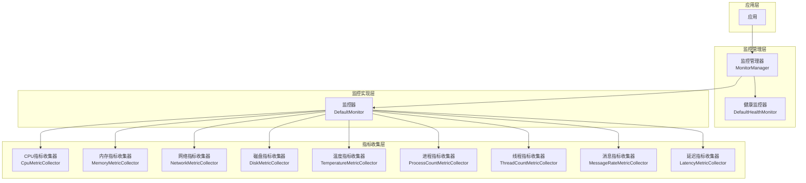
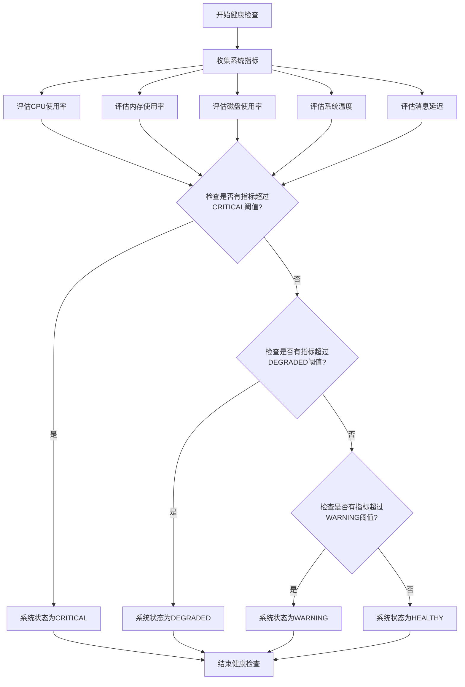

# 健康检查与故障自愈

## 1. 模块概述

健康检查与故障自愈是AuroraRT 车载实时消息中间件的核心功能之一，旨在提供实时的系统健康监控、指标收集和健康状态评估能力，确保车载系统的高可靠性和可用性。该模块通过多维度的指标收集和分析，实时评估系统健康状态，并为故障检测和处理提供依据。

## 2. 设计理念

### 2.1 核心设计目标
  - **实时监控**：实时监控系统状态，及时发现异常
  - **多维度指标**：从多个维度收集系统指标，全面评估健康状态
  - **低开销**：健康检查开销小，不影响核心业务性能
  - **跨平台支持**：支持在不同操作系统平台上运行
  - **可扩展性**：支持自定义指标收集器和监控器

### 2.2 设计原则
  - **模块化设计**：将指标收集、监控和健康检查分离为独立模块
  - **分级健康状态**：根据指标阈值划分不同级别的健康状态
  - **平台适配**：针对不同平台提供相应的指标收集实现
  - **可配置性**：支持配置监控参数和阈值

## 3. 技术实现

### 3.1 健康监控架构



### 3.2 核心组件

#### 3.2.1 指标收集器 (MetricCollector)
  - **实现方式**：抽象基类 + 具体实现，支持多种指标类型
  - **核心实现**：
    - `CpuMetricCollector`：收集CPU使用率
    - `MemoryMetricCollector`：收集内存使用率
    - `NetworkMetricCollector`：收集网络传输速率
    - `DiskMetricCollector`：收集磁盘使用率和IO速率
    - `TemperatureMetricCollector`：收集系统温度
    - `ProcessCountMetricCollector`：收集进程数量
    - `ThreadCountMetricCollector`：收集线程数量
    - `MessageRateMetricCollector`：收集消息处理速率
    - `LatencyMetricCollector`：收集消息处理延迟

#### 3.2.2 监控器 (Monitor)
  - **实现方式**：`DefaultMonitor` 实现，管理多个指标收集器
  - **核心功能**：
    - 启动和停止监控
    - 收集和汇总指标
    - 评估健康状态
    - 支持添加自定义指标收集器

#### 3.2.3 健康监控器 (HealthMonitor)
  - **实现方式**：`DefaultHealthMonitor` 实现，综合评估系统健康状态
  - **核心功能**：
    - 检查各组件健康状态
    - 综合评估系统整体健康状态
    - 支持平台、内存、传输层、通信层、安全模块和节点的健康检查

#### 3.2.4 监控管理器 (MonitorManager)
  - **实现方式**：单例模式，管理所有监控器和指标收集器
  - **核心功能**：
    - 初始化和管理监控系统
    - 创建和管理监控器
    - 添加和管理指标收集器
    - 收集和汇总指标
    - 评估系统健康状态

### 3.3 健康状态

AuroraRT定义了四级健康状态：
  - **HEALTHY**：系统运行正常
  - **DEGRADED**：系统性能下降，但核心功能正常
  - **WARNING**：系统存在潜在问题，需要关注
  - **CRITICAL**：系统出现严重问题，核心功能可能受影响

### 3.4 平台适配

指标收集器针对不同平台提供了相应的实现：
  - **Windows**：使用Windows API收集系统指标
  - **Linux**：使用/proc文件系统收集系统指标
  - **其他平台**：使用模拟数据

## 4. 核心功能

### 4.1 指标收集

#### 4.1.1 CPU使用率收集
  - **实现方式**：
    - Windows：使用`GetSystemTimes` API
    - Linux：读取`/proc/stat`文件
  - **核心功能**：计算CPU使用率百分比

#### 4.1.2 内存使用率收集
  - **实现方式**：
    - Windows：使用`GlobalMemoryStatusEx` API
    - Linux：读取`/proc/meminfo`文件
  - **核心功能**：计算内存使用率百分比

#### 4.1.3 网络传输速率收集
  - **实现方式**：
    - Windows：使用`GetIfTable` API
    - Linux：读取`/proc/net/dev`文件
  - **核心功能**：计算网络发送和接收速率（MB/s）

#### 4.1.4 磁盘使用率和IO收集
  - **实现方式**：
    - Windows：使用`GetDiskFreeSpaceEx`和`GetProcessIoCounters` API
    - Linux：读取`/proc/mounts`和`/proc/diskstats`文件
  - **核心功能**：计算磁盘使用率百分比和IO速率（MB/s）

#### 4.1.5 系统温度收集
  - **实现方式**：
    - Windows：使用WMI API
    - Linux：读取`/sys/class/thermal/thermal_zone0/temp`文件
  - **核心功能**：获取系统温度（°C）

#### 4.1.6 进程和线程数量收集
  - **实现方式**：
    - Windows：使用`EnumProcesses`和`GetProcessHandleCount` API
    - Linux：读取`/proc`目录和进程状态文件
  - **核心功能**：统计系统进程和线程数量

#### 4.1.7 消息速率和延迟收集
  - **实现方式**：模拟数据（可扩展为实际收集）
  - **核心功能**：模拟消息处理速率和延迟

### 4.2 健康状态评估

#### 4.2.1 健康状态评估流程



#### 4.2.2 监控器健康状态评估
  - **实现方式**：基于收集的指标阈值评估
  - **核心逻辑**：
    - CPU使用率 > 90% → CRITICAL
    - 内存使用率 > 90% → CRITICAL
    - 磁盘使用率 > 95% → CRITICAL
    - 温度 > 85°C → CRITICAL
    - 延迟 > 1000μs → CRITICAL
    - CPU使用率 > 70% → DEGRADED
    - 内存使用率 > 70% → DEGRADED
    - 磁盘使用率 > 80% → DEGRADED
    - 温度 > 70°C → DEGRADED
    - 延迟 > 100μs → DEGRADED

#### 4.2.3 系统整体健康状态评估
  - **实现方式**：综合各组件健康状态
  - **核心逻辑**：
    - 任何组件处于CRITICAL状态 → 系统CRITICAL
    - 任何组件处于WARNING状态 → 系统WARNING
    - 所有组件处于HEALTHY状态 → 系统HEALTHY

### 4.3 组件健康检查

#### 4.3.1 平台健康检查
  - **实现方式**：检查系统基本功能
  - **核心逻辑**：
    - Windows：检查处理器数量
    - Linux：检查/proc/cpuinfo文件

#### 4.3.2 内存健康检查
  - **实现方式**：基于内存使用率指标
  - **核心逻辑**：
    - 内存使用率 > 90% → CRITICAL
    - 内存使用率 > 70% → WARNING

#### 4.3.3 传输层健康检查
  - **实现方式**：检查传输层基本功能
  - **核心逻辑**：检查共享内存和网络连接是否正常

#### 4.3.4 通信层健康检查
  - **实现方式**：检查通信模式是否正常
  - **核心逻辑**：检查发布-订阅等通信模式是否正常工作

#### 4.3.5 安全模块健康检查
  - **实现方式**：检查安全功能是否正常
  - **核心逻辑**：检查认证和加密功能是否正常

#### 4.3.6 节点健康检查
  - **实现方式**：检查节点基本功能
  - **核心逻辑**：检查节点网络连接和请求处理能力

## 5. 性能指标

### 5.1 指标收集性能

| 指标类型 | 收集频率 | 收集延迟 | 资源占用 |
|---------|---------|---------|----------|
| CPU使用率 | 可配置 | < 1ms | 极低 |
| 内存使用率 | 可配置 | < 1ms | 极低 |
| 网络传输速率 | 可配置 | < 5ms | 低 |
| 磁盘使用率和IO | 可配置 | < 10ms | 低 |
| 系统温度 | 可配置 | < 5ms | 低 |
| 进程和线程数量 | 可配置 | < 10ms | 低 |
| 消息速率和延迟 | 可配置 | < 1ms | 极低 |

### 5.2 健康检查性能
  - **内存占用**：约100KB
  - **CPU占用**：< 0.5%
  - **健康状态评估延迟**：< 5ms

## 6. 使用方法

### 6.1 监控系统初始化

```cpp
// 初始化监控管理器
MonitorManager::instance().init();

// 启动监控系统
MonitorManager::instance().start();
```

### 6.2 创建和使用监控器

```cpp
// 创建监控器
auto monitor = MonitorManager::instance().createMonitor("node_monitor");

// 启动监控器
monitor->start();

// 收集指标
auto metrics = monitor->collectMetrics();
for (const auto& metric : metrics) {
    std::cout << "Metric: " << metric.getName() << " = " << metric.getValue() << std::endl;
}

// 获取健康状态
HealthStatus status = monitor->getHealthStatus();
std::cout << "Health status: " << status << std::endl;

// 停止监控器
monitor->stop();
```

### 6.3 系统健康状态检查

```cpp
// 获取系统健康状态
HealthStatus systemStatus = MonitorManager::instance().getHealthStatus();
std::cout << "System health status: " << systemStatus << std::endl;

// 获取各组件健康状态
auto componentHealth = MonitorManager::instance().getComponentHealth();
for (const auto& [component, status] : componentHealth) {
    std::cout << "Component " << component << " health status: " << status << std::endl;
}
```

### 6.4 添加自定义指标收集器

```cpp
// 创建自定义指标收集器
class CustomMetricCollector : public MetricCollector {
public:
    std::string getName() const override {
        return "custom_metric";
    }
    
    void start() override {
        // 初始化
    }
    
    void stop() override {
        // 清理
    }
    
    std::vector<Metric> collectMetrics() override {
        std::vector<Metric> metrics;
        // 收集自定义指标
        metrics.emplace_back(MetricType::CUSTOM, 42.0, std::chrono::steady_clock::now());
        return metrics;
    }
};

// 添加到监控管理器
MonitorManager::instance().addMetricCollector(std::make_shared<CustomMetricCollector>());
```

## 7. 最佳实践

### 7.1 监控配置
  - **收集频率**：根据指标重要性和系统负载设置合适的收集频率
  - **阈值设置**：根据系统性能和应用需求设置合理的健康状态阈值
  - **监控范围**：根据系统规模和重要性选择需要监控的指标

### 7.2 指标分析
  - **趋势分析**：分析指标趋势，预测潜在问题
  - **关联分析**：分析不同指标之间的关联关系，定位问题根因
  - **基线建立**：建立系统正常运行时的指标基线，便于异常检测

### 7.3 监控和告警
  - **集中监控**：建立集中的监控系统，统一管理所有节点的健康状态
  - **分级告警**：根据健康状态级别设置不同级别的告警
  - **告警策略**：制定合理的告警策略，避免告警风暴

### 7.4 测试策略
  - **压力测试**：在高负载下测试监控系统的性能和准确性
  - **故障注入**：注入故障，测试监控系统的检测能力
  - **恢复测试**：测试系统从故障中恢复的能力

## 8. 故障排查

### 8.1 常见问题
  - **指标收集失败**：检查平台支持情况和权限设置
  - **健康状态误报**：检查阈值设置和系统负载情况
  - **监控系统性能问题**：检查收集频率和系统资源使用
  - **跨平台兼容性问题**：检查平台特定实现是否正确

### 8.2 排查工具
  - **日志分析**：分析监控系统的日志信息
  - **性能分析**：使用性能分析工具分析监控系统性能
  - **手动验证**：手动验证系统状态，确认监控结果
  - **平台工具**：使用平台特定工具检查系统状态

## 9. 总结

健康检查与故障自愈模块是AuroraRT 车载实时消息中间件的核心功能之一，通过多维度的指标收集和健康状态评估，为系统运维和故障处理提供了有力的支持。该模块不仅能够实时监控系统状态，及时发现异常，还能够为故障检测和处理提供依据，确保车载系统的高可靠性和可用性。

通过合理的监控配置和指标分析，可以显著提高车载系统的可靠性和可维护性，为自动驾驶、车载信息娱乐、车载控制等系统提供有力的支持。同时，该模块的可扩展性和跨平台支持也为未来的功能增强和场景适配奠定了基础。

