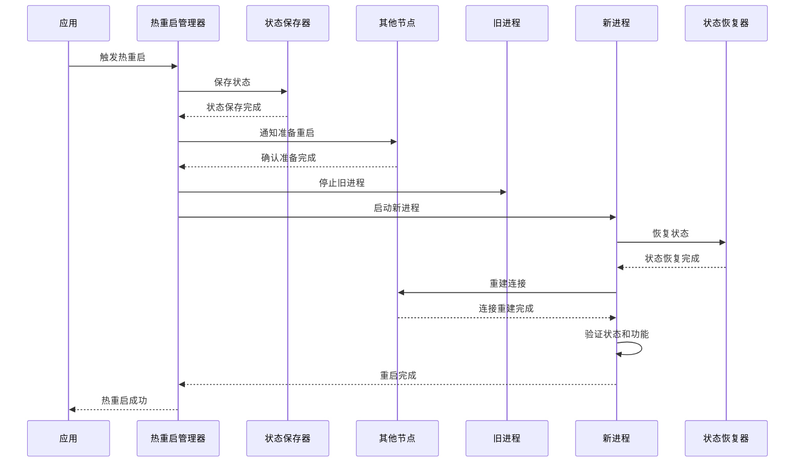

# 热重启

## 1. 模块概述

热重启是AuroraRT 车载实时消息中间件的核心功能之一，旨在提供节点的快速重启能力，在重启过程中保存和恢复节点状态，最小化服务中断时间，确保车载系统的高可用性

## 2. 设计理念

### 2.1 核心设计目标
  - **快速重启**：热重启时间 < 5ms，最小化服务中断
  - **状态保存**：在重启前保存节点的关键状态
  - **状态恢复**：在重启后恢复节点的关键状态
  - **无丢包保证**：确保重启过程中不丢失消息
  - **高可靠**：确保热重启过程的可靠性，避免重启失败

### 2.2 设计原则
  - **最小化状态**：只保存必要的状态，减少重启时间
  - **一致性保证**：确保状态保存和恢复的一致性
  - **原子操作**：热重启过程作为原子操作，要么成功，要么回滚
  - **可配置性**：热重启策略可配置，适应不同场景

## 3. 技术实现

### 3.1 热重启管理器

#### 3.1.1 实现方式
  - **自研热重启机制**：基于自研的状态保存和恢复逻辑
  - **增强设计**：优化状态保存和恢复机制，提高重启成功率

#### 3.1.2 核心组件
  - **HotRestartManager**：热重启管理器，协调整个重启过程
  - **StateSaver**：状态保存器，保存节点状态
  - **StateRestorer**：状态恢复器，恢复节点状态

### 3.2 状态管理

#### 3.2.1 状态类型
  - **配置状态**：节点的配置信息
  - **运行时状态**：节点的运行时信息
  - **连接状态**：节点的连接信息
  - **消息状态**：节点的消息队列状态

#### 3.2.2 状态存储
  - **共享内存**：使用共享内存储存状态，确保重启后可访问
  - **持久化存储**：对于需要持久化的状态，存储到磁盘

### 3.3 重启流程

#### 3.3.1 热重启时序图



#### 3.3.2 重启前准备
  - **状态保存**：保存节点的关键状态到共享内存
  - **连接管理**：通知其他节点准备重启
  - **消息处理**：处理完当前消息，暂停新消息处理

#### 3.3.3 重启执行
  - **进程停止**：停止当前节点进程
  - **进程启动**：启动新的节点进程
  - **状态恢复**：从共享内存恢复节点状态
  - **连接重建**：重建与其他节点的连接

#### 3.3.4 重启后验证
  - **状态验证**：验证节点状态是否正确恢复
  - **功能验证**：验证节点功能是否正常
  - **性能验证**：验证节点性能是否正常

## 4. 核心功能

### 4.1 状态保存

#### 4.1.1 保存内容
  - **配置信息**：节点的配置参数和选项
  - **运行时数据**：节点的运行时变量和状态
  - **连接信息**：与其他节点的连接状态
  - **消息队列**：未处理的消息队列
  - **订阅信息**：订阅的主题和服务

#### 4.1.2 保存策略
  - **增量保存**：只保存变化的状态，减少保存时间
  - **异步保存**：异步保存状态，减少对主业务的影响
  - **压缩存储**：对状态进行压缩，减少存储占用

### 4.2 状态恢复

#### 4.2.1 恢复内容
  - **配置信息**：恢复节点的配置参数和选项
  - **运行时数据**：恢复节点的运行时变量和状态
  - **连接信息**：恢复与其他节点的连接状态
  - **消息队列**：恢复未处理的消息队列
  - **订阅信息**：恢复订阅的主题和服务

#### 4.2.2 恢复策略
  - **增量恢复**：只恢复必要的状态，减少恢复时间
  - **验证恢复**：验证恢复的状态是否正确
  - **错误处理**：当恢复失败时，使用默认状态

### 4.3 连接管理

#### 4.3.1 重启前处理
  - **通知其他节点**：通知其他节点当前节点即将重启
  - **暂停连接**：暂停与其他节点的连接
  - **保存连接状态**：保存连接的状态信息

#### 4.3.2 重启后处理
  - **重建连接**：重建与其他节点的连接
  - **恢复连接状态**：恢复连接的状态信息
  - **同步数据**：与其他节点同步数据

### 4.4 消息管理

#### 4.4.1 重启前处理
  - **处理完当前消息**：确保当前消息处理完成
  - **暂停新消息**：暂停接收新消息
  - **保存消息队列**：保存未处理的消息队列

#### 4.4.2 重启后处理
  - **恢复消息队列**：恢复未处理的消息队列
  - **重启消息处理**：重启消息处理逻辑
  - **接收新消息**：开始接收新消息

## 5. 性能指标

### 5.1 重启时间

| 阶段 | 时间 |
|------|------|
| 状态保存 | < 1ms |
| 进程停止 | < 1ms |
| 进程启动 | < 2ms |
| 状态恢复 | < 1ms |
| 总重启时间 | < 5ms |

### 5.2 服务中断时间
  - **服务中断时间**：10ms
  - **消息丢失率**：0%
  - **连接重建时间**：50ms

### 5.3 资源占用
  - **内存占用**：1MB（状态存储）
  - **CPU占用**：1%（重启过程）

## 6. 使用方法

### 6.1 热重启配置

```cpp
// 配置热重启
HotRestartConfig config;

// 状态保存配置
config.stateSaving.enabled = true;
config.stateSaving.saveConfig = true;
config.stateSaving.saveRuntimeState = true;
config.stateSaving.saveConnectionState = true;
config.stateSaving.saveMessageQueue = true;

// 重启策略配置
config.restartPolicy.useHotRestart = true;
config.restartPolicy.maxRestartAttempts = 3;
config.restartPolicy.restartTimeout = 10; // ms

// 连接管理配置
config.connectionManagement.notifyPeers = true;
config.connectionManagement.reconnectTimeout = 50; // ms

// 消息管理配置
config.messageManagement.processPendingMessages = true;
config.messageManagement.saveMessageQueue = true;

// 应用配置
HotRestartManager::instance().setConfig(config);
```

### 6.2 触发热重启

#### 6.2.1 手动触发

```cpp
// 触发热重启
HotRestartManager manager;
bool success = manager.restartNode("sensor_node");
if (success) {
    std::cout << "Node restarted successfully" << std::endl;
} else {
    std::cout << "Failed to restart node" << std::endl;
}
```

#### 6.2.2 自动触发

```cpp
// 配置自动热重启
AutoRestartConfig autoRestartConfig;
autoRestartConfig.enabled = true;
autoRestartConfig.cpuThreshold = 90; // 90%
autoRestartConfig.memoryThreshold = 90; // 90%
autoRestartConfig.latencyThreshold = 10; // 10ms
autoRestartConfig.maxRestartsPerHour = 10;

// 应用配置
HotRestartManager::instance().setAutoRestartConfig(autoRestartConfig);
```

### 6.3 状态管理

```cpp
// 注册状态保存回调
StateSaver::instance().registerSaveCallback([](StateBuffer& buffer) {
    // 保存自定义状态
    CustomState state;
    state.value = 42;
    buffer.save("custom_state", state);
});

// 注册状态恢复回调
StateRestorer::instance().registerRestoreCallback([](const StateBuffer& buffer) {
    // 恢复自定义状态
    CustomState state;
    if (buffer.load("custom_state", state)) {
        std::cout << "Restored custom state: " << state.value << std::endl;
    }
});
```

### 6.4 监控热重启

```cpp
// 注册热重启事件回调
HotRestartManager::instance().registerEventCallback([](const HotRestartEvent& event) {
    std::cout << "Hot restart event: " << event.toString() << std::endl;
    
    switch (event.getType()) {
        case HotRestartEventType::STARTED:
            std::cout << "Hot restart started" << std::endl;
            break;
        case HotRestartEventType::STATE_SAVED:
            std::cout << "State saved successfully" << std::endl;
            break;
        case HotRestartEventType::RESTARTED:
            std::cout << "Process restarted" << std::endl;
            break;
        case HotRestartEventType::STATE_RESTORED:
            std::cout << "State restored successfully" << std::endl;
            break;
        case HotRestartEventType::COMPLETED:
            std::cout << "Hot restart completed successfully" << std::endl;
            break;
        case HotRestartEventType::FAILED:
            std::cout << "Hot restart failed: " << event.getReason() << std::endl;
            break;
    }
});
```

## 7. 最佳实践
### 7.1 状态管理
  - **最小化状态**：只保存必要的状态，减少重启时间
  - **状态验证**：确保保存和恢复的状态是有效的
  - **状态版本**：为状态添加版本号，确保兼容性
### 7.2 重启策略
  - **重启时机**：选择合适的时机进行热重启，避免在高负载时重启
  - **重启频率**：避免频繁热重启，影响系统稳定性
  - **重启验证**：重启后验证节点状态，确保恢复正常

### 7.3 监控和告警
  - **热重启监控**：监控热重启的频率和成功率
  - **告警设置**：当热重启失败或频繁发生时，发送告警
  - **日志记录**：详细记录热重启的过程和结果

### 7.4 测试策略
  - **热重启测试**：定期测试热重启功能，确保其正常工作
  - **压力测试**：在高负载下测试热重启，确保其可靠性
  - **恢复测试**：测试各种场景下的状态恢复，确保其正确性
## 8. 故障排查

### 8.1 常见问题
  - **热重启失败**：检查状态保存和恢复逻辑、节点配置和依赖服务
  - **状态恢复失败**：检查状态保存的完整性和兼容性
  - **连接重建失败**：检查网络连接和其他节点状态
  - **消息丢失**：检查消息处理逻辑和队列状态
### 8.2 排查工具
  - **热重启日志**：分析热重启的日志信息，查找失败原因
  - **状态检查**：检查保存的状态是否完整和有效
  - **连接测试**：测试节点间的连接是否正常
  - **性能分析**：分析热重启过程的性能瓶颈

## 9. 总结

热重启模块是AuroraRT 车载实时性消息中间件的核心功能之一，通过快速的状态保存和恢复机制，实现了节点的毫秒级重启动，最小化了服务中断时间，确保了车载系统的高可用性。该模块不仅能够在节点故障时快速恢复服务，还能够在系统升级和配置变更时实现无缝重启动，为车载系统的维护和升级提供了便利
通过合理的热重启配置和最佳实时性践，可以显著提高车载系统的可用性和可靠性，为自动驾驶、车载信息娱乐、车载控制等系统提供有力的支持。同时，该模块的可配置性和扩展性也为未来的功能增强和场景适配奠定了基础

