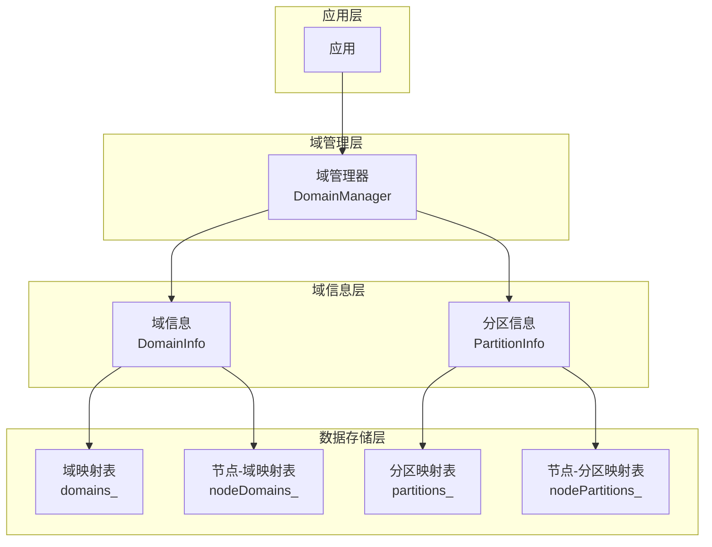
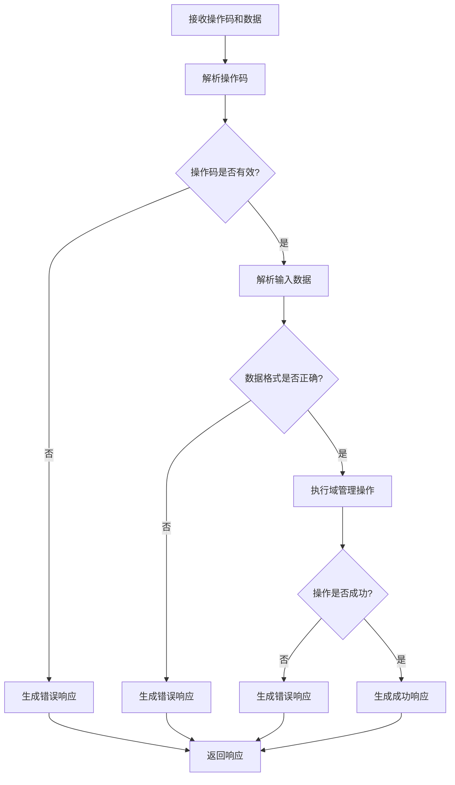

# 域管理
## 1. 模块概述

域管理是AuroraRT 车载实时消息中间件的核心功能之一，旨在提供域/分区级别的资源管理和隔离能力，支持大规模分布式系统的组织和管理。通过域管理，系统可以将节点组织成不同的域和分区，实现资源的逻辑隔离和管理。

## 2. 设计理念

### 2.1 核心设计目标
  - **域/分区组织**：将节点组织成域和分区，实现逻辑隔离
  - **操作码管理**：通过标准化的操作码进行域和分区管理
  - **线程安全**：确保域管理操作的线程安全性
  - **高效管理**：使用高效的数据结构和算法进行域管理
  - **扩展性**：支持动态创建和管理域和分区

### 2.2 设计原则
  - **层次化组织**：采用域-分区-节点的层次化组织方式
  - **操作码标准化**：使用标准化的操作码进行域管理操作
  - **线程安全**：所有域管理操作都是线程安全的
  - **最小开销**：域管理操作的开销最小化，不影响核心业务性能
  - **灵活性**：支持动态创建、删除、加入和离开域和分区

## 3. 技术实现

### 3.1 域管理架构



#### 3.1.1 核心组件
  - **DomainManager**：域管理器，负责域和分区的集中管理
  - **DomainInfo**：域信息类，管理域的基本信息和分区
  - **PartitionInfo**：分区信息类，管理分区的基本信息和节点

#### 3.1.2 数据结构
  - **domains_**：存储域信息的映射表（域名称 -> 域信息）
  - **partitions_**：存储分区信息的映射表（域名称 -> 分区名称 -> 分区信息）
  - **nodeDomains_**：存储节点-域关系的映射表（节点ID -> 域名称 -> 是否活跃）
  - **nodePartitions_**：存储节点-分区关系的映射表（节点ID -> 域名称 -> 分区名称 -> 是否活跃）

### 3.2 操作码定义

| 操作码 | 十六进制值 | 描述 |
|-------|-----------|------|
| CREATE_DOMAIN | 0x01 | 创建域 |
| DELETE_DOMAIN | 0x02 | 删除域 |
| JOIN_DOMAIN | 0x03 | 加入域 |
| LEAVE_DOMAIN | 0x04 | 离开域 |
| CREATE_PARTITION | 0x05 | 创建分区 |
| DELETE_PARTITION | 0x06 | 删除分区 |
| JOIN_PARTITION | 0x07 | 加入分区 |
| LEAVE_PARTITION | 0x08 | 离开分区 |
| LIST_DOMAINS | 0x09 | 列出所有域 |
| LIST_PARTITIONS | 0x0A | 列出域内所有分区 |
| GET_DOMAIN_INFO | 0x0B | 获取域信息 |
| GET_PARTITION_INFO | 0x0C | 获取分区信息 |

### 3.3 线程安全设计

- **互斥锁**：使用std::mutex确保所有域管理操作的线程安全性
- **原子操作**：使用std::atomic<bool>管理域和分区的活跃状态
- **锁粒度**：最小化锁的范围，提高并发性能

## 4. 核心功能

### 4.1 域管理

#### 4.1.1 创建域
  - **功能**：创建一个新的域
  - **参数**：域名称、描述（可选）
  - **返回**：创建成功/失败

#### 4.1.2 删除域
  - **功能**：删除一个域
  - **参数**：域名称
  - **返回**：删除成功/失败
  - **注意**：删除域时会自动移除该域下的所有分区和节点

#### 4.1.3 加入域
  - **功能**：将节点加入到域中
  - **参数**：域名称、节点ID
  - **返回**：加入成功/失败

#### 4.1.4 离开域
  - **功能**：将节点从域中移除
  - **参数**：域名称、节点ID
  - **返回**：离开成功/失败
  - **注意**：离开域时会自动从该域的所有分区中移除节点

### 4.2 分区管理

#### 4.2.1 创建分区
  - **功能**：在域中创建一个新的分区
  - **参数**：域名称、分区名称、描述（可选）
  - **返回**：创建成功/失败

#### 4.2.2 删除分区
  - **功能**：删除域中的一个分区
  - **参数**：域名称、分区名称
  - **返回**：删除成功/失败
  - **注意**：删除分区时会自动移除该分区下的所有节点

#### 4.2.3 加入分区
  - **功能**：将节点加入到分区中
  - **参数**：域名称、分区名称、节点ID
  - **返回**：加入成功/失败
  - **注意**：如果节点尚未加入域，会自动先加入域

#### 4.2.4 离开分区
  - **功能**：将节点从分区中移除
  - **参数**：域名称、分区名称、节点ID
  - **返回**：离开成功/失败

### 4.3 查询功能

#### 4.3.1 列出域
  - **功能**：列出所有活跃的域
  - **返回**：域名称列表

#### 4.3.2 列出分区
  - **功能**：列出域中所有活跃的分区
  - **参数**：域名称
  - **返回**：分区名称列表

#### 4.3.3 获取域信息
  - **功能**：获取域的详细信息
  - **参数**：域名称
  - **返回**：域信息对象

#### 4.3.4 获取分区信息
  - **功能**：获取分区的详细信息
  - **参数**：域名称、分区名称
  - **返回**：分区信息对象

### 4.4 节点管理

#### 4.4.1 获取节点所在的域
  - **功能**：获取节点加入的所有域
  - **参数**：节点ID
  - **返回**：域名称列表

#### 4.4.2 获取节点所在的分区
  - **功能**：获取节点在特定域中加入的所有分区
  - **参数**：节点ID、域名称
  - **返回**：分区名称列表

## 5. 操作码处理

### 5.1 操作码处理流程



### 5.2 操作码处理步骤

1. **接收操作码**：接收域管理操作的操作码和数据
2. **解析数据**：根据操作码解析输入数据
3. **执行操作**：执行相应的域管理操作
4. **生成响应**：生成操作结果的响应
5. **返回响应**：返回操作结果给调用者

### 5.3 操作码数据格式

| 操作码 | 数据格式 | 响应格式 |
|-------|---------|----------|
| CREATE_DOMAIN | 域名称 [描述] | SUCCESS 或 FAILED: 错误信息 |
| DELETE_DOMAIN | 域名称 | SUCCESS 或 FAILED: 错误信息 |
| JOIN_DOMAIN | 域名称 节点ID | SUCCESS 或 FAILED: 错误信息 |
| LEAVE_DOMAIN | 域名称 节点ID | SUCCESS 或 FAILED: 错误信息 |
| CREATE_PARTITION | 域名称 分区名称 [描述] | SUCCESS 或 FAILED: 错误信息 |
| DELETE_PARTITION | 域名称 分区名称 | SUCCESS 或 FAILED: 错误信息 |
| JOIN_PARTITION | 域名称 分区名称 节点ID | SUCCESS 或 FAILED: 错误信息 |
| LEAVE_PARTITION | 域名称 分区名称 节点ID | SUCCESS 或 FAILED: 错误信息 |
| LIST_DOMAINS | 无 | SUCCESS 域1 域2 ... |
| LIST_PARTITIONS | 域名称 | SUCCESS 分区1 分区2 ... |
| GET_DOMAIN_INFO | 域名称 | SUCCESS 域名称 描述 状态 |
| GET_PARTITION_INFO | 域名称 分区名称 | SUCCESS 分区名称 描述 状态 |

## 6. 性能指标

### 6.1 操作性能
  - **域创建时间**：< 1ms
  - **分区创建时间**：< 1ms
  - **节点加入域**：< 0.5ms
  - **节点加入分区**：< 0.5ms
  - **域列表查询**：< 0.1ms
  - **分区列表查询**：< 0.1ms

### 6.2 资源占用
  - **内存占用**：< 100KB（基础占用）
  - **CPU占用**：< 0.1%（空闲状态）
  - **并发能力**：支持1000+节点同时操作

## 7. 使用方法

### 7.1 域管理

```cpp
// 初始化域管理器
aurorart::domain::DomainManager::instance().init();

// 创建域
bool domainCreated = aurorart::domain::DomainManager::instance().createDomain("test_domain", "Test domain");

// 创建分区
bool partitionCreated = aurorart::domain::DomainManager::instance().createPartition("test_domain", "test_partition", "Test partition");

// 加入域
bool joinedDomain = aurorart::domain::DomainManager::instance().joinDomain("test_domain", "test_node");

// 加入分区
bool joinedPartition = aurorart::domain::DomainManager::instance().joinPartition("test_domain", "test_partition", "test_node");

// 列出域
auto domains = aurorart::domain::DomainManager::instance().listDomains();

// 列出分区
auto partitions = aurorart::domain::DomainManager::instance().listPartitions("test_domain");

// 关闭域管理器
aurorart::domain::DomainManager::instance().shutdown();
```

### 7.2 操作码处理

```cpp
// 处理创建域操作码
std::string response;
bool result = aurorart::domain::DomainManager::instance().processOpcode(
    aurorart::domain::DomainOpcode::CREATE_DOMAIN, 
    "new_domain New domain description", 
    response
);
std::cout << "Create domain result: " << result << ", response: " << response << std::endl;

// 处理列出域操作码
result = aurorart::domain::DomainManager::instance().processOpcode(
    aurorart::domain::DomainOpcode::LIST_DOMAINS, 
    "", 
    response
);
std::cout << "List domains result: " << result << ", response: " << response << std::endl;
```

## 8. 最佳实践

### 8.1 域设计
  - **域划分**：根据功能或物理位置划分域
  - **域命名**：使用清晰、有意义的域名称
  - **域大小**：每个域的节点数量不宜过多，建议不超过100个节点

### 8.2 分区设计
  - **分区划分**：根据服务类型或数据类型划分分区
  - **分区命名**：使用清晰、有意义的分区名称
  - **分区大小**：每个分区的节点数量不宜过多，建议不超过50个节点

### 8.3 节点管理
  - **节点加入**：节点启动时自动加入相应的域和分区
  - **节点离开**：节点关闭时自动离开域和分区
  - **节点迁移**：支持节点在不同域和分区之间迁移

### 8.4 操作码使用
  - **操作码选择**：根据具体需求选择合适的操作码
  - **数据格式**：严格按照规定的数据格式发送操作码数据
  - **错误处理**：妥善处理操作码执行失败的情况

## 9. 故障排查

### 9.1 常见问题
  - **域创建失败**：检查域名称是否已存在，权限是否足够
  - **分区创建失败**：检查域是否存在，分区名称是否已存在
  - **节点加入失败**：检查域或分区是否存在，节点ID是否有效
  - **操作码执行失败**：检查操作码数据格式是否正确，权限是否足够

### 9.2 排查工具
  - **日志分析**：分析域管理器的日志，查找故障原因
  - **状态检查**：检查域和分区的状态，确认是否正常
  - **网络诊断**：检查网络连接，确保操作码能够正常传输

## 10. 总结

域管理模块是AuroraRT 车载实时消息中间件的核心功能之一，通过域/分区的层次化组织和标准化的操作码管理，实现了大规模分布式系统的有效组织和管理。该模块采用线程安全设计，具备高效的操作性能和良好的扩展性，能够满足车载系统对实时性和可靠性的要求。

通过合理的域和分区设计，可以显著提高分布式车载系统的组织效率和管理能力，为自动驾驶、车载信息娱乐、车载控制等系统提供有力的支持。