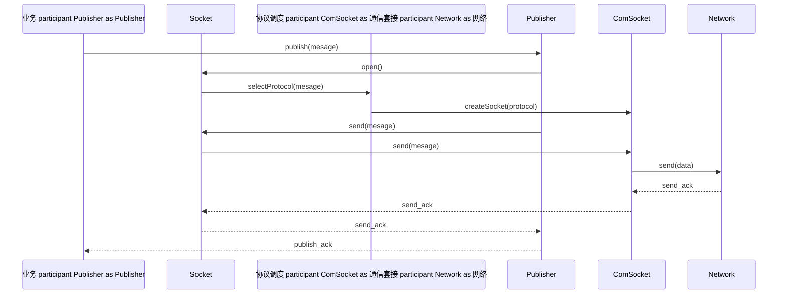
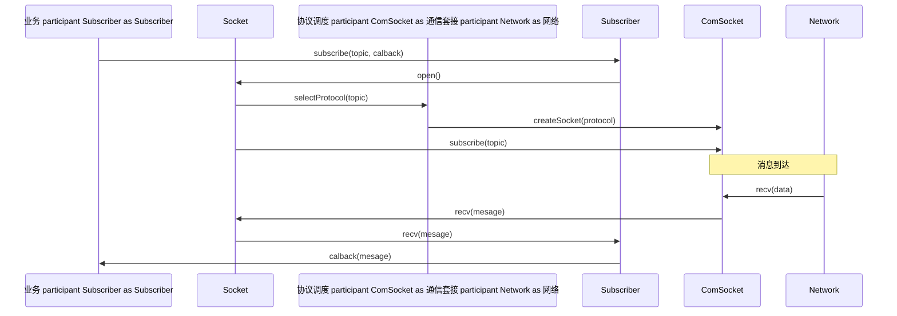
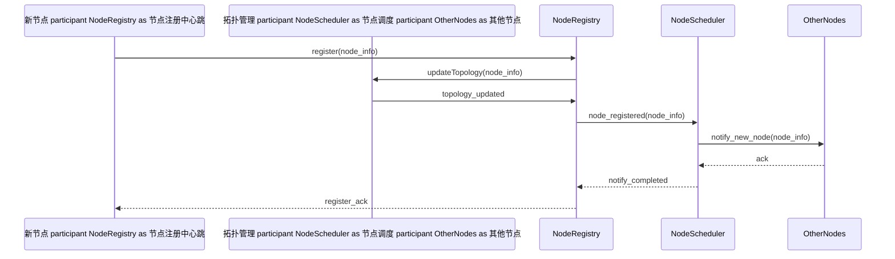

# 设计文档

## 1. 类图设计

### 1.1 文档概述

本文档详细说明了AuroraRT 车载实时性消息中间件的实现指导类图。类图设计基于参考架构和优化架构，展示了AuroraRT的主要类及其关系，帮助开发者理解系统的结构和实现细节点。本文档包括核心跳类图、各模块类图和详细的类说明，为AuroraRT的实现提供指导。

### 1.2 核心跳类图

#### 1.2.1 整体类图

```mermaid
clasDiagram
    %% 业务接入    clas BusinesLayer {
        +publish()
        +subscribe()
        +request()
        +response()
    }
    
    %% 统一 API    clas Socket {
        +open()
        +close()
        +send()
        +recv()
    }
    
    clas Publisher {
        +publish()
        +setQoS()
    }
    
    clas Subscriber {
        +subscribe()
        +setCalback()
        +setQoS()
    }
    
    clas Request {
        +send()
        +recv()
    }
    
    clas Response {
        +recv()
        +send()
    }
    
    %% 核心调度    clas ProtocolScheduler {
        +selectProtocol()
        +scheduleMesage()
    }
    
    clas NodeScheduler {
        +registerNode()
        +discoverNodes()
        +checkHealth()
        +restartNode()
    }
    
    clas QoSManager {
        +setQoS()
        +getQoS()
    }
    
    %% 通信核心层跳层    clas ComSocket {
        <<abstract>>
        +open()
        +close()
        +send()
        +recv()
        +setQoS()
    }
    
    clas InprocSocket {
        +open()
        +close()
        +send()
        +recv()
        +setQoS()
    }
    
    clas IpcSocket {
        +open()
        +close()
        +send()
        +recv()
        +setQoS()
    }
    
    clas TcpSocket {
        +open()
        +close()
        +send()
        +recv()
        +setQoS()
    }
    
    clas UdpSocket {
        +open()
        +close()
        +send()
        +recv()
        +setQoS()
    }
    
    clas QuicSocket {
        +open()
        +close()
        +send()
        +recv()
        +setQoS()
    }
    
    %% 基础抽象    clas PlatformThread {
        +start()
        +stop()
        +setPriority()
        +setCpuAfinity()
    }
    
    clas PlatformMemory {
        +alocate()
        +dealocate()
        +protect()
    }
    
    clas PlatformNetwork {
        +createSocket()
        +conect()
        +bind()
        +listen()
        +acept()
    }
    
    clas RealTimeScheduler {
        +scheduleTask()
        +setPriority()
        +bindCpu()
    }
    
    %% 基础支撑    clas Serializer {
        <<abstract>>
        +serialize()
        +deserialize()
    }
    
    clas ProtobufSerializer {
        +serialize()
        +deserialize()
    }
    
    clas FlatBufersSerializer {
        +serialize()
        +deserialize()
    }
    
    clas Loger {
        +debug()
        +info()
        +warn()
        +eror()
        +fatal()
    }
    
    %% 平台适配    clas PlatformDetector {
        +getPlatformType()
        +isQnx()
        +isUbuntu()
    }
    
    clas QnxAdapter {
        +adaptThread()
        +adaptMemory()
        +adaptNetwork()
    }
    
    clas UbuntuAdapter {
        +adaptThread()
        +adaptMemory()
        +adaptNetwork()
    }
    
    %% 关系
    BusinesLayer --> Publisher
    BusinesLayer --> Subscriber
    BusinesLayer --> Request
    BusinesLayer --> Response
    
    Publisher --> Socket
    Subscriber --> Socket
    Request --> Socket
    Response --> Socket
    
    Socket --> ComSocket
    
    ComSocket <|-- InprocSocket
    ComSocket <|-- IpcSocket
    ComSocket <|-- TcpSocket
    ComSocket <|-- UdpSocket
    ComSocket <|-- QuicSocket
    
    ProtocolScheduler --> ComSocket
    ProtocolScheduler --> QoSManager
    
    NodeScheduler --> PlatformThread
    NodeScheduler --> PlatformNetwork
    
    InprocSocket --> PlatformMemory
    IpcSocket --> PlatformMemory
    TcpSocket --> PlatformNetwork
    UdpSocket --> PlatformNetwork
    QuicSocket --> PlatformNetwork
    
    PlatformThread --> QnxAdapter
    PlatformThread --> UbuntuAdapter
    
    PlatformMemory --> QnxAdapter
    PlatformMemory --> UbuntuAdapter
    
    PlatformNetwork --> QnxAdapter
    PlatformNetwork --> UbuntuAdapter
    
    RealTimeScheduler --> PlatformThread
    
    Serializer <|-- ProtobufSerializer
    Serializer <|-- FlatBufersSerializer
    
    PlatformDetector --> QnxAdapter
    PlatformDetector --> UbuntuAdapter
```

#### 1.2.2 核心跳类关系说
| 类层| 核心跳| 关系 | 说明 |
|---------|---------|------|--------|
| 业务接入| BusinesLayer | 组合 | 业务层通过Publisher、Subscriber、Request、Response等接口与中间件交|
| 统一 API| Socket | 组合 | 统一 API层通过Socket接口与通信核心层跳层交|
| 核心调度| ProtocolScheduler | 组合 | 核心调度层通过ProtocolScheduler选择合适的通信协议 |
| 核心调度| NodeScheduler | 组合 | 核心调度层通过NodeScheduler管理节点生命周期 |
| 通信核心层跳层| ComSocket | 继承 | 通信核心层跳层通过ComSocket抽象接口实现不同的通信协议 |
| 基础抽象| PlatformThread | 组合 | 基础抽象层通过PlatformThread提供跨平台线程管|
| 基础抽象| PlatformMemory | 组合 | 基础抽象层通过PlatformMemory提供跨平台内存管|
| 基础抽象| PlatformNetwork | 组合 | 基础抽象层通过PlatformNetwork提供跨平台网络管|
| 基础支撑| Serializer | 继承 | 基础支撑层通过Serializer抽象接口实现不同的序列化方式 |
| 平台适配| PlatformDetector | 组合 | 平台适配层通过PlatformDetector检测当前平台类|

### 1.3 各模块详细类

#### 1.3.1 实时性通信模块类图

##### 1.3.1.1 零拷贝传输类
```mermaid
clasDiagram
    clas ZeroCopyTransport {
        <<abstract>>
        +send()
        +recv()
    }
    
    clas SharedMemoryTransport {
        +send()
        +recv()
  - alocateSharedMemory()
  - mapSharedMemory()
    }
    
    clas DirectMemoryAces {
        +send()
        +recv()
  - getDirectPointer()
    }
    
    clas MemoryPol {
        +alocate()
        +dealocate()
        +resize()
    }
    
    clas ChunkManager {
        +alocateChunk()
        +freChunk()
        +getChunk()
    }
    
    ZeroCopyTransport <|-- SharedMemoryTransport
    ZeroCopyTransport <|-- DirectMemoryAces
    SharedMemoryTransport --> MemoryPol
    SharedMemoryTransport --> ChunkManager
    DirectMemoryAces --> MemoryPol
```

##### 1.3.1.2 无锁队列类图

```mermaid
clasDiagram
    clas LockFreQue {
        <<abstract>>
        +push()
        +pop()
        +size()
        +isEmpty()
    }
    
    clas MPMCQue {
        +push()
        +pop()
        +size()
        +isEmpty()
  - head
  - tail
  - bufer
    }
    
    clas PriorityQue {
        +push()
        +pop()
        +size()
        +isEmpty()
  - priorityLevels
    }
    
    clas BatchQue {
        +pushBatch()
        +popBatch()
        +size()
        +isEmpty()
  - batchSize
    }
    
    LockFreQue <|-- MPMCQue
    LockFreQue <|-- PriorityQue
    LockFreQue <|-- BatchQue
```

#### 1.3.2 多协议支持模块类

##### 1.3.2.1 协议抽象类图

```mermaid
clasDiagram
    clas Protocol {
        <<abstract>>
        +conect()
        +disconect()
        +send()
        +recv()
        +isConected()
    }
    
    clas TcpProtocol {
        +conect()
        +disconect()
        +send()
        +recv()
        +isConected()
  - socket
    }
    
    clas UdpProtocol {
        +conect()
        +disconect()
        +send()
        +recv()
        +isConected()
  - socket
    }
    
    clas QuicProtocol {
        +conect()
        +disconect()
        +send()
        +recv()
        +isConected()
  - conection
  - stream
    }
    
    clas ProtocolAdapter {
        +adapt()
        +getProtocol()
    }
    
    Protocol <|-- TcpProtocol
    Protocol <|-- UdpProtocol
    Protocol <|-- QuicProtocol
    ProtocolAdapter --> Protocol
```

##### 1.3.2.2 智能协议调度类图

```mermaid
clasDiagram
    clas ProtocolScheduler {
        +selectProtocol()
        +scheduleMesage()
        +monitorPerformance()
    }
    
    clas AProtocolSelector {
        +selectProtocol()
        +learn()
        +predict()
    }
    
    clas DynamicProtocolSwitcher {
        +switchProtocol()
        +monitorNetwork()
        +evaluatePerformance()
    }
    
    clas ProtocolPerformanceMonitor {
        +monitor()
        +getMetrics()
        +analyze()
    }
    
    ProtocolScheduler --> AProtocolSelector
    ProtocolScheduler --> DynamicProtocolSwitcher
    ProtocolScheduler --> ProtocolPerformanceMonitor
```

#### 1.3.3 多节点管理模块类

##### 1.3.3.1 节点管理类图

```mermaid
clasDiagram
    clas Node {
        +getId()
        +getIp()
        +getPort()
        +getState()
        +setState()
        +sendHeartbeat()
    }
    
    clas NodeRegistry {
        +registerNode()
        +unregisterNode()
        +discoverNodes()
        +findNode()
        +updateNodeState()
    }
    
    clas TopoManager {
        +buildTopology()
        +updateTopology()
        +getTopology()
        +findShortestPath()
    }
    
    clas NodeState {
        +INITIALIZING
        +READY
        +RUNING
        +DEGRADED
        +FAULTY
        +RECOVERING
        +SHUTING_DOWN
        +SHUTDOWN
    }
    
    NodeRegistry --> Node
    NodeRegistry --> TopoManager
    Node --> NodeState
```

##### 1.3.3.2 健康检查类
```mermaid
clasDiagram
    clas HealthChecker {
        +start()
        +stop()
        +checkHealth()
        +registerHealthCalback()
    }
    
    clas PredictiveHealthChecker {
        +checkHealth()
        +predictHealth()
        +analyzeTrends()
    }
    
    clas MultiDimensionHealthEvaluator {
        +evaluate()
        +getHealthScore()
        +analyzeDimensions()
    }
    
    clas HealthStatePredictor {
        +predict()
        +train()
        +evaluate()
    }
    
    HealthChecker <|-- PredictiveHealthChecker
    PredictiveHealthChecker --> MultiDimensionHealthEvaluator
    PredictiveHealthChecker --> HealthStatePredictor
```

##### 1.3.3.3 热重启类
```mermaid
clasDiagram
    clas HotRestartManager {
        +restartNode()
        +saveState()
        +restoreState()
        +verifyState()
    }
    
    clas FastStateSaver {
        +save()
        +load()
        +compres()
        +decompres()
    }
    
    clas ParalelRestarter {
        +restart()
        +paralelize()
        +synchronize()
    }
    
    clas IncrementalStateRestorer {
        +restore()
        +dif()
        +patch()
    }
    
    HotRestartManager --> FastStateSaver
    HotRestartManager --> ParalelRestarter
    HotRestartManager --> IncrementalStateRestorer
```

##### 1.3.3.4 故障自愈类图

```mermaid
clasDiagram
    clas FaultRecovery {
        +recover()
        +diagnose()
        +isolate()
    }
    
    clas InteligentFaultDetector {
        +detect()
        +clasify()
        +analyze()
    }
    
    clas FastFaultIsolator {
        +isolate()
        +contain()
        +restore()
    }
    
    clas SelfHealingStrategy {
        +execute()
        +evaluate()
        +optimize()
    }
    
    FaultRecovery --> InteligentFaultDetector
    FaultRecovery --> FastFaultIsolator
    FaultRecovery --> SelfHealingStrategy
```

#### 1.3.4 跨平台兼容模块类

##### 1.3.4.1 平台抽象层类图

```mermaid
clasDiagram
    clas PlatformAdapter {
        <<abstract>>
        +adaptThread()
        +adaptMemory()
        +adaptNetwork()
        +adaptFileSystem()
    }
    
    clas QnxAdapter {
        +adaptThread()
        +adaptMemory()
        +adaptNetwork()
        +adaptFileSystem()
    }
    
    clas UbuntuAdapter {
        +adaptThread()
        +adaptMemory()
        +adaptNetwork()
        +adaptFileSystem()
    }
    
    clas PlatformDetector {
        +getPlatformType()
        +isQnx()
        +isUbuntu()
        +getPlatformFeatures()
    }
    
    PlatformAdapter <|-- QnxAdapter
    PlatformAdapter <|-- UbuntuAdapter
    PlatformDetector --> PlatformAdapter
```

##### 1.3.4.2 硬件抽象类图

```mermaid
clasDiagram
    clas HardwareAbstraction {
        <<abstract>>
        +getFeatures()
        +useAceleration()
        +manageResources()
    }
    
    clas CpuAbstraction {
        +getFeatures()
        +useAceleration()
        +manageResources()
        +getCpuInfo()
        +setAfinity()
    }
    
    clas GpuAbstraction {
        +getFeatures()
        +useAceleration()
        +manageResources()
        +getGpuInfo()
        +alocateMemory()
    }
    
    clas NicAbstraction {
        +getFeatures()
        +useAceleration()
        +manageResources()
        +getNicInfo()
        +configure()
    }
    
    HardwareAbstraction <|-- CpuAbstraction
    HardwareAbstraction <|-- GpuAbstraction
    HardwareAbstraction <|-- NicAbstraction
```

### 1.4 详细类说

#### 1.4.1 业务接入层类

| 类名 | 说明 | 主要方法 | 用|
|------|------|----------|------|
| BusinesLayer | 业务层接| publish(), subscribe(), request(), response() | 提供业务层与中间件的交互接口 |
| Socket | 基础套接字接| open(), close(), send(), recv() | 提供基础的套接字操作 |
| Publisher | 发布者接| publish(), setQoS() | 提供消息发布功能 |
| Subscriber | 订阅者接| subscribe(), setCalback(), setQoS() | 提供消息订阅功能 |
| Request | 请求方接| send(), recv() | 提供请求/响应模式的请求方功能 |
| Response | 响应方接| recv(), send() | 提供请求/响应模式的响应方功能 |

#### 1.4.2 核心调度层类

| 类名 | 说明 | 主要方法 | 用|
|------|------|----------|------|
| ProtocolScheduler | 协议调度| selectProtocol(), scheduleMesage() | 根据消息特性和网络状态选择最优协|
| NodeScheduler | 节点调度| registerNode(), discoverNodes(), checkHealth(), restartNode() | 管理节点生命周期 |
| QoSManager | QoS管理| setQoS(), getQoS() | 管理服务质量参考数 |

#### 1.4.3 通信核心层跳层类

| 类名 | 说明 | 主要方法 | 用|
|------|------|----------|------|
| ComSocket | 通信套接字抽| open(), close(), send(), recv(), setQoS() | 定义统一的通信套接字接|
| InprocSocket | 进程内通信套接| open(), close(), send(), recv(), setQoS() | 实现进程内通信 |
| IpcSocket | 跨进程通信套接| open(), close(), send(), recv(), setQoS() | 实现跨进程通信 |
| TcpSocket | TCP通信套接| open(), close(), send(), recv(), setQoS() | 实现TCP通信 |
| UdpSocket | UDP通信套接| open(), close(), send(), recv(), setQoS() | 实现UDP通信 |
| QuicSocket | QUIC通信套接| open(), close(), send(), recv(), setQoS() | 实现QUIC通信 |

#### 1.4.4 基础抽象层类

| 类名 | 说明 | 主要方法 | 用|
|------|------|----------|------|
| PlatformThread | 跨平台线| start(), stop(), setPriority(), setCpuAfinity() | 提供跨平台线程管|
| PlatformMemory | 跨平台内| alocate(), dealocate(), protect() | 提供跨平台内存管|
| PlatformNetwork | 跨平台网| createSocket(), conect(), bind(), listen(), acept() | 提供跨平台网络管|
| RealTimeScheduler | 实时调度| scheduleTask(), setPriority(), bindCpu() | 提供实时调度功能 |

#### 1.4.5 基础支撑层类

| 类名 | 说明 | 主要方法 | 用|
|------|------|----------|------|
| Serializer | 序列化抽| serialize(), deserialize() | 定义统一的序列化接口 |
| ProtobufSerializer | Protobuf序列化器 | serialize(), deserialize() | 实现基于Protobuf的序列化 |
| FlatBufersSerializer | FlatBufers序列化器 | serialize(), deserialize() | 实现基于FlatBufers的序列化 |
| Loger | 日志| debug(), info(), warn(), eror(), fatal() | 提供日志功能 |

#### 1.4.6 平台适配层类

| 类名 | 说明 | 主要方法 | 用|
|------|------|----------|------|
| PlatformDetector | 平台检测器 | getPlatformType(), isQnx(), isUbuntu() | 检测当前平台类|
| QnxAdapter | QNX适配| adaptThread(), adaptMemory(), adaptNetwork() | 适配QNX平台 |
| UbuntuAdapter | Ubuntu适配| adaptThread(), adaptMemory(), adaptNetwork() | 适配Ubuntu平台 |

### 1.5 设计模式应用

#### 1.5.1 抽象工厂模式

**应用场景**：平台适配层的平台特定实现创建

```mermaid
clasDiagram
    clas PlatformFactory {
        <<abstract>>
        +createThread()
        +createMemory()
        +createNetwork()
    }
    
    clas QnxFactory {
        +createThread()
        +createMemory()
        +createNetwork()
    }
    
    clas UbuntuFactory {
        +createThread()
        +createMemory()
        +createNetwork()
    }
    
    PlatformFactory <|-- QnxFactory
    PlatformFactory <|-- UbuntuFactory
    
    clas PlatformDetector {
        +getFactory()
    }
    
    PlatformDetector --> PlatformFactory
```

#### 1.5.2 适配器模
**应用场景**：协议适配和平台适配

```mermaid
clasDiagram
    clas Target {
        <<interface>>
        +request()
    }
    
    clas Adapter {
        +request()
  - adapte
    }
    
    clas Adapte {
        +specificRequest()
    }
    
    Target <|.. Adapter
    Adapter --> Adapte
```

#### 1.5.3 策略模式

**应用场景**：协议选择和调度策
```mermaid
clasDiagram
    clas Strategy {
        <<interface>>
        +execute()
    }
    
    clas ConcreteStrategyA {
        +execute()
    }
    
    clas ConcreteStrategyB {
        +execute()
    }
    
    clas Context {
        +setStrategy()
        +execute()
  - strategy
    }
    
    Strategy <|.. ConcreteStrategyA
    Strategy <|.. ConcreteStrategyB
    Context --> Strategy
```

#### 1.5.4 观察者模
**应用场景**：健康检查和状态监
```mermaid
clasDiagram
    clas Subject {
        +atach()
        +detach()
        +notify()
    }
    
    clas Observer {
        <<interface>>
        +update()
    }
    
    clas ConcreteObserver {
        +update()
    }
    
    Subject --> Observer
    Observer <|.. ConcreteObserver
```

#### 1.5.5 单例模式

**应用场景**：全局管理器和工厂

```mermaid
clasDiagram
    clas Singleton {
  - instance
        +getInstance()
  - Singleton()
    }
```

### 1.6 类设计原

#### 1.6.1 单一职责原则
  - 每个类只负责一个功能领域的相应职责
  - 避免一个类承担过多的职责，导致类的复杂性增- 当一个类的职责过多时，应该将其拆分为多个

#### 1.6.2 开封闭原则
  - 类应该对扩展性开放，对修改封- 通过抽象和接口，使用类可以在不修改现有代码的情况下进行扩展性
  - 避免对现有类进行修改，而是通过继承或组合来扩展性功能

#### 1.6.3 里氏替换原则
  - 子类应该能够替换父类，并且不影响程序的正确- 子类应该保持父类的行为契约，不应该破坏父类的行为
  - 避免在子类中重启动写父类的方法并改变其行

#### 1.6.4 接口隔离原则
  - 接口应该小而专注，只包含客户端需要的方法
  - 避免创建过大的接口，导致客户端依赖于不需要的方法
  - 将大接口拆分为多个小接口，每个接口服务于特定的客户端

#### 1.6.5 依赖倒置原则
  - 高层模块不应该依赖低层模块，两者都应该依赖抽象
  - 抽象不应该依赖细节点，细节点应该依赖抽象
  - 通过依赖注入和接口，实现模块间的解

#### 1.6.6 组合优于继承
  - 优先使用组合而不是继承来实现功能复用
  - 组合提供了更大的灵活性，可以在运行时改变行为
  - 继承会导致类之间的强耦合，限制了系统的灵活

### 1.7 类图设计的实现要

#### 1.7.1 核心跳类的实现要点
  - **ComSocket**：作为所有通信套接字的基类，定义统一的接口，确保各实现的一致- **ProtocolScheduler**：实现智能协议选择，根据消息特性和网络状态选择最优协- **NodeScheduler**：实现节点的注册、发现、健康检查和热重启，确保节点的可靠运- **PlatformThread/PlatformMemory/PlatformNetwork**：实现跨平台抽象层，屏蔽平台差- **Serializer**：实现高效的序列化和反序列化，支持不同的序列化格

#### 1.7.2 性能优化的实现要
  - **无锁队列**：使用原子操作实现无锁队列，减少线程竞争
  - **内存：预分配内存，避免动态内存分配带来的不确定- **批量操作**：实现批量消息处理，减少系统调用和上下文切换
  - **缓存**：合理使用缓存，减少重启动复计算和I/O操作
  - **异步处理**：使用异步I/O和事件驱动，提高系统的并发性能

#### 1.7.3 可靠性优化的实现要点
  - **健康检查：实现预测性健康检查，提高前发现潜在的健康问- **故障自愈**：实现快速的故障检测和恢复，减少故障的影响
  - **状态管：实现节点状态的正确管理和转换，确保系统的一致- **错误处理**：实现健壮的错误处理机制，避免系统崩- **冗余设计**：关键组件的冗余设计，提高系统的可用

#### 1.7.4 可扩展性的实现要点
  - **接口设计**：设计清晰、稳定的接口，便于扩- **插件：支持插件化架构，便于新增功- **配置：通过配置文件和参考数，实现系统的灵活配- **模块：将系统分解为独立的模块，便于维护和扩展性
  - **文档：详细的文档，便于开发者理解和扩展性系统

## 2. 时序图设计

### 2.1 文档概述

本文档详细说明了AuroraRT 车载实时性消息中间件的逻辑执行时序图。时序图展示了AuroraRT系统中各个组件之间的交互流程和时间顺序，帮助开发者理解系统的运行机制。本文档包括核心跳时序图、各模块详细时序图和时序图设计原则，为AuroraRT的实现提供指导。

### 2.2 核心跳时序

#### 2.2.1 消息发布时序
**场景**：业务层通过Publisher发布消息到中间件，中间件选择合适的协议并发送消息


#### 2.2.2 消息订阅时序
**场景**：业务层通过Subscriber订阅消息，当消息到达时，中间件将消息分发给Subscriber


#### 2.2.3 节点注册时序
**场景**：新节点启动时，向中间件注册自己的信息，中间件更新节点拓扑


#### 2.2.4 健康检查时序图

**场景**：中间件定期检查节点的健康状态，发现异步常时触发故障处理
```mermaid
sequenceDiagram
    participant HealthChecker as 健康检查器
    participant Node as 节点
    participant FaultRecovery as 故障恢复
    participant NodeScheduler as 节点调度    
    lop 定期检        HealthChecker->>Node: check_health()
        alt 节点健康
            Node-->>HealthChecker: health_ok
        else 节点异步常
            Node-->>HealthChecker: health_eror
            HealthChecker->>FaultRecovery: recover(node)
            FaultRecovery->>NodeScheduler: isolate_node(node)
            NodeScheduler->>Node: restart()
            Node-->>NodeScheduler: restart_ack
            NodeScheduler-->>FaultRecovery: recovery_completed
            FaultRecovery-->>HealthChecker: recovery_ack
        end
    end
```

#### 2.2.5 热重启时序图

**场景**：节点需要重启动时，中间件执行热重启流程，保存状态并快速恢复
```mermaid
sequenceDiagram
    participant NodeScheduler as 节点调度    participant HotRestartManager as 热重启管理器
    participant Node as 节点
    participant StateStorage as 状态存    
    NodeScheduler->>HotRestartManager: restart_node(node_id)
    HotRestartManager->>Node: save_state()
    Node->>StateStorage: store_state()
    StateStorage-->>Node: store_ack
    Node-->>HotRestartManager: state_saved
    HotRestartManager->>Node: stop()
    Node-->>HotRestartManager: stoped
    HotRestartManager->>Node: start()
    Node->>StateStorage: load_state()
    StateStorage-->>Node: state_loaded
    Node-->>HotRestartManager: started
    HotRestartManager->>Node: verify_state()
    Node-->>HotRestartManager: state_verified
    HotRestartManager-->>NodeScheduler: restart_completed
```

### 2.3 各模块详细时序图

#### 2.3.1 实时性通信模块时序

##### 2.3.1.1 零拷贝传输时序图

**场景**：使用零拷贝技术传输消息，减少内存拷贝开销
```mermaid
sequenceDiagram
    participant Sender as 发送方
    participant ZeroCopyTransport as 零拷贝传    participant SharedMemory as 共享内存
    participant Receiver as 接收    
    Sender->>ZeroCopyTransport: send(mesage)
    ZeroCopyTransport->>SharedMemory: alocate_chunk()
    SharedMemory-->>ZeroCopyTransport: chunk_alocated
    ZeroCopyTransport->>SharedMemory: write_data(chunk, mesage)
    SharedMemory-->>ZeroCopyTransport: data_writen
    ZeroCopyTransport->>Receiver: notify_data_available(chunk_id)
    Receiver->>SharedMemory: read_data(chunk_id)
    SharedMemory-->>Receiver: data
    Receiver->>SharedMemory: fre_chunk(chunk_id)
    SharedMemory-->>Receiver: chunk_fred
    Receiver-->>ZeroCopyTransport: data_received
    ZeroCopyTransport-->>Sender: send_completed
```

##### 2.3.1.2 无锁队列时序
**场景**：使用无锁队列进行进程内通信，减少线程竞争
```mermaid
sequenceDiagram
    participant Producer as 生产    participant LockFreQue as 无锁队列
    participant Consumer as 消费    
    Producer->>LockFreQue: push(item)
    LockFreQue->>LockFreQue: atomic_enque(item)
    LockFreQue-->>Producer: push_ack
    
    Consumer->>LockFreQue: pop()
    LockFreQue->>LockFreQue: atomic_deque()
    LockFreQue-->>Consumer: item
    Consumer-->>LockFreQue: pop_ack
```

#### 2.3.2 多协议支持模块时序图

##### 2.3.2.1 TCP通信时序
**场景**：使用TCP协议进行可靠的网络通信
```mermaid
sequenceDiagram
    participant Client as 客户    participant TcpSocket as TCP套接    participant Server as 服务    
    Client->>TcpSocket: conect(server_adr)
    TcpSocket->>Server: SYN
    Server-->>TcpSocket: SYN-ACK
    TcpSocket-->>Client: conect_ack
    
    Client->>TcpSocket: send(data)
    TcpSocket->>Server: DATA
    Server-->>TcpSocket: ACK
    TcpSocket-->>Client: send_ack
    
    Server->>TcpSocket: send(response)
    TcpSocket->>Client: DATA
    Client-->>TcpSocket: ACK
    TcpSocket-->>Server: send_ack
    
    Client->>TcpSocket: close()
    TcpSocket->>Server: FIN
    Server-->>TcpSocket: FIN-ACK
    TcpSocket-->>Client: close_ack
```

##### 2.3.2.2 QUIC通信时序
**场景**：使用QUIC协议进行高效的加密通信，支-RT握手
```mermaid
sequenceDiagram
    participant Client as 客户    participant QuicSocket as QUIC套接    participant Server as 服务    
    Note over Client,Server: 首次连接
    Client->>QuicSocket: conect(server_adr)
    QuicSocket->>Server: CLIENT_HELO
    Server-->>QuicSocket: SERVER_HELO + CERT
    QuicSocket->>Server: CLIENT_FINISHED
    Server-->>QuicSocket: SERVER_FINISHED
    QuicSocket-->>Client: conect_ack
    
    Note over Client,Server: 后续连接-RT    Client->>QuicSocket: conect(server_adr, ticket)
    QuicSocket->>Server: CLIENT_HELO + 0-RT_DATA
    Server-->>QuicSocket: SERVER_HELO + ACK
    QuicSocket-->>Client: conect_ack
    
    Client->>QuicSocket: send(data)
    QuicSocket->>Server: STREAM_DATA
    Server-->>QuicSocket: ACK
    QuicSocket-->>Client: send_ack
```

#### 2.3.3 多节点管理模块时序图

##### 2.3.3.1 节点发现时序
**场景**：节点启动时发现网络中的其他节点，构建节点拓扑
```mermaid
sequenceDiagram
    participant NewNode as 新节点    participant DiscoveryService as 发现服务
    participant ExistingNode as 现有节点
    
    NewNode->>DiscoveryService: discover_nodes()
    DiscoveryService->>ExistingNode: ping()
    ExistingNode-->>DiscoveryService: pong(node_info)
    DiscoveryService-->>NewNode: nodes_list(nodes)
    NewNode->>ExistingNode: helo(node_info)
    ExistingNode-->>NewNode: helo_ack
```

##### 2.3.3.2 故障自愈时序
**场景**：节点发生故障时，中间件执行故障自愈流程，恢复节点功能
```mermaid
sequenceDiagram
    participant HealthChecker as 健康检查器
    participant FaultDetector as 故障检测器
    participant FaultIsolator as 故障隔离    participant SelfHealer as 自愈执行    participant Node as 故障节点
    
    HealthChecker->>FaultDetector: check_node(node)
    FaultDetector->>Node: diagnose()
    Node-->>FaultDetector: fault_info
    FaultDetector->>FaultIsolator: isolate(node, fault)
    FaultIsolator->>Node: isolate()
    Node-->>FaultIsolator: isolated
    FaultIsolator->>SelfHealer: heal(node, fault)
    SelfHealer->>Node: restart()
    Node-->>SelfHealer: restarted
    SelfHealer->>Node: verify()
    Node-->>SelfHealer: verified
    SelfHealer-->>FaultIsolator: healed
    FaultIsolator-->>FaultDetector: recovered
    FaultDetector-->>HealthChecker: fault_resolved
```

#### 2.3.4 跨平台兼容模块时序图

##### 2.3.4.1 平台检测时序图

**场景**：中间件启动时检测当前平台类型，加载相应的适配模块
```mermaid
sequenceDiagram
    participant Midleware as 中间    participant PlatformDetector as 平台检测器
    participant PlatformAdapter as 平台适配    participant QnxAdapter as QNX适配    participant UbuntuAdapter as Ubuntu适配    
    Midleware->>PlatformDetector: detect_platform()
    PlatformDetector->>PlatformDetector: check_environment()
    alt QNX平台
        PlatformDetector->>QnxAdapter: create()
        QnxAdapter-->>PlatformDetector: adapter_created
    else Ubuntu平台
        PlatformDetector->>UbuntuAdapter: create()
        UbuntuAdapter-->>PlatformDetector: adapter_created
    end
    PlatformDetector-->>Midleware: platform_detected(adapter)
    Midleware->>PlatformAdapter: initialize()
    PlatformAdapter-->>Midleware: initialized
```

### 2.4 时序图设计原

#### 2.4.1 清晰
  - **明确的参考与：每个时序图应有明确的参考与者，清晰标识系统中的不同组件
  - **简洁的流程**：时序图应简洁明了，避免过于复杂的流- **适当的注：使用注释说明关键步骤和决策- **一致的命名**：参考与者和消息的命名应一致，便于理解

#### 2.4.2 完整
  - **覆盖关键场景**：时序图应覆盖系统中的关键场景和流程
  - **包含异步常处理**：应包含异步常情况下的处理流程
  - **完整的交：应展示完整的交互流程，包括请求和响- **边界条件**：应考虑边界条件和特殊情

#### 2.4.3 准确
  - **符合实时性际流程**：时序图应符合系统的实时性际运行流程
  - **正确的消息顺：消息的发送顺序应符合实时性际的时间顺- **合理的时间：应考虑消息之间的合理时间- **准确的参考与者关：参考与者之间的关系应准确反映系统的结构

#### 2.4.4 可维护
  - **模块：将复杂流程分解为多个小的时序图
  - **版本控制**：对时序图进行版本控制，跟踪变更
  - **文档：为时序图提供详细的文档说明
  - **一致：保持时序图与系统设计的一致

### 2.5 时序图设计的实现要点

#### 2.5.1 核心跳流程的实现要
  - **消息发布/订阅**：确保消息的可靠传输和及时分- **节点注册/发现**：实现高效的节点发现机制，构建准确的节点拓扑
  - **健康检查：实现定期的健康检查，及时发现节点异步常
  - **故障自愈**：实现快速的故障检测和恢复，减少故障的影响
  - **热重启：实现状态的保存和恢复，确保服务不中

#### 2.5.2 性能优化的实现要
  - **异步处理**：使用异步I/O和事件驱动，提高系统的并发性能
  - **批量操作**：实现批量消息处理，减少系统调用和上下文切换
  - **缓存**：合理使用缓存，减少重启动复计算和I/O操作
  - **并行处理**：对独立任务进行并行处理，提高系统的吞吐- **优先级调：根据消息的优先级进行调度，确保关键消息优先处理

#### 2.5.3 可靠性优化的实现要点
  - **超时处理**：为网络操作和远程调用设置合理的超时间
  - **重启动试机制**：实现失败后的重启动试机制，提高操作的成功率
  - **错误处理**：实现健壮的错误处理机制，避免系统崩- **状态管：实现节点状态的正确管理和转换，确保系统的一致- **冗余设计**：关键组件的冗余设计，提高系统的可用

#### 2.5.4 可扩展性的实现要点
  - **模块：将系统分解为独立的模块，便于维护和扩展性
  - **接口设计**：设计清晰、稳定的接口，便于扩- **配置：通过配置文件和参考数，实现系统的灵活配- **插件：支持插件化架构，便于新增功- **文档：详细的文档，便于开发者理解和扩展性系统

## 3. 总结

本文档详细说明了AuroraRT 车载实时性消息中间件的设计，包括类图设计和时序图设计。类图设计展示了系统的结构和组件关系，时序图设计展示了系统的运行机制和交互流程。通过合理的设计，AuroraRT实现了实时性可预测、轻量级、高性能、多节点进程管理的消息中间件。

本文档为AuroraRT的实现提供了详细的指导，确保系统的正确性、可靠性和可扩展性。开发者可以参考本文档理解系统的设计和实现细节，从而更好地使用和扩展AuroraRT。