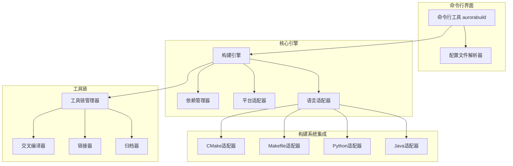

# 自研编译系统设计文档

## 1. 现有编译系统分析

### 1.1 catkin\_make (ROS 1)

- **特点**：
  - 基于CMake构建系统
  - 支持ROS包的依赖管理
  - 自动生成构建文件
  - 提供统一的构建接口
- **不足**：
  - 构建速度慢，特别是大型项目
  - 依赖管理复杂，容易出现依赖冲突
  - 不支持多语言混合编译
  - 配置文件复杂，学习曲线较陡
  - 仅支持ROS生态系统

### 1.2 ament (CyberRT)

- **特点**：
  - 基于CMake和Python
  - 支持包管理和依赖解析
  - 提供构建工具和测试框架
  - 支持跨平台编译
- **不足**：
  - 依赖Python，增加了系统复杂度
  - 跨平台支持有限，特别是在嵌入式系统
  - 构建配置仍较复杂
  - 与现有构建系统集成不够灵活

### 1.3 colcon (ROS 2)

- **特点**：
  - 基于Python，支持多种构建系统（CMake、ament、setuptools等）
  - 并行构建，提高构建速度
  - 支持包依赖管理
  - 提供统一的命令行接口
- **不足**：
  - 依赖Python，增加了系统依赖
  - 配置复杂，学习曲线较陡
  - 构建过程不够透明
  - 错误处理不够友好
  - 对非ROS项目支持有限

## 2. 自研编译系统设计

### 2.1 系统名称

**AuroraBuild** - 取自AuroraRT项目名称，寓意高效、灵活的构建系统

### 2.2 设计目标

- **独立轻量**：不依赖Python等外部运行时，提高跨平台兼容性
- **多语言支持**：支持C++、C、Python、Java等多种语言混合编译
- **并行构建**：支持多线程并行构建，提高构建速度
- **简化配置**：提供简洁的配置文件格式，降低学习曲线
- **强大的依赖管理**：自动解析和管理包依赖关系
- **跨平台支持**：支持Linux、Windows、QNX、VxWorks等多种平台
- **与现有工具兼容**：支持与XMake、Makefile等现有构建系统集成
- **可扩展性**：支持插件机制，便于功能扩展

### 2.3 系统架构



### 2.4 核心功能

#### 2.4.1 命令行工具

- **aurorabuild build**：构建项目
- **aurorabuild clean**：清理构建产物
- **aurorabuild test**：运行测试
- **aurorabuild install**：安装构建产物
- **aurorabuild list**：列出项目和依赖
- **aurorabuild deps**：分析依赖关系
- **aurorabuild init**：初始化新项目

#### 2.4.2 配置文件系统

- **aurora.yml**：项目配置文件，定义项目基本信息、依赖和构建选项
- **aurora.pkg**：包描述文件，定义包的元数据和依赖
- **aurora.toolchain**：工具链配置文件，定义编译器和编译选项

#### 2.4.3 依赖管理

- 自动解析包依赖关系
- 支持本地依赖和远程依赖
- 依赖版本管理
- 依赖冲突检测和解决

#### 2.4.4 多语言支持

- C++/C：支持现代C++标准（C++17/20/23）
- Python：支持Python 3.x
- Java：支持Java 8+
- 其他语言：通过插件机制支持

#### 2.4.5 并行构建

- 基于依赖关系的并行构建
- 可配置的并行度
- 增量构建支持

#### 2.4.6 跨平台支持

- 平台抽象层
- 自动检测目标平台
- 跨编译支持
- 平台特定优化

#### 2.4.7 插件系统

- 构建系统插件（支持新的构建系统）
- 语言插件（支持新的编程语言）
- 工具插件（支持新的工具链）
- 扩展插件（自定义功能）

## 3. 多语言混合编译实现

### 3.1 语言适配器

- **C++/C适配器**：集成CMake或直接调用编译器
- **Python适配器**：支持setuptools或直接编译Python模块
- **Java适配器**：集成Maven或Gradle
- **其他语言适配器**：通过插件机制扩展

### 3.2 混合编译工作流

1. 解析项目配置文件，确定需要编译的语言
2. 为每种语言选择合适的构建工具
3. 解析依赖关系，确保依赖正确传递
4. 按照依赖顺序并行构建各语言组件
5. 处理跨语言依赖（如C++库被Python模块使用）
6. 生成统一的构建产物

### 3.3 跨语言依赖处理

- **C++/C → Python**：生成Python绑定（使用pybind11或SWIG）
- **C++/C → Java**：生成JNI绑定
- **Python → C++/C**：通过ctypes或Cython调用
- **Java → C++/C**：通过JNI调用

## 4. 工作流程

### 4.1 项目初始化

```bash
# 创建新项目
aurorabuild init my_project

# 进入项目目录
cd my_project

# 编辑aurora.yml配置文件
# 编辑源代码
```

### 4.2 构建流程

1. 解析aurora.yml配置文件
2. 分析依赖关系
3. 下载或验证依赖
4. 配置工具链
5. 并行构建各组件
6. 处理跨语言依赖
7. 生成构建产物

### 4.3 典型使用场景

#### 4.3.1 纯C++项目

```yaml
# aurora.yml
name: my_cpp_project
type: cpp
version: 1.0.0
dependencies:
  - name: eigen
    version: ^3.4.0
build:
  cmake:
    options:
      - DCMAKE_BUILD_TYPE=Release
```

#### 4.3.2 混合C++和Python项目

```yaml
# aurora.yml
name: my_mixed_project
type: mixed
version: 1.0.0
dependencies:
  - name: eigen
    version: ^3.4.0
  - name: numpy
    version: ^1.21.0
languages:
  cpp:
    sources: src/cpp
  python:
    sources: src/python
    packages: my_package
```

## 5. 与现有工具的集成

### 5.1 与CMake集成

- 支持使用CMake作为底层构建系统
- 自动生成CMakeLists.txt文件
- 支持现有CMake项目的迁移

### 5.2 与Makefile集成

- 支持使用Makefile作为底层构建系统
- 自动生成Makefile文件
- 支持现有Makefile项目的迁移

### 5.3 与包管理器集成

- 支持与pip（Python）集成
- 支持与Maven（Java）集成
- 支持与系统包管理器（apt、yum等）集成

## 6. 迁移策略

### 6.1 从catkin\_make迁移

1. 分析现有catkin项目结构
2. 生成对应的aurora.yml配置文件
3. 迁移依赖关系
4. 验证构建结果

### 6.2 从ament迁移

1. 分析现有ament项目结构
2. 生成对应的aurora.yml配置文件
3. 迁移依赖关系
4. 验证构建结果

### 6.3 从colcon迁移

1. 分析现有colcon项目结构
2. 生成对应的aurora.yml配置文件
3. 迁移依赖关系
4. 验证构建结果

## 7. 技术实现

### 7.1 核心实现语言

- **C++**：核心引擎和命令行工具
- **YAML**：配置文件格式
- **Python**（可选）：高级功能和脚本支持

### 7.2 关键技术

- **依赖解析算法**：基于拓扑排序的依赖解析
- **并行构建**：基于任务图的并行执行
- **跨平台适配**：条件编译和平台抽象
- **插件系统**：动态加载和扩展

### 7.3 性能优化

- **增量构建**：只重新编译修改的文件
- **缓存机制**：缓存构建结果和依赖信息
- **并行度优化**：根据系统资源自动调整并行度
- **预编译头**：支持C++预编译头

## 8. 优势总结

### 8.1 性能优势

- 并行构建，提高构建速度
- 增量构建，减少重复编译
- 缓存机制，加速依赖解析

### 8.2 灵活性优势

- 多语言支持，满足混合开发需求
- 插件系统，便于功能扩展
- 与现有工具集成，降低迁移成本

### 8.3 易用性优势

- 简洁的配置文件格式
- 统一的命令行接口
- 友好的错误提示

### 8.4 跨平台优势

- 支持多种操作系统
- 支持多种硬件平台
- 支持交叉编译

## 9. 结论

AuroraBuild编译系统通过吸取现有编译系统的优点，解决了它们的不足，提供了一个轻量、高效、灵活的多语言混合编译解决方案。它不仅支持AuroraRT项目的需求，也可以作为一个通用的构建工具，适用于各种规模和类型的项目。

通过模块化设计和插件机制，AuroraBuild具有良好的可扩展性，可以根据需要添加新的功能和支持新的语言。同时，它的跨平台特性确保了在不同环境下的一致性构建体验。

AuroraBuild的设计理念是"简单而强大"，通过简化配置和构建过程，同时提供强大的功能，使开发人员能够专注于代码开发，而不是构建系统的复杂性。
