# AuroraRT自研工具系统设计文档

## 1. 工具系统架构

### 1.1 整体架构

```mermaid
flowchart TD
    subgraph 核心工具层
        AuroraCLI[统一命令行接口 AuroraCLI]
        AuroraBuild[编译构建工具 AuroraBuild]
        AuroraPackage[包管理工具 AuroraPackage]
    end
    
    subgraph 命令行工具集
        AuroraNode[节点管理工具 AuroraNode]
        AuroraTopic[话题管理工具 AuroraTopic]
        AuroraService[服务管理工具 AuroraService]
        AuroraParam[参数管理工具 AuroraParam]
        AuroraBag[数据记录与回放 AuroraBag]
    end
    
    subgraph 可视化与调试工具
        AuroraViz[3D可视化工具 AuroraViz]
        AuroraDebug[图形化调试工具 AuroraDebug]
        AuroraMonitor[系统监控工具 AuroraMonitor]
    end
    
    subgraph 仿真工具
        AuroraSim[物理仿真引擎 AuroraSim]
        AuroraSimWeb[跨平台仿真工具 AuroraSimWeb]
        AuroraDigitalTwin[数字孪生工具 AuroraDigitalTwin]
    end
    
    subgraph 算法与功能包
        AuroraMove[运动规划框架 AuroraMove]
        AuroraNav[导航框架 AuroraNav]
        AuroraVision[计算机视觉库 AuroraVision]
        AuroraPointCloud[点云处理库 AuroraPointCloud]
        AuroraAI[深度学习框架集成 AuroraAI]
    end
    
    subgraph 开发辅助工具
        AuroraInterface[接口定义工具 AuroraInterface]
        AuroraCodeGen[代码生成工具 AuroraCodeGen]
        AuroraPerf[性能分析工具 AuroraPerf]
    end
    
    subgraph 测试与部署工具
        AuroraTest[自动化测试框架 AuroraTest]
        AuroraDocker[容器化部署工具 AuroraDocker]
        AuroraCI[持续集成与部署工具链 AuroraCI]
        AuroraEdgeDeploy[边缘部署工具 AuroraEdgeDeploy]
    end
    
    subgraph 安全认证工具
        AuroraSecure[安全框架 AuroraSecure]
        AuroraSafety[功能安全工具 AuroraSafety]
        AuroraBus[工业总线协议支持 AuroraBus]
    end
    
    subgraph 质量保证工具
        AuroraCoverage[代码覆盖率分析 AuroraCoverage]
        AuroraStatic[静态代码分析工具 AuroraStatic]
        AuroraValgrind[内存分析工具 AuroraValgrind]
    end
    
    subgraph 运行时工具
        AuroraScheduler[用户态调度器 AuroraScheduler]
        AuroraMemory[内存池管理 AuroraMemory]
        AuroraTimer[高精度定时器 AuroraTimer]
        AuroraComm[通信优化工具 AuroraComm]
    end
    
    subgraph 跨平台适配工具
        AuroraQNX[QNX操作系统适配 AuroraQNX]
        AuroraLinux[Linux操作系统适配 AuroraLinux]
        AuroraAUTOSAR[AUTOSAR架构适配 AuroraAUTOSAR]
    end
    
    subgraph 多机器人协同工具
        AuroraSwarm[多机器人协同工具 AuroraSwarm]
    end
    
    AuroraCLI --> AuroraNode
    AuroraCLI --> AuroraTopic
    AuroraCLI --> AuroraService
    AuroraCLI --> AuroraParam
    AuroraCLI --> AuroraBag
    AuroraCLI --> AuroraBuild
    AuroraCLI --> AuroraPackage
    AuroraCLI --> AuroraTest
    
    AuroraBuild --> AuroraPackage
    AuroraPackage --> AuroraInterface
    
    AuroraNode --> AuroraMonitor
    AuroraTopic --> AuroraMonitor
    AuroraService --> AuroraMonitor
    
    AuroraViz --> AuroraDebug
    AuroraMonitor --> AuroraDebug
    
    AuroraSim --> AuroraDigitalTwin
    AuroraSimWeb --> AuroraDigitalTwin
    
    AuroraMove --> AuroraAI
    AuroraNav --> AuroraAI
    AuroraVision --> AuroraAI
    AuroraPointCloud --> AuroraAI
    
    AuroraInterface --> AuroraCodeGen
    AuroraPerf --> AuroraCodeGen
    
    AuroraTest --> AuroraCI
    AuroraDocker --> AuroraCI
    AuroraEdgeDeploy --> AuroraCI
    
    AuroraSecure --> AuroraSafety
    AuroraBus --> AuroraSafety
    
    AuroraCoverage --> AuroraTest
    AuroraStatic --> AuroraTest
    AuroraValgrind --> AuroraTest
    
    AuroraScheduler --> AuroraRT
    AuroraMemory --> AuroraRT
    AuroraTimer --> AuroraRT
    AuroraComm --> AuroraRT
    
    AuroraQNX --> AuroraRT
    AuroraLinux --> AuroraRT
    AuroraAUTOSAR --> AuroraRT
    
    AuroraSwarm --> AuroraRT
```

### 1.2 工具系统核心设计

#### 1.2.1 统一命令行接口 (AuroraCLI)
- **设计目标**：提供统一的命令行入口，简化工具使用
- **核心功能**：
  - 统一命令格式：`aurora <command> <subcommand> [options]`
  - 命令自动补全
  - 帮助信息系统
  - 插件机制，支持扩展命令
- **实现方式**：
  - C++实现核心命令
  - 插件系统支持动态加载命令
  - 配置文件支持自定义命令别名

#### 1.2.2 工具间集成机制
- **设计目标**：实现工具间的无缝集成和数据交换
- **核心功能**：
  - 统一数据格式
  - 工具间通信接口
  - 共享配置系统
  - 统一日志系统
- **实现方式**：
  - 基于共享内存的数据交换
  - 标准化的工具间API
  - 统一的配置文件格式

## 2. 命令行工具集设计

### 2.1 节点管理工具 (AuroraNode)
- **功能描述**：管理节点的生命周期和状态
- **核心命令**：
  - `aurora node list`：列出所有节点
  - `aurora node info <node_name>`：查看节点详细信息
  - `aurora node start <node_name>`：启动节点
  - `aurora node stop <node_name>`：停止节点
  - `aurora node restart <node_name>`：重启节点
  - `aurora node kill <node_name>`：强制终止节点
  - `aurora node monitor <node_name>`：监控节点状态
- **技术特性**：
  - 实时节点状态监控
  - 节点资源使用统计
  - 节点健康检查
  - 节点自动重启机制

### 2.2 话题管理工具 (AuroraTopic)
- **功能描述**：管理话题的发布、订阅和数据查看
- **核心命令**：
  - `aurora topic list`：列出所有话题
  - `aurora topic info <topic_name>`：查看话题详细信息
  - `aurora topic echo <topic_name>`：查看话题数据
  - `aurora topic pub <topic_name> <message>`：发布话题数据
  - `aurora topic hz <topic_name>`：查看话题发布频率
  - `aurora topic bw <topic_name>`：查看话题带宽
  - `aurora topic delay <topic_name>`：查看话题延迟
- **技术特性**：
  - 实时数据查看
  - 数据统计分析
  - 支持多种数据格式
  - 数据录制和回放

### 2.3 服务管理工具 (AuroraService)
- **功能描述**：管理服务的调用和发现
- **核心命令**：
  - `aurora service list`：列出所有服务
  - `aurora service info <service_name>`：查看服务详细信息
  - `aurora service call <service_name> <request>`：调用服务
  - `aurora service type <service_name>`：查看服务类型
  - `aurora service wait <service_name>`：等待服务可用
- **技术特性**：
  - 同步/异步服务调用
  - 服务响应时间监控
  - 服务质量评估
  - 服务故障检测

### 2.4 参数管理工具 (AuroraParam)
- **功能描述**：管理系统参数的设置和获取
- **核心命令**：
  - `aurora param list`：列出所有参数
  - `aurora param get <param_name>`：获取参数值
  - `aurora param set <param_name> <value>`：设置参数值
  - `aurora param delete <param_name>`：删除参数
  - `aurora param load <file>`：从文件加载参数
  - `aurora param save <file>`：保存参数到文件
  - `aurora param history <param_name>`：查看参数历史值
- **技术特性**：
  - 动态参数调整
  - 参数持久化
  - 参数版本控制
  - 参数依赖管理

### 2.5 数据记录与回放工具 (AuroraBag)
- **功能描述**：记录和回放话题数据
- **核心命令**：
  - `aurora bag record <topics>`：记录指定话题
  - `aurora bag play <bag_file>`：回放数据包
  - `aurora bag info <bag_file>`：查看数据包信息
  - `aurora bag filter <bag_file> <output_file> <filter>`：过滤数据包
  - `aurora bag convert <bag_file> <output_format>`：转换数据包格式
- **技术特性**：
  - 高性能数据记录
  - 多种数据格式支持
  - 数据压缩
  - 实时数据查看
  - 数据回放控制

## 3. 可视化与调试工具设计

### 3.1 3D可视化工具 (AuroraViz)
- **功能描述**：提供3D场景可视化
- **核心功能**：
  - 机器人模型显示
  - 传感器数据可视化
  - 路径规划可视化
  - 环境地图显示
  - 自定义插件支持
- **技术特性**：
  - 基于OpenGL/Vulkan的高性能渲染
  - 实时数据更新
  - 多视角切换
  - 场景保存和加载
  - 支持自定义标记和注释

### 3.2 图形化调试工具 (AuroraDebug)
- **功能描述**：提供图形化的系统调试界面
- **核心功能**：
  - 节点通信拓扑图
  - 实时日志查看
  - 动态参数调整
  - 数据绘图
  - 系统状态监控
- **技术特性**：
  - 模块化设计
  - 插件扩展系统
  - 实时数据刷新
  - 数据导出功能
  - 远程调试支持

### 3.3 系统监控工具 (AuroraMonitor)
- **功能描述**：监控系统运行状态和性能
- **核心功能**：
  - 实时数据流监控
  - 节点状态监控
  - 资源使用监控
  - 性能分析
  - 异常检测和告警
- **技术特性**：
  - 实时性能数据采集
  - 历史数据存储和分析
  - 自定义监控指标
  - 告警机制
  - 可视化仪表盘

## 4. 仿真工具设计

### 4.1 物理仿真引擎 (AuroraSim)
- **功能描述**：提供物理仿真环境
- **核心功能**：
  - 多物理引擎支持（Bullet、ODE、PhysX等）
  - 传感器模型
  - 环境建模
  - 物理交互
  - 真实机器人代码直接运行
- **技术特性**：
  - 高精度物理模拟
  - 实时仿真
  - 可扩展性
  - 多种环境模型
  - 支持多种机器人类型

### 4.2 跨平台仿真工具 (AuroraSimWeb)
- **功能描述**：提供基于Web的仿真环境
- **核心功能**：
  - 基于Web的仿真界面
  - 无需安装，浏览器访问
  - 易于分享和协作
  - 轻量级设计
- **技术特性**：
  - 基于WebGL的3D渲染
  - 跨平台兼容
  - 实时仿真
  - 支持移动设备
  - 云渲染支持

### 4.3 数字孪生工具 (AuroraDigitalTwin)
- **功能描述**：提供数字孪生功能
- **核心功能**：
  - 高保真虚拟环境
  - 实时数据同步
  - 虚拟调试
  - 仿真预测
- **技术特性**：
  - 高精度模型
  - 实时数据传输
  - 虚拟-现实同步
  - 场景编辑工具
  - 多用户协作

## 5. 算法与功能包设计

### 5.1 运动规划框架 (AuroraMove)
- **功能描述**：提供机器人运动规划功能
- **核心功能**：
  - 逆运动学求解
  - 碰撞检测
  - 轨迹生成与执行
  - 多机器人协同规划
- **技术特性**：
  - 支持多种机器人类型
  - 实时规划
  - 碰撞避免
  - 轨迹优化
  - 多目标规划

### 5.2 导航框架 (AuroraNav)
- **功能描述**：提供机器人导航功能
- **核心功能**：
  - 地图构建
  - 路径规划
  - 避障与动态重规划
  - 多机器人协同导航
- **技术特性**：
  - 动态环境适应
  - 全局与局部规划
  - 多传感器融合
  - 导航行为库
  - 导航参数自动调优

### 5.3 计算机视觉库 (AuroraVision)
- **功能描述**：提供计算机视觉功能
- **核心功能**：
  - 图像处理
  - 目标检测
  - 特征提取
  - 视觉SLAM
- **技术特性**：
  - GPU加速
  - 实时处理
  - 多传感器融合
  - 深度学习集成
  - 可定制化算法

### 5.4 点云处理库 (AuroraPointCloud)
- **功能描述**：提供点云处理功能
- **核心功能**：
  - 点云滤波
  - 分割
  - 配准
  - 特征提取
  - 三维重建
- **技术特性**：
  - 大规模点云处理
  - 实时分析
  - 多传感器融合
  - 并行处理
  - 内存优化

### 5.5 深度学习框架集成 (AuroraAI)
- **功能描述**：集成深度学习框架
- **核心功能**：
  - 模型推理
  - 训练
  - 部署
  - 模型优化
- **技术特性**：
  - 支持多种深度学习框架（TensorFlow、PyTorch等）
  - 边缘设备部署
  - 模型量化
  - 实时推理
  - 模型管理

## 6. 开发辅助工具设计

### 6.1 接口定义工具 (AuroraInterface)
- **功能描述**：定义和生成接口代码
- **核心功能**：
  - 消息、服务、动作接口定义
  - 代码生成
  - 版本兼容管理
- **技术特性**：
  - 支持IDL定义
  - 自动代码生成
  - 多语言支持
  - 版本控制
  - 接口兼容性检查

### 6.2 代码生成工具 (AuroraCodeGen)
- **功能描述**：自动生成机器人应用代码框架
- **核心功能**：
  - 模板化代码生成
  - 自定义代码结构
  - 项目初始化
- **技术特性**：
  - 支持多种编程语言
  - 可定制模板
  - 集成开发环境
  - 代码风格一致性

### 6.3 性能分析工具 (AuroraPerf)
- **功能描述**：分析系统性能
- **核心功能**：
  - 系统性能预测
  - 瓶颈分析
  - 优化建议
  - 实时性能监控
- **技术特性**：
  - 低开销监控
  - 可视化分析
  - 瓶颈自动检测
  - 优化建议生成
  - 性能基准测试

## 7. 测试与部署工具设计

### 7.1 自动化测试框架 (AuroraTest)
- **功能描述**：提供自动化测试功能
- **核心功能**：
  - 单元测试
  - 集成测试
  - 性能测试
  - 测试覆盖率分析
  - 测试报告生成
- **技术特性**：
  - 自动化测试流程
  - 多种测试类型支持
  - 测试结果分析
  - 集成到CI/CD流程
  - 模拟环境测试

### 7.2 容器化部署工具 (AuroraDocker)
- **功能描述**：提供容器化部署功能
- **核心功能**：
  - 容器镜像构建
  - 管理
  - 部署
  - 多平台支持
- **技术特性**：
  - 轻量化镜像
  - 快速部署
  - 版本管理
  - 环境隔离
  - 资源限制

### 7.3 持续集成与部署工具链 (AuroraCI)
- **功能描述**：提供持续集成与部署功能
- **核心功能**：
  - 代码检查
  - 自动构建
  - 测试
  - 部署
- **技术特性**：
  - 代码质量检查
  - 自动化测试
  - 多环境部署
  - 部署回滚
  - 集成通知

### 7.4 边缘部署工具 (AuroraEdgeDeploy)
- **功能描述**：提供边缘设备部署功能
- **核心功能**：
  - 资源受限设备优化
  - 部署包大小优化
  - 远程更新
  - 边缘设备管理
- **技术特性**：
  - 轻量级部署
  - 网络带宽优化
  - 断点续传
  - 版本管理
  - 设备状态监控

## 8. 安全认证工具设计

### 8.1 安全框架 (AuroraSecure)
- **功能描述**：提供安全保障功能
- **核心功能**：
  - 身份认证
  - 数据加密
  - 访问控制
  - 权限管理
- **技术特性**：
  - 符合工业安全标准
  - 细粒度权限控制
  - 安全审计
  - 密钥管理
  - 安全通信

### 8.2 功能安全工具 (AuroraSafety)
- **功能描述**：提供功能安全认证支持
- **核心功能**：
  - 安全验证
  - 认证支持
  - 风险评估
  - 安全文档生成
- **技术特性**：
  - 符合IEC 61508等安全标准
  - 安全验证流程
  - 风险分析工具
  - 安全指标监控

### 8.3 工业总线协议支持 (AuroraBus)
- **功能描述**：支持工业总线协议
- **核心功能**：
  - PROFINET
  - EtherCAT
  - Modbus
  - 其他工业以太网协议
- **技术特性**：
  - 实时通信
  - 多协议支持
  - 设备发现和配置
  - 协议转换
  - 故障诊断

## 9. 质量保证工具设计

### 9.1 代码覆盖率分析 (AuroraCoverage)
- **功能描述**：分析代码覆盖率
- **核心功能**：
  - 语句覆盖
  - 分支覆盖
  - 路径覆盖
  - 覆盖率报告生成
- **技术特性**：
  - 多语言代码分析
  - 详细覆盖报告
  - 集成到CI流程
  - 覆盖率趋势分析

### 9.2 静态代码分析工具 (AuroraStatic)
- **功能描述**：分析代码质量
- **核心功能**：
  - 代码质量检查
  - 潜在缺陷检测
  - 代码规范验证
  - 代码复杂度分析
- **技术特性**：
  - 自定义规则
  - 集成到CI流程
  - 多语言支持
  - 详细分析报告

### 9.3 内存分析工具 (AuroraValgrind)
- **功能描述**：分析内存使用
- **核心功能**：
  - 内存泄漏检测
  - 内存使用分析
  - 性能分析
  - 内存错误检测
- **技术特性**：
  - 实时内存监控
  - 内存泄漏自动检测
  - 内存使用统计
  - 性能瓶颈分析

## 10. 运行时工具设计

### 10.1 用户态调度器 (AuroraScheduler)
- **功能描述**：提供用户态任务调度
- **核心功能**：
  - 减少内核依赖
  - 提高确定性
  - 支持协程调度
  - 优先级调度
- **技术特性**：
  - 实时性保证
  - 资源隔离
  - 低延迟调度
  - 可预测性

### 10.2 内存池管理 (AuroraMemory)
- **功能描述**：管理内存池
- **核心功能**：
  - 减少动态内存分配碎片
  - 提高内存使用效率
  - 内存池预分配
  - 零拷贝技术
- **技术特性**：
  - 内存使用监控
  - 内存泄漏检测
  - 内存使用统计
  - 多内存池管理

### 10.3 高精度定时器 (AuroraTimer)
- **功能描述**：提供高精度时间管理
- **核心功能**：
  - 周期性任务触发
  - 高精度时间管理
  - 任务调度
  - 时间同步
- **技术特性**：
  - 纳秒级精度
  - 低抖动
  - 时间同步协议支持
  - 任务队列管理

### 10.4 通信优化工具 (AuroraComm)
- **功能描述**：优化通信性能
- **核心功能**：
  - 共享内存通信
  - 多协议支持
  - QoS配置
  - 通信监控
- **技术特性**：
  - 零拷贝技术
  - 多协议支持（TCP/UDP/QUIC）
  - 灵活的QoS策略
  - 通信性能优化

## 11. 跨平台适配工具设计

### 11.1 QNX操作系统适配 (AuroraQNX)
- **功能描述**：适配QNX操作系统
- **核心功能**：
  - 实时性优化
  - 资源管理
  - 安全保障
  - QNX特性利用
- **技术特性**：
  - 支持QNX实时特性
  - 与AuroraRT深度集成
  - 硬件资源优化
  - 安全机制适配

### 11.2 Linux操作系统适配 (AuroraLinux)
- **功能描述**：适配Linux操作系统
- **核心功能**：
  - 实时性优化
  - 资源管理
  - 生态集成
  - 硬实时支持
- **技术特性**：
  - 支持Linux RT
  - 与AuroraRT深度集成
  - 系统资源优化
  - 生态系统集成

### 11.3 AUTOSAR架构适配 (AuroraAUTOSAR)
- **功能描述**：适配AUTOSAR架构
- **核心功能**：
  - 标准化软件架构
  - 功能安全支持
  - AUTOSAR接口适配
  - 汽车电子集成
- **技术特性**：
  - 支持AUTOSAR标准
  - 与AuroraRT无缝集成
  - 功能安全认证支持
  - 汽车电子应用优化

## 12. 多机器人协同工具设计

### 12.1 多机器人协同工具 (AuroraSwarm)
- **功能描述**：支持多机器人协同
- **核心功能**：
  - 集群管理
  - 任务分配
  - 协同规划
  - 集群状态监控
- **技术特性**：
  - 分布式协调
  - 任务分配算法
  - 集群状态监控
  - 容错机制
  - 可扩展性

## 13. 工具系统集成与使用

### 13.1 工具系统安装与配置
- **安装方式**：
  - 二进制安装包
  - 源码编译
  - 容器化部署
- **配置文件**：
  - 全局配置：`/etc/aurora/aurora.conf`
  - 用户配置：`~/.aurora/aurora.conf`
  - 项目配置：`./aurora.conf`

### 13.2 工具系统工作流程
- **开发流程**：
  1. 项目初始化：`aurora init <project_name>`
  2. 接口定义：`aurora interface create <interface_name>`
  3. 代码生成：`aurora codegen generate`
  4. 编译构建：`aurora build`
  5. 测试：`aurora test`
  6. 部署：`aurora deploy`

- **运行流程**：
  1. 启动核心服务：`aurora core start`
  2. 运行节点：`aurora node start <node_name>`
  3. 监控系统：`aurora monitor start`
  4. 数据记录：`aurora bag record <topics>`
  5. 可视化：`aurora viz start`

### 13.3 工具系统扩展
- **插件机制**：
  - 命令插件：扩展命令行功能
  - 可视化插件：扩展可视化功能
  - 算法插件：扩展算法功能
- **插件开发**：
  - 插件API文档
  - 插件示例
  - 插件测试框架

## 14. 结论

AuroraRT自研工具系统通过开发一套完整的工具链，实现了对ROS2的全面替代，同时提供了更多先进功能。这套工具链覆盖了软件开发全生命周期的各个阶段，包括设计、开发、测试、部署及运维等，为机器人开发者提供了完整的技术支持。

通过模块化设计和插件机制，AuroraRT工具系统具有良好的可扩展性，可以根据需要添加新的功能和支持新的应用场景。同时，它的跨平台特性确保了在不同环境下的一致性使用体验。

AuroraRT工具系统的设计理念是"简单而强大"，通过简化工具使用和提供强大的功能，使开发人员能够专注于机器人应用的开发，而不是工具的复杂性。它不仅支持AuroraRT项目的需求，也可以作为一个通用的机器人开发工具链，适用于各种规模和类型的机器人项目。

未来，AuroraRT工具系统将继续演进，融入云原生、AI融合、安全认证和数字孪生等新兴技术，为机器人技术的大规模应用提供更好的支持。