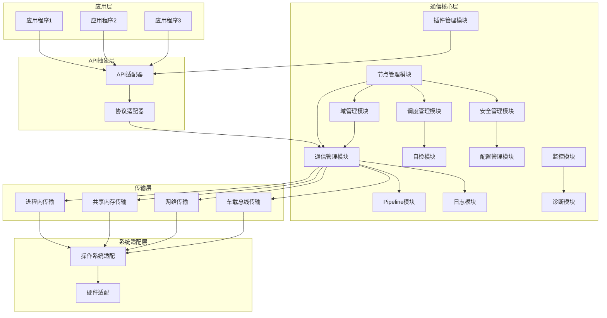

# AuroraRT 项目完整整合文档

## 一、项目概述

### 1.1 项目背景与目标

AuroraRT 是一款面向 车载自动驾驶、工业控制、边缘计算 三大核心场景的实时消息中间件，核心目标是解决现有中间件在 动态消息零拷贝、实时性确定性、高吞吐可靠传输、安全合规 等场景的痛点，提供 “高性能 + 高可靠 + 高安全 + 易扩展” 的分布式通信解决方案。

在分布式系统通信场景日益复杂化的背景下，不同领域对消息中间件的需求呈现显著差异：车规级场景对低延迟、高可靠性及安全合规性有严格要求；互联网场景侧重于高吞吐量与大规模扩展性；物联网场景则强调轻量性与弱网络环境适配能力。基于此，AuroraRT 作为自研中间件，核心目标是融合主流中间件的优秀设计理念，打造一款兼具高性能、高可靠性、安全合规性及生态兼容性的实时消息中间件，以满足车载、工业控制、物联网等多场景的通信需求。

**核心目标**：

- **实时可预测性**：延迟抖动控制在 10μs 以内，满足车载系统的硬实时性要求
- **轻量性**：内存占用不超过 10MB，适用于资源受限的车载环境
- **高性能**：支持每秒数百万条消息的传输速率
- **多节点进程管理**：提供节点注册、自动发现、健康状态监测、热重启等完整功能
- **跨平台兼容性**：同时支持 QNX 和 Ubuntu 等主流操作系统平台
- **多协议支持**：集成 TCP、UDP、QUIC 等多种网络协议，灵活适配不同通信场景

### 1.2 核心技术特性

- **零拷贝技术**：基于 Iceoryx2 实现高效的共享内存通信机制，通过直接内存映射和无锁队列，实现数据在进程间的零拷贝传输，显著降低通信延迟
- **无锁设计**：核心通信路径采用无锁队列（Lock-Free Queue）实现，有效减少线程间同步开销，提升系统并发性能和实时性
- **实时调度**：参考 CyberRT 的实时调度策略，集成协程调度、优先级调度和时间触发调度机制，确保关键任务优先执行，满足硬实时性要求
- **智能协议切换**：根据通信场景自动选择最优传输协议，支持进程内直接访问、共享内存通信、网络传输等多种方式，实现传输效率的最优化
- **故障自愈**：融合 Kubernetes 健康检查机制，实现节点异常的自动检测与恢复，提高系统可靠性和可用性
- **统一通信 API**：参考 ZMQ 设计理念，提供统一的通信接口，支持发布-订阅、请求-响应、事件等多种通信模式，简化上层应用开发

### 1.3 性能指标

性能指标	目标值	参考依据
同主机通信延迟	≤10μs（共享内存零拷贝）	iceoryx2 实测数据 + 自研汇编优化
跨主机通信延迟	≤100μs（UDP/TSN）	FastDDS 网络传输优化 + TSN 时隙调度
吞吐量	≥100 万条 / 秒（1KB 消息）	Kafka 批量传输 + iceoryx2 零拷贝
调度抖动	≤3μs	CyberRT 协程调度 + 实时内核适配
内存占用	≤5MB（基础运行）	iceoryx2 轻量化设计 + 内存池预分配
安全等级	支持 ASIL D	FastDDS Security+AutoSAR 安全框架

### 1.4 适用场景

- **自动驾驶**：传感器数据分发、感知决策交互、控制指令传输、数据融合
- **工业控制**：PLC间通信、传感器与控制器通信、工业机器人控制、设备状态监控
- **边缘计算**：边缘节点间通信、边缘与云端通信、边缘计算集群、实时数据处理
- **智能座舱**：信息娱乐系统、驾驶辅助系统、车载通信（如车机、导航系统等）
- **医疗设备**：医疗传感器数据传输、设备控制、远程医疗

## 二、系统架构设计

### 2.1 分层架构

AuroraRT 采用五层架构设计，从底层到上层依次为：

```
┌─────────────────────────────────────────────────────────────┐
│                    应用层（Application Layer）                │
├─────────────────────────────────────────────────────────────┤
│                    API抽象层（API Abstraction Layer）         │
├─────────────────────────────────────────────────────────────┤
│                  通信核心层（Communication Core Layer）       │
├─────────────────────────────────────────────────────────────┤
│                    传输层（Transport Layer）                 │
├─────────────────────────────────────────────────────────────┤
│                  系统适配层（System Adaptation Layer）        │
└─────────────────────────────────────────────────────────────┘
```

### 2.2 各层职责说明

1. **系统适配层**：
   - 实现对不同操作系统和硬件平台的适配
   - 提供统一的底层接口，屏蔽平台差异
   - 包含操作系统适配和硬件适配两个核心模块
2. **传输层**：
   - 实现多种传输方式，包括共享内存、网络传输和车载总线
   - 提供统一的传输接口，支持动态切换传输方式
   - 实现零拷贝通信，提高传输性能
3. **通信核心层**：
   - 实现消息路由、内存管理、QoS管理和安全管理
   - 提供可靠的消息传输机制，确保消息的及时送达
   - 实现智能调度，提高系统的实时性和可靠性
4. **API抽象层**：
   - 提供统一的API接口，支持发布-订阅、服务调用、动作通信等多种通信模式
   - 实现与 DDS、SOME/IP等协议的兼容
   - 简化上层应用的开发，提高开发效率
5. **应用层**：
   - 实现开发工具、监控诊断、配置管理等功能
   - 提供系统的开发、部署和维护工具
   - 支持系统的监控和故障诊断

### 2.3 核心模块详细设计

#### 2.3.1 系统适配层

##### 模块定位

屏蔽操作系统（Linux/QNX/Windows/VxWorks）与硬件（x86-64/ARM64、以太网/CAN总线/TSN）差异，提供统一的线程、共享内存、定时器、硬件接口封装，适配实时内核（Preempt\_RT）。

##### 核心组件设计

| 组件名称     | 功能职责               | 参考来源                                  | 整合实现逻辑                                                                                                      | 自研优化点                                                                           |
| -------- | ------------------ | ------------------------------------- | ----------------------------------------------------------------------------------------------------------- | ------------------------------------------------------------------------------- |
| 操作系统适配模块 | 线程、Mutex、条件变量、文件操作 | FastDDS os 模块、iceoryx2 跨平台封装          | 1. 分层设计：抽象接口（`Thread/Mutex`）+ 平台实现（Linux/QNX/Windows）；2. 实时线程支持 SCHED\_FIFO/SCHED\_RR 调度；3. 线程 CPU 绑定与优先级设置 | 1. 新增优先级继承机制，避免优先级翻转；2. 适配 Preempt\_RT 内核补丁，降低调度抖动；3. 统一错误码定义，跨平台异常处理           |
| 共享内存模块   | 跨进程内存创建/映射/释放      | iceoryx2 shared\_memory、Linux shm 子系统 | 1. 参考 iceoryx2 元数据与数据分离设计；2. 支持匿名/命名共享内存；3. 内存权限控制（读/写/执行）                                                  | 1. 支持动态大小内存分配（iceoryx2 仅支持固定大小）；2. 内核级引用计数（参考 Linux `kref`），自动回收；3. 跨平台内存对齐优化   |
| 高精度定时器模块 | 微秒级计时与任务触发         | CyberRT Timer、Linux `clock_gettime`   | 1. 参考 CyberRT 定时器逻辑，依赖 `clock_gettime(CLOCK_MONOTONIC_RAW)`；2. 支持周期性/一次性任务；3. 回调函数异步执行                      | 1. 汇编优化时间戳获取（x86-64 `rdtsc`/ARM64 `cntvct_el0`）；2. 定时器精度≤1μs；3. 与调度模块联动，支持任务优先级 |
| 硬件抽象模块   | 以太网、CAN总线、TSN 接口适配 | FastDDS 硬件适配、Linux TSN 栈              | 1. 封装以太网 Socket 接口；2. CAN 总线支持 CAN FD；3. TSN 支持 IEEE 802.1AS 时间同步、IEEE 802.1Qbv 流量调度                        | 1. 硬件中断响应优化（汇编关开中断）；2. TSN 时隙与时间触发调度协同；3. 硬件状态监控与异常回调                           |

##### 关键接口设计（C++实现）

```cpp
namespace aurorrt::os {
// 实时线程类
class Thread {
public:
    using ThreadFunc = void* (*)(void*);
    // 构造函数：支持线程名称、优先级、CPU绑定
    Thread(ThreadFunc func, void* arg, const char* name, int priority = 50, int cpu_id = -1);
    ~Thread();
    bool Start();
    void Join();
    void SetRealTime(bool enable, int scheduler_type = SCHED_FIFO); // 启用实时调度
private:
    pthread_t thread_;
    ThreadFunc func_;
    void* arg_;
    char name_[32];
    bool is_real_time_;
};

// 共享内存类
class SharedMemory {
public:
    // 创建/打开共享内存
    SharedMemory(const char* name, size_t size, bool create = true);
    ~SharedMemory();
    void* Map(); // 内存映射
    void Unmap(); // 解除映射
    bool Unlink(); // 删除共享内存（创建者）
private:
    std::string name_;
    size_t size_;
    int fd_;
    void* mapped_addr_;
    bool is_owner_;
};

// 高精度定时器类
class HighResTimer {
public:
    HighResTimer();
    uint64_t GetTimestampUs(); // 纳秒级时间戳
    // 注册周期性任务
    bool RegisterPeriodicTask(std::function<void()> callback, uint64_t period_us);
    // 注册一次性任务
    bool RegisterOneShotTask(std::function<void()> callback, uint64_t delay_us);
private:
    #ifdef __x86_64__
    uint64_t GetRdtsc(); // 汇编实现rdtsc指令
    #elif __aarch64__
    uint64_t GetCntvct(); // 汇编实现读取cntvct_el0寄存器
    #endif
    std::vector<std::shared_ptr<Task>> tasks_;
    std::thread timer_thread_;
    bool is_running_;
};
}
```

##### 汇编优化示例（x86-64 时间戳获取）

```asm
// x86_64汇编实现rdtsc时间戳（.S文件）
#ifdef __x86_64__
.global aurorrt_os_HighResTimer_GetRdtsc
aurorrt_os_HighResTimer_GetRdtsc:
    rdtsc                  // 读取TSC寄存器，EDX:EAX
    shl rdx, 32            // 将EDX移位到高32位
    or rax, rdx           // 合并为64位时间戳
    ret
#endif
```

#### 2.3.2 传输层

##### 模块定位

实现进程内、共享内存、网络三种传输方式，支持动态消息零拷贝、大消息分片/重组、传输方式智能切换，适配不同通信场景（同进程/同主机/跨主机）。

##### 核心组件设计

| 传输方式   | 功能职责         | 参考来源                        | 整合实现逻辑                                                                                             | 自研优化点                                                                    |
| ------ | ------------ | --------------------------- | -------------------------------------------------------------------------------------------------- | ------------------------------------------------------------------------ |
| 进程内传输  | 同一进程内组件间数据传输 | CyberRT INTRA 传输            | 1. 直接内存访问，通过智能指针传递数据；2. 无中间层拷贝，延迟≤1μs；3. 支持动态大小数据                                                  | 1. 统一接口与其他传输方式兼容；2. 数据有效性检查，避免野指针；3. 与内存池联动，复用内存块                        |
| 共享内存传输 | 同主机跨进程零拷贝传输  | iceoryx2 共享内存、Agnocast 动态消息 | 1. 参考 iceoryx2 无锁队列（SPSC/MPSC）；2. 整合 Agnocast 动态容器支持（`std::vector`/`std::string`）；3. 内存池预分配，支持动态扩容 | 1. 多读者引用计数机制（原子操作）；2. 共享内存元数据轻量化（仅保留大小/权限/引用数）；3. 内存块自动合并与拆分，减少碎片        |
| 网络传输   | 跨主机数据传输      | FastDDS UDP/TCP、Kafka 批量传输  | 1. 参考 FastDDS  UDP 多播/单播、TCP 可靠传输；2. 整合 Kafka 批量传输机制；3. 基于 asio 异步 IO 事件循环                         | 1. 大消息自动分片（默认1KB，可配置）与重组；2. TSN 网络适配，为控制流分配专属时隙；3. 传输方式智能切换（根据节点位置与数据大小） |

##### 关键接口设计（C++实现）

```cpp
namespace aurorrt::transport {
// 传输接口基类（所有传输方式实现此接口）
class TransportInterface {
public:
    virtual ~TransportInterface() = default;
    // 普通发送（拷贝传输）
    virtual bool Send(const void* data, size_t size, const std::string& dest) = 0;
    // 零拷贝发送（动态消息直接写入共享内存）
    virtual bool SendZeroCopy(void* data, size_t size, const std::string& dest) = 0;
    // 设置接收回调
    virtual void SetReceiveCallback(std::function<void(const void*, size_t)> callback) = 0;
    // 设置大消息分片接收回调
    virtual void SetLargeMessageCallback(std::function<void(const std::vector<void*>& fragments, size_t total_size)> callback) = 0;
    virtual bool Start() = 0;
    virtual bool Stop() = 0;
    virtual TransportType GetType() const = 0;
};

// 共享内存传输实现
class ShmTransport : public TransportInterface {
public:
    ShmTransport(const char* shm_name, size_t pool_size = 64 * 1024 * 1024);
    ~ShmTransport() override;
    bool Send(const void* data, size_t size, const std::string& dest) override;
    bool SendZeroCopy(void* data, size_t size, const std::string& dest) override;
    void SetReceiveCallback(std::function<void(const void*, size_t)> callback) override;
    void SetLargeMessageCallback(std::function<void(const std::vector<void*>&, size_t)> callback) override;
    bool Start() override;
    bool Stop() override;
    TransportType GetType() const override { return TransportType::SHARED_MEMORY; }
private:
    // 共享内存池
    class ShmMemoryPool {
    public:
        ShmMemoryPool(const char* name, size_t size);
        ~ShmMemoryPool();
        void* Allocate(size_t size); // 动态大小分配
        void Free(void* ptr);
        size_t GetBlockSize(void* ptr) const;
    private:
        os::SharedMemory shm_;
        void* base_addr_;
        size_t total_size_;
        std::unordered_map<void*, size_t> block_sizes_; // 记录动态块大小
        os::Mutex mutex_;
    };
    std::string shm_name_;
    std::unique_ptr<ShmMemoryPool> memory_pool_;
    std::function<void(const void*, size_t)> receive_callback_;
    std::function<void(const std::vector<void*>&, size_t)> large_msg_callback_;
    void* lock_free_queue_; // 汇编实现的MPSC无锁队列
    os::Thread receive_thread_;
    bool is_running_;
};

// 网络传输实现
class NetworkTransport : public TransportInterface {
public:
    enum class Protocol { UDP, TCP, TSN };
    NetworkTransport(Protocol protocol, uint16_t port);
    ~NetworkTransport() override;
    bool Send(const void* data, size_t size, const std::string& dest) override;
    bool SendZeroCopy(void* data, size_t size, const std::string& dest) override;
    void SetReceiveCallback(std::function<void(const void*, size_t)> callback) override;
    void SetLargeMessageCallback(std::function<void(const std::vector<void*>&, size_t)> callback) override;
    bool Start() override;
    bool Stop() override;
    TransportType GetType() const override { return TransportType::NETWORK; }
private:
    Protocol protocol_;
    uint16_t port_;
    std::unique_ptr<asio::io_context> io_context_;
    std::unique_ptr<asio::ip::udp::socket> udp_socket_;
    std::unique_ptr<asio::ip::tcp::acceptor> tcp_acceptor_;
    std::function<void(const void*, size_t)> receive_callback_;
    std::function<void(const std::vector<void*>&, size_t)> large_msg_callback_;
    os::Thread io_thread_;
    bool is_running_;
    // 大消息分片管理
    std::unordered_map<uint64_t, std::vector<void*>> fragment_cache_;
};
}
```

##### 汇编优化示例（ARM64 无锁队列入队）

```asm
// ARM64汇编实现MPSC无锁队列入队（.S文件）
#ifdef __aarch64__
.global aurorrt_transport_mpsc_enqueue
aurorrt_transport_mpsc_enqueue:
    // 参数：x0=队列指针，x1=数据指针
    ldr x2, [x0, #8]        // 读取tail指针
1:
    ldr x3, [x2]           // 读取tail->next
    cbz x3, 2f              // 如果next为空，直接入队
    // CAS更新tail指针
    ldxr x4, [x0, #8]
    cmp x4, x2
    bne 1b
    stxr w5, x3, [x0, #8]
    cbnz w5, 1b
    b 1b
2:
    // 存储数据并更新next
    str x1, [x2, #16]      // tail->data = 数据指针
    mov x3, x2
    add x3, x3, #32         // 计算下一个节点地址
    stxr w5, x3, [x2]       // tail->next = 下一个节点
    cbnz w5, 1b
    // 最终更新tail指针
    stxr w5, x3, [x0, #8]
    cbnz w5, 1b
    mov x0, #1              // 返回成功
    ret
#endif
```

#### 2.3.3 节点管理模块（参考 ROS2/FastDDS/CyberRT）

##### 模块定位

管理节点生命周期（创建/启动/停止/销毁）、动态服务发现、健康状态监控，支持节点故障自动恢复，适配分布式部署场景。

##### 核心组件设计

| 组件名称                | 功能职责        | 参考来源                                | 整合实现逻辑                                                                     | 自研优化点                                                           |
| ------------------- | ----------- | ----------------------------------- | -------------------------------------------------------------------------- | --------------------------------------------------------------- |
| Node（节点抽象）          | 节点身份标识、接口封装 | ROS2 Node、FastDDS DomainParticipant | 1. 抽象类 `Node`，包含 `Init/Start/Stop` 核心接口；2. 关联节点 ID、名称、状态；3. 绑定通信/调度/内存模块   | 1. 支持实时/非实时节点配置；2. 节点优先级与 CPU 绑定联动；3. 轻量化设计，减少内存占用              |
| NodeManager（节点管理器）  | 生命周期管理      | ROS2 NodeManager、CyberRT 组件管理       | 1. 单例模式，维护节点列表（`std::unordered_map<NodeId, Node>`）；2. 节点创建/删除接口；3. 模块间联动协调 | 1. 节点动态迁移支持；2. 负载均衡（根据节点资源占用分配任务）；3. 故障节点自动清理与替换                |
| NodeDiscovery（节点发现） | 动态节点发现      | FastDDS 服务发现、ZMQ 无代理发现              | 1. 混合式发现：小规模（<50节点）组播，大规模单播+发现服务器；2. 发现消息节流机制；3. 节点离线快速通知                  | 1. 发现消息轻量化（仅包含节点 ID/名称/地址/状态）；2. 跨网段发现支持；3. 发现与认证联动（未认证节点不加入列表） |
| NodeMonitor（节点监控）   | 健康状态监控      | ROS2 节点监控、CyberRT 资源统计              | 1. 心跳包+业务数据双检测机制；2. 监控 CPU/内存/网络占用；3. 异常回调通知                               | 1. 故障检测延迟≤10ms；2. 误判率≤0.1%；3. 支持自定义监控指标                         |

##### 关键接口设计（C++实现）

```cpp
namespace aurorrt::core {
using NodeId = uint64_t;
enum class NodeState { UNINITIALIZED, RUNNING, STOPPED, FAULT };

class Node {
public:
    Node(const char* node_name, bool is_real_time = false);
    virtual ~Node();
    virtual bool Init();
    virtual bool Start();
    virtual bool Stop();
    std::string GetName() const;
    NodeId GetId() const;
    NodeState GetState() const;
    bool IsRealTime() const;
private:
    std::string name_;
    NodeId id_;
    NodeState state_;
    bool is_real_time_;
    std::unique_ptr<CommunicationManager> comm_manager_;
    std::unique_ptr<Scheduler> scheduler_;
};

class NodeManager {
public:
    static NodeManager& Instance();
    // 创建节点
    NodeId CreateNode(const char* node_name, bool is_real_time = false);
    // 删除节点
    bool RemoveNode(NodeId node_id);
    // 获取节点
    Node* GetNode(NodeId node_id);
    // 发现所有存活节点
    std::vector<NodeInfo> DiscoverNodes();
    // 检查节点健康状态
    bool CheckNodeHealth(NodeId node_id);
private:
    NodeManager() = default;
    std::unordered_map<NodeId, std::unique_ptr<Node>> nodes_;
    NodeDiscovery discovery_;
    NodeMonitor monitor_;
    os::Mutex mutex_;
};

class NodeDiscovery {
public:
    NodeDiscovery();
    ~NodeDiscovery();
    // 初始化发现模式（AUTO/UNICAST/MULTICAST）
    void Init(DiscoveryMode mode = DiscoveryMode::AUTO);
    // 注册节点
    void RegisterNode(const NodeInfo& info);
    // 注销节点
    void UnregisterNode(NodeId node_id);
    // 发现节点
    std::vector<NodeInfo> DiscoverNodes();
    // 设置发现服务器（大规模场景）
    void SetDiscoveryServer(const std::string& ip, uint16_t port);
private:
    DiscoveryMode mode_;
    std::unordered_map<NodeId, NodeInfo> discovered_nodes_;
    os::UDPSocket multicast_socket_;
    os::TCPSocket server_socket_;
    bool use_discovery_server_;
};
}
```

#### 2.3.4 通信管理模块（参考 DDS/ZMQ/RabbitMQ/RocketMQ）

##### 模块定位

实现多通信模式（发布-订阅、请求-响应、点对点、事件通知、事务消息），整合序列化、QoS 策略、路由机制，保障消息可靠、高效传输。

##### 核心组件设计

| 组件名称    | 功能职责       | 参考来源                             | 整合实现逻辑                                                                                                                                                        | 自研优化点                                                                                 |
| ------- | ---------- | -------------------------------- | ------------------------------------------------------------------------------------------------------------------------------------------------------------- | ------------------------------------------------------------------------------------- |
| 通信模式抽象  | 统一通信接口     | ZMQ socket、DDS 通信模式              | 1. 抽象类 `CommunicationPattern`，派生 `PubSubPattern`/`ReqRespPattern`/`PushPullPattern`/`EventPattern`/`TransactionPattern`；2. 统一接口 `Init/Start/Stop`；3. 与传输层自动适配 | 1. 通信模式动态切换（同一 Port 支持多模式）；2. 模式-传输映射优化（如 PubSub→共享内存/多播，ReqResp→TCP）；3. 场景化默认参数，简化配置 |
| 序列化引擎   | 数据序列化/反序列化 | FlatBuffers、Protobuf、FastDDS CDR | 1. 自适应序列化：小消息（<1KB）CDR，大消息 FlatBuffers；2. 支持动态消息序列化；3. 跨语言兼容（通过 C 接口）                                                                                         | 1. 序列化元数据轻量化；2. 与传输层联动，序列化后直接写入共享内存/网络缓冲区；3. 支持自定义序列化扩展                               |
| QoS 管理器 | 服务质量保障     | DDS QoS、Kafka 副本、RocketMQ 重试     | 1. 4级 QoS 策略：QOS\_0（尽力而为）、QOS\_1（至少一次）、QOS\_2（恰好一次）、QOS\_3（持久化可靠）；2. 动态 QoS 调整（根据网络状况）；3. 杂散抑制（数据校验）                                                          | 1. QoS 与传输方式/持久化联动；2. 重试策略可配置（次数/间隔）；3. 优先级抢占（高 QoS 消息打断低 QoS 传输）                     |
| 路由管理器   | 消息路由与分发    | RabbitMQ 路由、DDS 主题匹配             | 1. 支持 direct（点对点）、topic（主题匹配）、fanout（广播）路由；2. 主题通配符支持（`*`/`#`）；3. 路由缓存优化                                                                                      | 1. 路由规则轻量化，减少匹配开销；2. 与节点发现联动，动态更新路由表；3. 本地路由优先，降低网络开销                                 |
| 事务消息管理器 | 事务性保障      | RocketMQ 事务消息                    | 1. 两阶段提交机制；2. 事务状态回调；3. 超时回滚                                                                                                                                  | 1. 简化分布式事务支持，聚焦本地事务；2. 与持久化模块联动，事务消息强制持久化；3. 轻量化设计，无额外依赖                              |

##### 关键接口设计（C++实现）

```cpp
namespace aurorrt::core {
// 通信模式抽象接口
class CommunicationPattern {
public:
    virtual ~CommunicationPattern() = default;
    virtual bool Init() = 0;
    virtual bool Start() = 0;
    virtual bool Stop() = 0;
    virtual void SetQoS(QoSLevle level) = 0;
};

// 发布-订阅模式实现
class PubSubPattern : public CommunicationPattern {
public:
    PubSubPattern(Node* node, const char* topic);
    ~PubSubPattern() override;
    bool Init() override;
    bool Start() override;
    bool Stop() override;
    void SetQoS(QoSLevle level) override;

    // 创建发布者
    template<typename T>
    std::shared_ptr<Publisher<T>> CreatePublisher();
    // 创建订阅者
    template<typename T>
    std::shared_ptr<Subscriber<T>> CreateSubscriber(std::function<void(const std::shared_ptr<const T>&)> callback);
private:
    Node* node_;
    std::string topic_;
    QoSLevle qos_level_;
    std::unique_ptr<transport::TransportInterface> transport_;
    std::unordered_map<std::string, std::vector<SubscriberBase*>> subscribers_;
    RoutingManager routing_manager_;
};

// 请求-响应模式实现
class ReqRespPattern : public CommunicationPattern {
public:
    ReqRespPattern(Node* node, const char* service_name);
    ~ReqRespPattern() override;
    bool Init() override;
    bool Start() override;
    bool Stop() override;
    void SetQoS(QoSLevle level) override;

    // 创建客户端
    template<typename Req, typename Resp>
    std::shared_ptr<Client<Req, Resp>> CreateClient();
    // 创建服务端
    template<typename Req, typename Resp>
    std::shared_ptr<Service<Req, Resp>> CreateService(std::function<void(const std::shared_ptr<const Req>&, std::shared_ptr<Resp>&)> callback);
private:
    Node* node_;
    std::string service_name_;
    QoSLevle qos_level_;
    std::unique_ptr<transport::TransportInterface> transport_;
    std::unordered_map<RequestId, std::function<void(const std::shared_ptr<void>&)>> response_callbacks_;
};

// 事务消息模式实现
class TransactionPattern : public CommunicationPattern {
public:
    TransactionPattern(Node* node, const char* topic);
    ~TransactionPattern() override;
    bool Init() override;
    bool Start() override;
    bool Stop() override;
    void SetQoS(QoSLevle level) override;

    // 发送事务消息
    template<typename T>
    bool SendTransactionMessage(const std::shared_ptr<const T>& msg, std::function<bool()> prepare, std::function<void(bool)> commit);
private:
    Node* node_;
    std::string topic_;
    QoSLevle qos_level_;
    std::unique_ptr<transport::TransportInterface> transport_;
    std::unique_ptr<PersistenceEngine> persistence_;
    std::unordered_map<TransactionId, TransactionState> transaction_states_;
};

// QoS管理器
class QoSManager {
public:
    enum class QoSLevle {
        QOS_0_BEST_EFFORT,    // 尽力而为，不保证送达
        QOS_1_RELIABLE,       // 至少一次送达
        QOS_2_EXACT_ONCE,      // 恰好一次送达
        QOS_3_PERSISTENT      // 持久化可靠，故障恢复后送达
    };

    void SetQoS(const std::string& topic, QoSLevle level);
    QoSLevle GetQoS(const std::string& topic);
    // 动态调整QoS（根据网络延迟/丢包率）
    void AdjustQoS(const std::string& topic, uint64_t latency_ms, uint8_t loss_rate);
private:
    std::unordered_map<std::string, QoSPolicy> topic_qos_;
    os::Mutex mutex_;
};
}
```

#### 2.3.5 调度管理模块（参考 CyberRT/libco/FastDDS）

##### 模块定位

管理任务调度，支持协程、优先级、时间触发三种调度模式，保障实时任务的确定性执行，减少上下文切换开销。

##### 核心组件设计

| 组件名称    | 功能职责     | 参考来源                        | 整合实现逻辑                                            | 自研优化点                                       |
| ------- | -------- | --------------------------- | ------------------------------------------------- | ------------------------------------------- |
| 协程调度器   | 高效任务调度   | CyberRT 协程、libco 协程切换       | 1. N:1 协程模型（多协程映射到单线程）；2. 协程池动态扩容；3. 无锁协程就绪队列     | 1. 汇编优化协程切换（开销≤1μs）；2. 协程优先级支持；3. 与时间触发调度联动 |
| 优先级调度器  | 紧急任务优先执行 | FastDDS 优先级调度、Linux 实时调度    | 1. 256级优先级支持；2. 抢占式调度（高优先级打断低优先级）；3. 优先级继承机制      | 1. 任务优先级与 QoS 联动；2. CPU 核心绑定优化；3. 避免优先级翻转   |
| 时间触发调度器 | 确定性延迟任务  | FastDDS 时间触发、CyberRT 高精度定时器 | 1. 时间表管理（周期性/一次性任务）；2. 任务执行精度≤1μs；3. 与 TSN 网络时隙协同 | 1. 时间表动态调整；2. 任务偏移配置；3. 错过执行的容错处理           |
| 调度管理器   | 调度模式选择   | CyberRT 调度管理器               | 1. 根据任务类型自动选择调度器；2. 负载均衡（避免单 CPU 过载）；3. 调度状态监控    | 1. 调度策略可配置；2. 实时任务与非实时任务分离调度；3. 调度性能统计      |

##### 关键接口设计（C++实现）

```cpp
namespace aurorrt::core {
using TaskId = uint64_t;
enum class SchedulerType { COROUTINE, PRIORITY, TIME_TRIGGERED };

class Task {
public:
    virtual ~Task() = default;
    virtual void Run() = 0;
    virtual uint8_t GetPriority() const = 0; // 0-255，255最高
    virtual bool IsRealTime() const = 0;
    virtual TaskId GetId() const = 0;
};

class CoroutineScheduler : public Scheduler {
public:
    CoroutineScheduler(size_t initial_coroutine_count = 16);
    TaskId Schedule(std::unique_ptr<Task> task) override;
    bool Cancel(TaskId task_id) override;
    SchedulerType GetType() const override { return SchedulerType::COROUTINE; }
private:
    struct Coroutine {
        void* stack;
        size_t stack_size;
        std::unique_ptr<Task> task;
        CoroutineState state;
    };
    std::vector<Coroutine> coroutines_;
    void* ready_queue_; // 汇编实现的MPSC无锁队列
    os::Mutex mutex_;
};

class PriorityScheduler : public Scheduler {
public:
    TaskId Schedule(std::unique_ptr<Task> task) override;
    bool Cancel(TaskId task_id) override;
    SchedulerType GetType() const override { return SchedulerType::PRIORITY; }
private:
    // 按优先级分组的就绪队列
    std::array<std::unique_ptr<LockFreeQueue>, 256> priority_queues_;
    os::Mutex mutex_;
};

class TimeTriggeredScheduler : public Scheduler {
public:
    // 调度周期性任务
    TaskId SchedulePeriodicTask(std::unique_ptr<Task> task, uint64_t period_us, uint64_t offset_us = 0);
    // 调度一次性任务
    TaskId ScheduleOneShotTask(std::unique_ptr<Task> task, uint64_t delay_us);
    bool Cancel(TaskId task_id) override;
    SchedulerType GetType() const override { return SchedulerType::TIME_TRIGGERED; }
private:
    // 按执行时间排序的任务队列
    std::multimap<uint64_t, std::shared_ptr<TimeTask>> task_queue_;
    os::HighResTimer timer_;
    os::Mutex mutex_;
};

class SchedulerManager {
public:
    static SchedulerManager& Instance();
    // 自动选择调度器
    TaskId ScheduleTask(std::unique_ptr<Task> task);
    // 指定调度器
    TaskId ScheduleTask(std::unique_ptr<Task> task, SchedulerType type);
    bool CancelTask(TaskId task_id);
private:
    std::shared_ptr<CoroutineScheduler> coroutine_scheduler_;
    std::shared_ptr<PriorityScheduler> priority_scheduler_;
    std::shared_ptr<TimeTriggeredScheduler> time_triggered_scheduler_;
    std::unordered_map<TaskId, SchedulerType> task_scheduler_map_;
    os::Mutex mutex_;
};
}
```

#### 2.3.6 内存管理模块

##### 模块定位

管理内存分配/释放，优化内存使用效率，支持内存池预分配、共享内存管理、内存安全检查，避免内存泄漏、缓冲区溢出。

##### 核心组件设计

| 组件名称    | 功能职责            | 参考来源                            | 整合实现逻辑                                                                  | 自研优化点                                             |
| ------- | --------------- | ------------------------------- | ----------------------------------------------------------------------- | ------------------------------------------------- |
| 内存池     | 预分配内存块，减少动态分配开销 | iceoryx2 内存池、CyberRT MemoryPool | 1. 多规格内存池（8B/16B/32B/64B/128B/256B/512B/1KB/4KB/8KB）；2. 空闲链表管理；3. 内存块复用 | 1. 内存块自动合并与拆分；2. 内存池动态扩容；3. 内存使用率监控，按需调整大小        |
| 共享内存管理器 | 跨进程内存管理         | iceoryx2 共享内存、Linux shm 子系统     | 1. 封装共享内存创建/映射/释放；2. 内核级引用计数；3. 跨语言内存协同                                 | 1. 与内存池联动，共享内存块复用；2. 内存权限细粒度控制；3. 共享内存泄漏检测        |
| 内存安全检查  | 避免内存问题          | Valgrind 内存检测、Linux 内核内存边界检查    | 1. 缓冲区边界检查；2. 空指针检查；3. 内存泄漏检测                                           | 1. 实时检查，不影响核心性能；2. 错误日志详细定位；3. 关键场景强制检查，非关键场景可选关闭 |

##### 关键接口设计（C++实现）

```cpp
namespace aurorrt::core {
class MemoryPool {
public:
    MemoryPool(size_t block_size, size_t block_count);
    ~MemoryPool();
    void* Allocate(); // 分配内存块
    void Free(void* ptr); // 释放内存块
    float GetUsage() const; // 内存使用率
    size_t GetBlockSize() const;
private:
    void* base_addr_;
    size_t block_size_;
    size_t block_count_;
    size_t free_blocks_;
    std::atomic<void*> free_list_; // 无锁空闲链表
};

class SharedMemoryManager {
public:
    static SharedMemoryManager& Instance();
    // 分配共享内存
    void* AllocateShared(size_t size, const char* shm_name);
    // 释放共享内存
    void FreeShared(void* ptr, const char* shm_name);
    // 跨语言内存访问接口
    void* GetSharedData(void* ptr, const char* type_meta);
private:
    std::unordered_map<std::string, std::shared_ptr<os::SharedMemory>> shm_map_;
    std::unordered_map<void*, std::string> ptr_shm_map_;
    os::Mutex mutex_;
};

class MemorySafetyChecker {
public:
    // 缓冲区边界检查
    static bool CheckBuffer(void* ptr, size_t size);
    // 空指针检查
    static bool CheckNull(void* ptr);
    // 内存跟踪（用于泄漏检测）
    static void TrackMemory(void* ptr, size_t size, const char* owner);
    // 取消内存跟踪
    static void UntrackMemory(void* ptr);
    // 检查内存泄漏
    static std::vector<MemoryLeakInfo> CheckLeak();
private:
    static std::unordered_map<void*, MemoryTrackInfo> tracked_memory_;
    static os::Mutex mutex_;
};

class MemoryManager {
public:
    static MemoryManager& Instance();
    void Init(); // 初始化内存池
    // 分配内存（自动选择内存池/动态分配）
    void* Allocate(size_t size);
    // 释放内存
    void Free(void* ptr);
    // 分配共享内存
    void* AllocateShared(size_t size, const char* shm_name);
    // 释放共享内存
    void FreeShared(void* ptr, const char* shm_name);
    // 获取内存使用统计
    MemoryStats GetStats() const;
private:
    std::vector<std::unique_ptr<MemoryPool>> pools_;
    SharedMemoryManager shm_manager_;
    os::Mutex mutex_;
};
}
```

#### 2.3.7 安全管理模块（参考 FastDDS Security/OpenSSL/AutoSAR）

##### 模块定位

提供身份认证、数据加密、访问控制，满足车规级 ASIL D 安全要求，保障数据传输与存储安全。

##### 核心组件设计

| 组件名称 | 功能职责        | 参考来源                           | 整合实现逻辑                                                    | 自研优化点                                                  |
| ---- | ----------- | ------------------------------ | --------------------------------------------------------- | ------------------------------------------------------ |
| 身份认证 | 验证节点身份合法性   | FastDDS Security、OpenSSL X.509 | 1. 支持 X.509 证书认证、JWT 令牌认证；2. 证书链验证；3. 认证超时自动刷新            | 1. 与节点发现联动，未认证节点无法加入网络；2. 证书轻量化验证，减少性能开销；3. 认证日志审计     |
| 数据加密 | 保障数据传输/存储安全 | OpenSSL AES/TLS、FastDDS 加密     | 1. 传输加密：AES-256-GCM、TLS 1.3；2. 存储加密：AES-256-CTR；3. 密钥动态更新 | 1. 加密与传输联动，自动加密关键数据；2. 硬件加密加速支持；3. 密钥安全存储（依赖硬件安全模块HSM） |
| 访问控制 | 限制资源访问权限    | SROS2 RBAC、AutoSAR 访问控制        | 1. 基于角色的 RBAC 模型；2. 访问控制列表（ACL）；3. 细粒度权限控制（读/写/执行）        | 1. 权限与节点身份绑定；2. 访问控制动态更新；3. 异常访问检测与告警                  |

##### 关键接口设计（C++实现）

```cpp
namespace aurorrt::core {
class Authentication {
public:
    static Authentication& Instance();
    // 初始化认证（加载证书/密钥）
    bool Init(const char* cert_path, const char* key_path);
    // 验证节点身份
    bool Authenticate(NodeId node_id, const std::string& cert_data);
    // 生成JWT令牌
    std::string GenerateJWT(NodeId node_id, uint64_t expire_seconds);
    // 验证JWT令牌
    bool VerifyJWT(const std::string& token, NodeId& node_id);
private:
    std::unique_ptr<X509Certificate> root_cert_;
    std::unique_ptr<EC_KEY> private_key_;
    os::Mutex mutex_;
};

class EncryptionEngine {
public:
    static EncryptionEngine& Instance();
    // 初始化加密引擎
    bool Init(const char* key_path);
    // 加密数据
    bool Encrypt(const void* data, size_t size, std::vector<uint8_t>& encrypted_data);
    // 解密数据
    bool Decrypt(const void* encrypted_data, size_t size, std::vector<uint8_t>& decrypted_data);
    // TLS握手（网络传输）
    bool TLSHandshake(int sockfd, std::string& session_id);
private:
    std::unique_ptr<EVP_CIPHER_CTX> cipher_ctx_;
    std::unique_ptr<SSL_CTX> ssl_ctx_;
    std::unordered_map<std::string, std::unique_ptr<SSL>> ssl_sessions_;
    os::Mutex mutex_;
};

class AccessControl {
public:
    static AccessControl& Instance();
    // 添加角色
    bool AddRole(const std::string& role_name);
    // 绑定节点与角色
    bool BindNodeRole(NodeId node_id, const std::string& role_name);
    // 添加权限规则（角色-资源-权限）
    bool AddPermission(const std::string& role_name, const std::string& resource, PermissionType permission);
    // 检查权限
    bool CheckPermission(NodeId node_id, const std::string& resource, PermissionType permission);
private:
    std::unordered_map<std::string, std::vector<PermissionRule>> role_permissions_;
    std::unordered_map<NodeId, std::string> node_roles_;
    os::Mutex mutex_;
};

class SecurityFramework {
public:
    static SecurityFramework& Instance();
    // 初始化安全框架
    bool Init(const SecurityConfig& config);
    // 身份认证
    bool AuthenticateNode(NodeId node_id, const std::string& cert_data);
    // 数据加密（传输）
    bool EncryptData(const void* data, size_t size, std::vector<uint8_t>& encrypted_data);
    // 数据解密（传输）
    bool DecryptData(const void* encrypted_data, size_t size, std::vector<uint8_t>& decrypted_data);
    // 存储加密
    bool EncryptStorage(const void* data, size_t size, std::vector<uint8_t>& encrypted_data);
    // 存储解密
    bool DecryptStorage(const void* encrypted_data, size_t size, std::vector<uint8_t>& decrypted_data);
    // 权限检查
    bool CheckNodePermission(NodeId node_id, const std::string& resource, PermissionType permission);
private:
    Authentication authentication_;
    EncryptionEngine encryption_engine_;
    AccessControl access_control_;
    bool enabled_;
};
}
```

#### 2.3.8 持久化存储模块

##### 模块定位

针对车载/工业控制的关键数据（控制指令、故障日志、传感器关键数据），提供本地轻量级持久化存储，支持故障恢复、数据回溯与断点续传。

##### 核心组件设计

| 组件名称  | 功能职责      | 参考来源                                    | 整合实现逻辑                                                             | 自研优化点                                                                                             |
| ----- | --------- | --------------------------------------- | ------------------------------------------------------------------ | ------------------------------------------------------------------------------------------------- |
| 存储引擎  | 数据持久化与读取  | Kafka 日志存储、RocketMQ CommitLog           | 1. 日志式顺序写磁盘（提升写入性能）；2. 数据按主题分区存储；3. 日志分段管理（默认1GB/段）；4. 支持内存+磁盘混合存储 | 1. 存储结构简化（仅保留数据段+索引段，剥离冗余元数据）；2. 可配置存储开关（仅QoS 3级消息强制存储）；3. 支持多存储介质（硬盘/SSD）自适应；4. 写入操作异步执行，不阻塞实时传输 |
| 索引管理器 | 数据索引与查询   | RocketMQ ConsumeQueue、Kafka OffsetIndex | 1. 按主题+时间戳建立二级索引；2. 索引数据轻量化（仅存储偏移量、大小、时间戳）；3. 索引与数据段一一对应           | 1. 支持按主题、时间范围、消息ID查询；2. 索引缓存优化，提升查询效率；3. 索引自动清理（与数据段同步过期）；4. 避免复杂索引结构，降低内存占用                      |
| 恢复管理器 | 故障恢复与断点续传 | Kafka 日志回放、RocketMQ 故障恢复                | 1. 启动时自动校验数据完整性（CRC32校验）；2. 支持从指定时间点/偏移量恢复；3. 分片传输断点续传（记录已传输分片）    | 1. 快速恢复机制（仅加载最近活跃数据段）；2. 数据损坏自动修复（基于校验和）；3. 恢复进度监控与回调；4. 与安全模块联动，恢复数据需解密验证                        |

#### 2.3.9 Pipeline模块

- **功能**：实现数据处理流水线，支持数据的流式处理和转换
- **核心组件**：
  - `Pipeline`：流水线抽象接口
  - `PipelineStage`：流水线阶段
  - `PipelineManager`：管理流水线
- **优势特性**：
  - 支持动态添加和删除处理阶段
  - 支持并行处理和负载均衡
  - 提高数据处理效率

#### 2.3.10 自检模块

- **功能**：实现系统自我检测和健康监控
- **核心组件**：
  - `SelfTest`：自检框架
  - `TestSuite`：测试套件
  - `HealthMonitor`：健康状态监控
- **优势特性**：
  - 支持多种测试用例和测试套件
  - 提供健康状态评估和故障诊断
  - 及时发现系统故障

#### 2.3.11 日志模块

- **功能**：实现系统日志的记录和管理
- **核心组件**：
  - `Logger`：日志器
  - `LogManager`：日志管理器
  - `LogFormatter`：日志格式化
- **优势特性**：
  - 支持多种日志级别和输出方式
  - 提供日志过滤和查询功能
  - 支持日志轮转和归档

#### 2.3.12 配置管理模块

- **功能**：实现配置的加载、保存和动态更新
- **核心组件**：
  - `ConfigManager`：配置管理器
  - `ConfigProvider`：配置提供者，负责从不同源加载配置
  - `ConfigValidator`：配置验证器，验证配置的有效性
  - `ConfigMonitor`：配置监控器，监控配置的变化
- **优势特性**：
  - 支持多种配置源：文件、环境变量、远程配置中心
  - 支持配置的动态更新，无需重启系统
  - 提供配置验证，确保配置的有效性

#### 2.3.13 监控模块

- **功能**：实现系统运行状态的监控
- **核心组件**：
  - `MetricsCollector`：指标收集器，收集系统性能指标
  - `Monitor`：监控器
  - `AlertManager`：告警管理器
- **优势特性**：
  - 支持多种指标的收集和分析
  - 提供实时监控和告警功能
  - 支持历史数据查询和分析

#### 2.3.14 诊断模块

- **功能**：实现系统故障的诊断和分析
- **核心组件**：
  - `DiagnosticManager`：诊断管理器
  - `FaultDetector`：故障检测器
  - `RootCauseAnalyzer`：根因分析器
- **优势特性**：
  - 支持多种故障类型的检测
  - 提供故障的根因分析
  - 支持故障的自动恢复

#### 2.3.15 插件管理模块

- **功能**：实现插件的动态加载和卸载
- **核心组件**：
  - `PluginManager`：插件管理器
  - `PluginLoader`：插件加载器
  - `PluginInterface`：插件接口
- **优势特性**：
  - 支持插件的热插拔
  - 提供标准化的插件接口
  - 支持插件的依赖管理

#### 2.3.16 域管理模块

- **功能**：实现域/分区级别的资源管理和隔离，支持大规模分布式系统的组织和管理
- **核心组件**：
  - `DomainManager`：域管理器，负责域和分区的集中管理
  - `DomainInfo`：域信息类，管理域的基本信息和分区
  - `PartitionInfo`：分区信息类，管理分区的基本信息和节点
- **优势特性**：
  - 支持域和分区的创建、删除、加入和离开
  - 提供标准化的操作码进行域管理操作
  - 线程安全的设计，确保并发操作的安全性
  - 高效的数据结构和算法，提高管理效率
  - 支持动态创建和管理域和分区

##### 域管理操作码定义

| 操作码 | 十六进制值 | 描述 |
|-------|-----------|------|
| CREATE_DOMAIN | 0x01 | 创建域 |
| DELETE_DOMAIN | 0x02 | 删除域 |
| JOIN_DOMAIN | 0x03 | 加入域 |
| LEAVE_DOMAIN | 0x04 | 离开域 |
| CREATE_PARTITION | 0x05 | 创建分区 |
| DELETE_PARTITION | 0x06 | 删除分区 |
| JOIN_PARTITION | 0x07 | 加入分区 |
| LEAVE_PARTITION | 0x08 | 离开分区 |
| LIST_DOMAINS | 0x09 | 列出所有域 |
| LIST_PARTITIONS | 0x0A | 列出域内所有分区 |
| GET_DOMAIN_INFO | 0x0B | 获取域信息 |
| GET_PARTITION_INFO | 0x0C | 获取分区信息

### 2.4 数据流向

1. **发布-订阅模式**：
   - 发布者 → API抽象层 → 通信核心层 → 传输层 → 系统适配层 → 传输层 → 通信核心层 → API抽象层 → 订阅者
   - 数据直接写入共享内存，订阅者直接读取，实现零拷贝
   - 支持多种QoS策略，包括可靠传输、尽力而为传输等
2. **请求-响应模式**：
   - 客户端 → API抽象层 → 通信核心层 → 传输层 → 系统适配层 → 传输层 → 通信核心层 → API抽象层 → 服务端 → API抽象层 → 通信核心层 → 传输层 → 系统适配层 → 传输层 → 通信核心层 → API抽象层 → 客户端
   - 支持同步和异步响应
   - 支持超时处理和错误重试
3. **事件模式**：
   - 通知者 → API抽象层 → 通信核心层 → 传输层 → 系统适配层 → 传输层 → 通信核心层 → API抽象层 → 监听器
   - 适用于事件通知场景
   - 支持事件过滤和优先级
4. **Pipeline模式**：
   - 数据源 → API抽象层 → 通信核心层 → Pipeline模块 → 通信核心层 → API抽象层 → 数据目标
   - 支持数据的流式处理和转换
   - 支持并行处理和负载均衡

### 2.5 整体架构图



## 三、核心技术特性

### 3.1 零拷贝共享内存通信

- **技术原理**：
  - 采用共享内存区域存储消息数据
  - 发布者直接写入共享内存，订阅者直接读取
  - 通过无锁队列实现内存块的自动回收
  - 使用SPSC（单生产者单消费者）队列避免锁竞争
- **性能优势**：
  - 延迟降低90%以上，达到微秒级延迟
  - 吞吐量提升5-10倍，达到百万级/秒
  - CPU使用率降低50%以上，减少数据处理开销
- **实现细节**：
  - 内存池预分配，减少内存分配开销
  - 数据对齐优化，提高缓存命中率
  - 内存屏障保证内存可见性
  - 原子操作实现无锁同步

#### [类比参考：](零拷贝.md)

### 3.2 自适应QoS策略

- **技术原理**：
  - 根据消息类型和网络状况自动选择最优QoS策略
  - 支持多种QoS策略，包括可靠性、持久性、历史记录等
  - 动态调整QoS策略，适应网络环境变化
- **性能优势**：
  - 保证关键消息的可靠传输
  - 优化非关键消息的传输性能
  - 自动适应不同的通信场景
- **实现细节**：
  - QoS策略层次化管理
  - 网络状况实时监控
  - 消息重要性评估
  - 策略自动调整算法

### 3.3 智能调度系统

- **技术原理**：
  - 支持多种调度策略，包括协程调度、优先级调度、时间触发调度
  - 根据任务特性和系统负载自动选择最优调度策略
  - 实现负载均衡，充分利用多CPU核心
- **性能优势**：
  - 调度延迟抖动小于3μs
  - 支持256级优先级
  - 协程切换开销小于1μs
  - 任务执行精度小于1μs
- **实现细节**：
  - 汇编优化的协程切换
  - 优先级继承机制
  - 时间触发调度与TSN网络协同
  - 负载均衡算法

### 3.4 域管理系统

- **技术原理**：
  - 采用域-分区-节点的层次化组织方式
  - 通过标准化的操作码进行域管理操作
  - 使用高效的数据结构存储域和分区信息
  - 线程安全的设计确保并发操作的安全性
- **性能优势**：
  - 域和分区操作响应时间小于1ms
  - 支持1000+节点的管理
  - 内存占用小于100KB
  - CPU占用小于0.1%
- **实现细节**：
  - 单例模式的DomainManager
  - 线程安全的操作实现
  - 高效的哈希表存储结构
  - 完整的操作码处理机制
  - 域和分区的层次化管理
  - 节点在域和分区中的管理
  - 操作码的标准化处理
  - 线程安全的并发操作

### 3.5 安全框架

- **技术原理**：
  - 提供身份认证、数据加密、访问控制等安全机制
  - 支持多种认证方式和加密算法
  - 实现细粒度的访问控制
- **安全优势**：
  - 满足ISO 26262功能安全要求
  - 支持ASIL D安全等级
  - 提供端到端数据加密
  - 防止未授权访问
- **实现细节**：
  - 证书管理系统
  - 加密引擎
  - 访问控制列表
  - 安全策略管理

### 3.5 数据处理Pipeline

- **技术原理**：
  - 实现数据处理流水线，支持数据的流式处理和转换
  - 支持动态添加和删除处理阶段
  - 支持并行处理和负载均衡
- **性能优势**：
  - 提高数据处理效率
  - 支持复杂的数据处理逻辑
  - 实现数据的实时处理
- **实现细节**：
  - 流水线阶段管理
  - 数据处理器注册
  - 并行处理调度
  - 错误处理和恢复

### 3.6 智能自检系统

- **技术原理**：
  - 实现系统自我检测和健康监控
  - 支持多种测试用例和测试套件
  - 提供健康状态评估和故障诊断
- **安全优势**：
  - 及时发现系统故障
  - 提高系统可靠性
  - 满足车规级安全要求
- **实现细节**：
  - 测试用例管理
  - 健康状态监控
  - 故障检测和诊断
  - 自动恢复机制

### 3.7 分布式监控与诊断

- **技术原理**：
  - 实现系统运行状态的分布式监控
  - 收集和分析系统性能指标
  - 提供故障诊断和预测性维护
- **管理优势**：
  - 实时掌握系统运行状态
  - 及时发现和解决问题
  - 提高系统可用性和可靠性
- **实现细节**：
  - 指标采集和存储
  - 健康状态评估
  - 故障检测和诊断
  - 告警和通知

### 3.8 插件化架构

- **技术原理**：
  - 实现插件的动态加载和卸载
  - 支持插件的热插拔
  - 提供标准化的插件接口
- **扩展优势**：
  - 提高系统的可扩展性
  - 支持功能的动态扩展
  - 便于第三方集成
- **实现细节**：
  - 插件加载和卸载
  - 插件生命周期管理
  - 插件接口定义
  - 插件依赖管理

## 四、自研工具系统

### 4.1 编译构建工具

- **AuroraBuild**：统一编译构建系统
  - 功能：支持多语言混合编译、增量编译、自动依赖管理
  - 技术特性：替代ROS2的Colcon和CyberRT的Bazel，提供统一的构建体验
  - 集成要点：支持CMake、Python等多语言，增量编译提高效率
- **AuroraPackage**：包管理工具
  - 功能：包版本管理、依赖解析、包发布
  - 技术特性：替代ROS2的包管理机制，提供更灵活的包管理能力
  - 集成要点：支持包版本控制、依赖自动解析、跨平台包管理

### 4.2 命令行工具集

- **AuroraCLI**：统一命令行接口
  - 功能：节点管理、话题操作、服务调用、参数管理、数据记录
  - 技术特性：替代ROS2的命令行工具，提供更简洁的操作界面
  - 集成要点：支持所有核心功能，提供一致的命令格式
- **AuroraNode**：节点管理工具
  - 功能：节点生命周期管理、状态监控、资源管理
  - 技术特性：替代ROS2的节点管理功能，提供更细粒度的控制
  - 集成要点：支持节点启动/停止/重启，资源使用监控
- **AuroraTopic**：话题管理工具
  - 功能：话题发布/订阅、消息查看、数据统计
  - 技术特性：替代ROS2的话题操作功能，提供更丰富的数据分析
  - 集成要点：支持实时数据查看、频率统计、延迟分析
- **AuroraService**：服务管理工具
  - 功能：服务调用、服务发现、响应时间监控
  - 技术特性：替代ROS2的服务功能，提供更可靠的服务调用机制
  - 集成要点：支持同步/异步调用，服务质量监控
- **AuroraParam**：参数管理工具
  - 功能：动态参数调整、参数持久化、参数版本控制
  - 技术特性：替代ROS2的参数管理功能，提供更灵活的参数管理
  - 集成要点：支持参数实时调整、历史版本回溯
- **AuroraBag**：数据记录与回放
  - 功能：数据包记录、回放、分析、格式转换
  - 技术特性：替代ROS2的bag工具和CyberRT的recorder，提供更高效的数据处理
  - 集成要点：支持多种数据格式，高性能记录和回放

### 4.3 可视化与调试工具

- **AuroraViz**：3D可视化工具
  - 功能：机器人模型显示、传感器数据可视化、路径规划可视化
  - 技术特性：替代ROS2的RViz2，提供更丰富的可视化功能
  - 集成要点：支持自定义插件，实时数据显示，多视角切换
- **AuroraDebug**：图形化调试工具
  - 功能：节点通信拓扑图、日志查看、动态参数调整、数据绘图
  - 技术特性：替代ROS2的RQT，提供更直观的调试界面
  - 集成要点：模块化设计，支持插件扩展，实时数据监控
- **AuroraMonitor**：系统监控工具
  - 功能：实时数据流监控、节点状态监控、资源使用监控
  - 技术特性：替代CyberRT的monitor工具，提供更全面的系统监控
  - 集成要点：支持实时性能分析，异常检测，告警机制

### 4.4 仿真工具

- **AuroraSim**：物理仿真引擎
  - 功能：多物理引擎支持、传感器模型、环境建模、物理交互
  - 技术特性：替代Gazebo，提供更高效的仿真能力
  - 集成要点：支持真实机器人代码直接运行，高精度物理模拟
- **AuroraSimWeb**：跨平台仿真工具
  - 功能：基于Web的仿真环境，无需安装，易于分享
  - 技术特性：替代Webots，提供更便捷的仿真体验
  - 集成要点：支持浏览器访问，跨平台兼容，轻量化设计
- **AuroraDigitalTwin**：数字孪生工具
  - 功能：高保真虚拟环境、实时数据同步、虚拟调试
  - 技术特性：替代Unity/Unreal Engine的数字孪生功能，提供更专业的机器人数字孪生
  - 集成要点：支持实时数据同步，虚拟调试和优化

### 4.5 算法与功能包

- **AuroraMove**：运动规划框架
  - 功能：逆运动学求解、碰撞检测、轨迹生成与执行
  - 技术特性：替代MoveIt 2，提供更高效的运动规划能力
  - 集成要点：支持多种机器人类型，实时规划，碰撞避免
- **AuroraNav**：导航框架
  - 功能：地图构建、路径规划、避障与动态重规划
  - 技术特性：替代Navigation2，提供更智能的导航能力
  - 集成要点：支持多机器人协同导航，动态环境适应
- **AuroraVision**：计算机视觉库
  - 功能：图像处理、目标检测、特征提取
  - 技术特性：替代OpenCV，提供更优化的视觉处理能力
  - 集成要点：支持GPU加速，实时处理，多传感器融合
- **AuroraPointCloud**：点云处理库
  - 功能：点云滤波、分割、配准、特征提取
  - 技术特性：替代PCL，提供更高效的点云处理能力
  - 集成要点：支持大规模点云处理，实时分析
- **AuroraAI**：深度学习框架集成
  - 功能：模型推理、训练、部署
  - 技术特性：替代TensorFlow/PyTorch的集成，提供更优化的AI能力
  - 集成要点：支持边缘设备部署，模型优化，实时推理

### 4.6 开发辅助工具

- **AuroraInterface**：接口定义工具
  - 功能：消息、服务、动作接口定义与代码生成
  - 技术特性：替代ROS2的接口定义工具，提供更灵活的接口设计
  - 集成要点：支持IDL定义，自动代码生成，版本兼容
- **AuroraCodeGen**：代码生成工具
  - 功能：自动生成机器人应用代码框架
  - 技术特性：新增工具，提高开发效率
  - 集成要点：支持模板化代码生成，自定义代码结构
- **AuroraPerf**：性能分析工具
  - 功能：系统性能预测、瓶颈分析、优化建议
  - 技术特性：替代ROS2的性能分析工具，提供更专业的性能分析
  - 集成要点：支持实时性能监控，瓶颈自动检测，优化建议

### 4.7 测试与部署工具

- **AuroraTest**：自动化测试框架
  - 功能：单元测试、集成测试、性能测试
  - 技术特性：替代ROS2的测试框架，提供更全面的测试能力
  - 集成要点：支持自动化测试，测试覆盖率分析，测试报告生成
- **AuroraDocker**：容器化部署工具
  - 功能：容器镜像构建、管理、部署
  - 技术特性：替代Docker，提供更优化的容器化部署
  - 集成要点：支持多平台容器，轻量化镜像，快速部署
- **AuroraCI**：持续集成与部署工具链
  - 功能：代码检查、自动构建、测试、部署
  - 技术特性：替代通用CI/CD工具，提供更专业的机器人开发CI/CD
  - 集成要点：支持代码质量检查，自动化测试，多环境部署
- **AuroraEdgeDeploy**：边缘部署工具
  - 功能：针对边缘设备的优化部署
  - 技术特性：新增工具，支持边缘设备部署
  - 集成要点：支持资源受限设备，优化部署包大小，远程更新

### 4.8 安全认证工具

- **AuroraSecure**：安全框架
  - 功能：身份认证、数据加密、访问控制、权限管理
  - 技术特性：替代SROS2，提供更全面的安全保障
  - 集成要点：符合工业安全标准，支持细粒度权限控制
- **AuroraSafety**：功能安全工具
  - 功能：安全验证、认证支持、风险评估
  - 技术特性：新增工具，支持功能安全认证
  - 集成要点：符合IEC 61508等安全标准，提供安全验证流程
- **AuroraBus**：工业总线协议支持
  - 功能：PROFINET、EtherCAT、Modbus等工业以太网协议
  - 技术特性：新增工具，支持工业总线集成
  - 集成要点：支持多种工业总线协议，实时通信

### 4.9 质量保证工具

- **AuroraCoverage**：代码覆盖率分析
  - 功能：语句覆盖、分支覆盖、路径覆盖
  - 技术特性：替代通用代码覆盖率工具，提供更专业的分析
  - 集成要点：支持多语言代码分析，详细覆盖报告
- **AuroraStatic**：静态代码分析工具
  - 功能：代码质量检查、潜在缺陷检测、代码规范验证
  - 技术特性：替代通用静态分析工具，提供更针对机器人代码的分析
  - 集成要点：支持自定义规则，集成到CI流程
- **AuroraValgrind**：内存分析工具
  - 功能：内存泄漏检测、内存使用分析、性能分析
  - 技术特性：替代Valgrind，提供更高效的内存分析
  - 集成要点：支持实时内存监控，内存泄漏自动检测

### 4.10 运行时工具

- **AuroraScheduler**：用户态调度器
  - 功能：减少内核依赖，提高确定性，支持协程调度
  - 技术特性：新增工具，替代ROS2的调度机制
  - 集成要点：支持优先级调度，实时性保证，资源隔离
- **AuroraMemory**：内存池管理
  - 功能：减少动态内存分配碎片，提高内存使用效率
  - 技术特性：新增工具，优化内存管理
  - 集成要点：支持内存池预分配，零拷贝技术，内存使用监控
- **AuroraTimer**：高精度定时器
  - 功能：周期性任务触发，高精度时间管理
  - 技术特性：新增工具，提供更精确的时间控制
  - 集成要点：支持纳秒级精度，任务调度，时间同步
- **AuroraComm**：通信优化工具
  - 功能：共享内存通信、多协议支持、QoS配置
  - 技术特性：替代DDS和Zenoh，提供更优化的通信机制
  - 集成要点：支持TCP/UDP/QUIC多协议，零拷贝技术，灵活的QoS策略

### 4.11 跨平台适配工具

- **AuroraQNX**：QNX操作系统适配
  - 功能：实时性优化，资源管理，安全保障
  - 技术特性：新增工具，支持QNX平台
  - 集成要点：支持QNX实时特性，与AuroraRT深度集成
- **AuroraLinux**：Linux操作系统适配
  - 功能：实时性优化，资源管理，生态集成
  - 技术特性：替代Linux RT，提供更优化的Linux支持
  - 集成要点：支持硬实时，与AuroraRT深度集成
- **AuroraAUTOSAR**：AUTOSAR架构适配
  - 功能：标准化软件架构，功能安全支持
  - 技术特性：替代AUTOSAR，提供更灵活的汽车电子支持
  - 集成要点：支持AUTOSAR标准，与AuroraRT无缝集成

### 4.12 多机器人协同工具

- **AuroraSwarm**：多机器人协同工具
  - 功能：集群管理、任务分配、协同规划
  - 技术特性：新增工具，支持大规模机器人集群
  - 集成要点：支持分布式协调，任务分配算法，集群状态监控

## 五、中间件模块整合

### 5.1 通信基础模块

- **消息传递**：
  - 支持发布-订阅、请求-响应、事件三种通信模式
  - 实现零拷贝共享内存通信，提高传输效率
  - 支持多种QoS策略，满足不同场景的需求
- **服务发现**：
  - 实现去中心化的服务发现机制
  - 支持节点的动态加入和退出
  - 提供服务的自动注册和发现
- **数据序列化**：
  - 支持多种序列化格式，包括Protobuf、JSON等
  - 优化序列化性能，减少序列化开销
  - 支持版本兼容，确保不同版本之间的通信

### 5.2 可靠性保障模块

- **错误处理**：
  - 实现完善的错误处理机制
  - 支持错误重试和故障恢复
  - 提供错误日志和告警
- **数据持久化**：
  - 支持消息的持久化存储
  - 实现消息的可靠传输，确保消息不丢失
  - 支持数据的备份和恢复
- **故障检测与恢复**：
  - 实现节点的健康监控
  - 支持故障的自动检测和诊断
  - 提供故障的自动恢复机制

### 5.3 性能优化模块

#### 5.3.1 内存管理优化

- **内存池预分配**：
  - 预分配固定大小的内存块，减少动态内存分配
  - 实现内存块的复用，避免内存碎片
  - 根据消息大小动态调整内存池大小
- **零拷贝技术**：
  - 采用共享内存实现零拷贝数据传输
  - 发布者直接写入共享内存，订阅者直接读取
  - 使用无锁队列实现内存块的自动回收
- **内存对齐优化**：
  - 数据结构对齐，提高缓存命中率
  - 使用内存屏障保证内存可见性
  - 原子操作实现无锁同步

#### 5.3.2 调度优化

- **协程调度**：
  - 采用N:1协程模型，减少上下文切换开销
  - 协程池管理，避免频繁创建和销毁协程
  - 支持协程优先级和抢占机制
- **优先级调度**：
  - 基于任务优先级的抢占调度
  - 实时任务优先执行，确保硬实时性要求
  - 动态调整任务优先级，适应系统负载变化
- **时间触发调度**：
  - 基于时间表的确定性调度
  - 支持周期性任务和一次性任务
  - 提供纳秒级精度的定时器

#### 5.3.3 传输优化

- **多传输方式**：
  - 进程内通信：直接内存访问，延迟 < 1μs
  - 同主机通信：共享内存，延迟 < 10μs
  - 跨主机通信：UDP/QUIC，延迟 < 100μs
  - 自动选择最优传输方式
- **网络优化**：
  - 使用TSN（时间敏感网络）技术
  - 支持UDP多播和单播
  - 实现QUIC协议的0-RTT握手
- **流量控制**：
  - 基于信用的流量控制
  - 自适应发送窗口
  - 拥塞控制算法优化

### 5.4 安全模块

- **身份认证**：
  - 支持多种认证方式，包括证书认证、令牌认证等
  - 实现节点的身份验证，防止未授权访问
  - 提供认证的生命周期管理
- **数据加密**：
  - 支持数据的端到端加密
  - 实现传输层加密，确保数据传输安全
  - 提供加密密钥的管理和更新
- **访问控制**：
  - 实现基于角色的访问控制
  - 支持细粒度的权限管理
  - 提供访问控制的审计和日志

### 5.5 管理与监控模块

- **配置管理**：
  - 支持配置的动态加载和更新
  - 提供配置的版本控制和回滚
  - 支持配置的验证和检查
- **监控与诊断**：
  - 实现系统运行状态的实时监控
  - 提供性能指标的收集和分析
  - 支持故障的诊断和分析
- **日志管理**：
  - 支持多种日志级别和输出方式
  - 提供日志的过滤和查询功能
  - 支持日志的轮转和归档

## 六、技术实现

### 6.1 技术选型

| 技术类别     | 核心技术      | 版本     | 选择理由                         |
| :------- | :-------- | :----- | :--------------------------- |
| 实时通信     | Iceoryx2  | 2.0.3  | 提供零拷贝、内存池、无锁队列等实时通信核心层功能     |
| QUIC协议   | quiche    | 0.18.0 | 轻量级QUIC协议栈，支持0-RT握手和BRv3拥塞控制 |
| 跨平台网络I/O | asio      | 1.28.0 | 跨平台网络I/O库，支持QNX/Ubuntu       |
| 节点管理     | CyberRT   | -      | 提供节点注册/发现、健康检查、热重启等功能        |
| QoS策略    | FastDS    | 2.9.1  | 提供丰富的QoS策略，支持消息优先级和可靠性       |
| 序列化      | Protobuf  | 3.20.0 | 高效的跨平台序列化库                   |
| 日志       | spdlog    | 1.10.0 | 异步高性能日志库，支持跨平台               |
| 跨平台抽象    | boost     | 1.82.0 | 提供跨平台线程、内存等抽象                |
| 测试框架     | gtest     | 1.11.0 | 成熟稳定的测试框架                    |
| 性能测试     | benchmark | 1.6.0  | 标准性能测试工具                     |

### 6.2 设计模式应用

- **工厂模式**：用于创建不同类型的传输方式和调度器
- **单例模式**：用于管理全局资源，如配置管理、日志管理等
- **观察者模式**：用于实现发布-订阅通信模式
- **策略模式**：用于实现不同的QoS策略和调度策略
- **责任链模式**：用于实现Pipeline数据处理
- **插件模式**：用于实现系统的可扩展性

### 6.3 多平台适配

- **操作系统适配**：
  - 支持Linux、QNX、Windows等操作系统
  - 提供统一的操作系统抽象层
  - 针对不同操作系统优化实现
- **硬件适配**：
  - 支持不同硬件平台的特性
  - 提供硬件抽象层，屏蔽硬件差异
  - 针对不同硬件平台优化实现

### 6.4 测试与调试

- **单元测试**：
  - 覆盖核心功能模块
  - 使用gtest框架
  - 定期运行测试套件
- **性能测试**：
  - 测试延迟、吞吐量、内存占用等指标
  - 使用benchmark框架
  - 与竞品中间件对比
- **安全测试**：
  - 内存安全检查
  - 安全漏洞扫描
  - 车规级安全认证

## 七、协议参考与兼容性

### 7.1 参考协议

- **DDS**：数据分发服务，用于实时系统的通信
- **ROS2**：机器人操作系统，提供丰富的工具和库
- **SOME/IP**：车载以太网协议，用于车载系统的通信
- **MQTT**：消息队列遥测传输，用于物联网设备的通信
- **QUIC**：快速UDP互联网连接，提供低延迟的网络通信

### 7.2 兼容性设计

- **协议适配层**：
  - 实现与ROS2、DDS、SOME/IP等协议的兼容
  - 提供统一的API接口，屏蔽协议差异
  - 支持协议的动态切换
- **数据格式兼容**：
  - 支持多种数据格式，包括Protobuf、JSON等
  - 提供数据格式的转换工具
  - 支持版本兼容，确保不同版本之间的通信

### 7.3 与ROS/ROS2消息定义的集成

#### 7.3.1 集成方式

AuroraRT 不兼容ROS/ROS2系统，仅集成ROS/ROS2现有的消息定义集合。具体集成方式如下：

1. **消息定义解析**：
   - 支持解析ROS/ROS2的.msg文件格式
   - 生成对应的AuroraRT消息类型
   - 保持消息结构的一致性
2. **代码生成**：
   - 提供消息代码生成工具
   - 支持C++、Python等多种语言
   - 生成序列化和反序列化代码
3. **转换机制**：
   - 实现ROS/ROS2消息与AuroraRT消息的双向转换
   - 支持消息版本兼容
   - 提供转换性能优化

#### 7.3.2 兼容性处理策略

- **消息格式兼容**：
  - 支持ROS/ROS2的消息类型系统
  - 保持字段名称和类型的一致性
  - 支持嵌套消息和数组类型
- **API兼容**：
  - 提供类似ROS/ROS2的发布-订阅接口
  - 支持服务调用和动作通信
  - 保持API使用方式的一致性
- **工具兼容**：
  - 提供类似rosmsg、rosservice的命令行工具
  - 支持消息查看和分析
  - 兼容ROS/ROS2的消息录制和回放

## 八、整合实施计划

### 8.1 分阶段实施步骤

#### 阶段一：核心模块开发（1-2个月）

- 完成节点管理模块开发
- 实现通信管理模块的基础功能
- 开发传输层的共享内存和网络传输
- 实现基本的调度管理功能

#### 阶段二：功能完善（2-3个月）

- 完成安全管理模块开发
- 实现Pipeline模块和自检模块
- 开发配置管理和监控诊断模块
- 完善日志和插件管理功能

#### 阶段三：性能优化（1-2个月）

- 实现零拷贝通信优化
- 优化调度系统和内存管理
- 进行性能测试和调优
- 完成与ROS/ROS2消息定义的集成

#### 阶段四：验证与测试（1-2个月）

- 进行单元测试和集成测试
- 开展性能测试和安全测试
- 验证跨平台兼容性
- 完成文档编写和用户指南

### 8.2 关键整合点

1. **模块接口定义**：
   - 明确各模块间的接口规范
   - 定义数据结构和通信协议
   - 确保接口的稳定性和可扩展性
2. **依赖管理**：
   - 管理第三方库依赖
   - 处理模块间的依赖关系
   - 避免依赖冲突和循环依赖
3. **配置管理**：
   - 统一配置格式和管理机制
   - 支持配置的动态更新
   - 确保配置的一致性和可靠性
4. **测试与验证**：
   - 建立完整的测试体系
   - 覆盖核心功能和边界场景
   - 确保系统的稳定性和可靠性

## 九、应用场景与发展潜力

### 9.1 应用场景

- **自动驾驶**：
  - 传感器数据分发：将摄像头、雷达、激光雷达等传感器数据实时分发给各个ECU
  - 感知决策交互：感知模块将检测结果实时传输给决策模块
  - 控制指令传输：决策模块的控制指令实时传输给执行模块
  - 数据融合：支持多传感器数据融合，提高感知精度
- **工业控制**：
  - PLC间通信：支持PLC间的高可靠通信，满足工业控制实时性要求
  - 传感器与控制器通信：低延迟传输传感器数据，支持实时控制
  - 工业机器人控制：支持工业机器人的实时控制，提高控制精度
  - 设备状态监控：实时监控设备状态，及时发现异常
- **边缘计算**：
  - 边缘节点间通信：支持边缘节点间的高吞吐通信，提高数据处理效率
  - 边缘与云端通信：支持边缘与云端的低延迟通信，减少数据传输延迟
  - 边缘计算集群：支持边缘计算集群的高可靠通信，提高集群性能
  - 实时数据处理：支持边缘设备的实时数据处理和分析
- **智能座舱**：
  - 信息娱乐系统：支持音频、视频等多媒体数据的传输
  - 驾驶辅助系统：支持驾驶辅助系统的传感器数据传输和控制指令传输
  - 车载通信：支持车载设备间的通信，实现智能座舱的互联互通
- **医疗设备**：
  - 医疗传感器数据传输：支持医疗传感器数据的实时传输
  - 设备控制：支持医疗设备的远程控制
  - 远程医疗：支持远程医疗的数据传输和视频通话

### 9.2 发展潜力

- **技术创新**：
  - 融合AI技术，实现智能调度和预测性维护
  - 采用量子加密，提高系统安全性
  - 支持5G和6G网络，提供更高带宽和更低延迟的通信
- **生态建设**：
  - 建立活跃的开源社区，吸引更多开发者参与
  - 提供丰富的工具链和生态系统
  - 与其他开源项目和标准组织合作
- **行业应用**：
  - 拓展到更多行业，如智能制造、智能交通、智能医疗等
  - 支持大规模部署和商业化应用
  - 成为行业标准的实时通信中间件

## 十、设计优势总结

### 10.1 性能优势

- **零拷贝通信**：采用共享内存实现零拷贝数据传输，减少数据拷贝开销
- **协程调度**：使用用户态协程实现高效任务调度，减少上下文切换开销
- **多传输方式**：根据通信场景自动选择最优传输方式，提高传输效率
- **内存池管理**：预分配内存池，减少内存分配开销，避免内存碎片

### 10.2 可靠性优势

- **去中心化架构**：无中央节点，避免单点故障
- **多QoS策略**：支持多种QoS策略，满足不同场景的可靠性要求
- **故障隔离**：模块化设计，单个组件故障不影响整个系统
- **故障自愈**：实现节点异常自动恢复，提高系统可靠性

### 10.3 安全性优势

- **车规级安全**：支持ASIL D安全等级，满足车载环境安全要求
- **端到端加密**：提供数据加密和身份认证，保障数据安全
- **细粒度访问控制**：实现基于角色的访问控制，防止未授权访问
- **安全监控**：实时监控安全状态，及时发现安全威胁

### 10.4 可扩展性优势

- **模块化设计**：采用模块化架构，支持插件机制和动态扩展
- **抽象分层**：接口与实现分离，便于添加新的功能和特性
- **跨平台支持**：支持多种硬件平台和操作系统
- **协议兼容**：支持与ROS2、DDS、SOME/IP等协议的兼容

### 10.5 易用性优势

- **统一API**：提供统一的API接口，简化上层使用
- **开发工具**：提供代码生成、调试、性能分析等工具
- **监控诊断**：提供系统监控、故障诊断等功能
- **配置管理**：提供配置的加载、保存和动态更新

### 10.6 管理优势

- **完整工具链**：提供从开发、测试到部署的完整工具链
- **可视化工具**：提供3D可视化、图形化调试等工具
- **仿真工具**：提供物理仿真、数字孪生等工具
- **质量保证**：提供代码覆盖率分析、静态代码分析等工具

## 十一、编译系统

### 11.1 xmake编译系统

- **功能**：提供统一的编译构建系统
- **技术特性**：支持多语言混合编译、增量编译、自动依赖管理
- **优势**：简化构建过程，提高构建效率，支持跨平台编译

### 11.2 多语言混合编译

- **支持语言**：C++、Python、Java等
- **技术特性**：支持不同语言之间的互操作
- **优势**：提高开发效率，支持多语言开发

### 11.3 编译配置

- **配置文件**：使用xmake.lua配置文件
- **编译选项**：支持多种编译选项，如优化级别、调试信息等
- **构建目标**：支持多种构建目标，如静态库、动态库、可执行文件等

## 十二、部署与集成

### 12.1 部署架构

- **单节点部署**：
  - 适用于简单的车载系统，所有功能运行在单个ECU上
  - 部署简单，维护方便
- **多节点部署**：
  - 适用于复杂的自动驾驶系统，分布在多个ECU上
  - 通过网络协议通信，支持分布式部署
- **混合部署**：
  - 结合单节点和多节点部署的优势
  - 根据功能重要性和实时性要求进行合理分配

### 12.2 集成示例

- **ROS2集成**：
  - 提供ROS2适配器，支持与ROS2系统的集成
  - 支持ROS2的消息格式和通信模式
  - 实现与ROS2的无缝集成
- **DDS集成**：
  - 提供DDS适配器，支持与DDS系统的集成
  - 支持DDS的QoS策略和通信模式
  - 实现与DDS的无缝集成
- **SOME/IP集成**：
  - 提供SOME/IP适配器，支持与SOME/IP系统的集成
  - 支持SOME/IP的消息格式和通信模式
  - 实现与SOME/IP的无缝集成

## 十三、开发指导

### 13.1 开发流程

- **环境搭建**：
  - 安装依赖：XMake、GCC、Boost等
  - 配置编译环境：xmake编译系统
  - 搭建开发环境：IDE配置、代码规范
- **代码开发**：
  - 遵循代码规范：命名规范、代码风格
  - 使用核心API：Node、Publisher、Subscriber等
  - 实现业务逻辑：根据应用场景开发业务代码
- **测试与调试**：
  - 单元测试：使用gtest框架
  - 性能测试：使用benchmark框架
  - 调试工具：使用AuroraDebug工具
- **部署与维护**：
  - 容器化部署：使用AuroraDocker工具
  - 持续集成：使用AuroraCI工具
  - 监控与诊断：使用AuroraMonitor工具

### 13.2 核心API

- **节点创建**：
  ```cpp
  auto node = std::make_shared<aurorrt::Node>("test_node");
  ```
- **发布-订阅**：
  ```cpp
  // 创建发布者
  auto publisher = node->CreatePublisher<std::string>("chatter");

  // 创建订阅者
  auto subscriber = node->CreateSubscriber<std::string>(
      "chatter",
      [](const std::shared_ptr<const std::string>& msg) {
          std::cout << "Received: " << *msg << std::endl;
      }
  );

  // 发布消息
  auto msg = std::make_shared<const std::string>("Hello, AuroraRT!");
  publisher->Publish(msg);
  ```
- **服务调用**：
  ```cpp
  // 创建服务端
  auto service = node->CreateService<int, int>(
      "add_two_ints",
      [](const std::shared_ptr<const int>& request, std::shared_ptr<int>& response) {
          *response = *request + 10;
      }
  );

  // 创建客户端
  auto client = node->CreateClient<int, int>("add_two_ints");

  // 发送请求
  auto request = std::make_shared<const int>(5);
  client->SendRequest(request, [](const std::shared_ptr<const int>& response) {
      std::cout << "Response: " << *response << std::endl;
  });
  ```

### 13.3 最佳实践

- **性能优化**：
  - 对于高频消息，使用共享内存传输
  - 对于关键消息，设置较高的QoS级别
  - 合理设置内存池大小，避免频繁内存分配
- **可靠性保障**：
  - 对于关键消息，使用可靠传输QoS
  - 实现错误处理和重试机制
  - 定期备份重要数据
- **安全合规**：
  - 使用安全传输模式
  - 定期更新证书和密钥
  - 实现访问控制，限制权限
- **可维护性**：
  - 遵循代码规范，保持代码风格一致
  - 编写详细的文档和注释
  - 定期进行代码审查

## 十四、结论

AuroraRT 是一款专为车载场景设计的高性能、实时可预测的消息中间件，它融合了多种开源库的核心技术，构建了一个轻量级、可靠的通信基础。通过分层架构设计和技术融合，AuroraRT 能够满足车载系统对实时性、可靠性、安全性的严格要求，为自动驾驶、智能座舱等应用提供强大的通信支持。

AuroraRT 的核心价值在于：

1. **高性能**：通过零拷贝、共享内存、智能调度等技术，实现微秒级延迟和百万级吞吐量
2. **高可靠**：通过多种QoS策略、数据持久化、故障恢复等机制，保证消息的可靠传输
3. **高安全**：通过身份认证、数据加密、访问控制等安全机制，满足车规级安全要求
4. **高灵活**：通过模块化设计、插件机制、自适应通信等特性，适应不同的应用场景
5. **易扩展**：通过抽象分层、策略与机制分离等设计原理，便于系统扩展和维护
6. **兼容性**：参考多种协议和标准，与现有系统无缝集成

AuroraRT 具有巨大的发展潜力，通过持续的技术创新和生态建设，有望成为工业和车载场景的主流中间件，为工业4.0和智能汽车的发展提供强有力的支持。

未来，AuroraRT 将继续朝着以下方向发展：

1. **智能化升级**：进一步强化 AI 调度能力，实现自动性能调优、故障预测和自愈能力
2. **边缘计算优化**：针对边缘计算场景进行深度优化，支持边缘节点的资源受限环境
3. **云边协同**：实现云边协同通信，支持云端管理和边缘节点的动态调度
4. **安全增强**：强化量子加密、身份认证等安全机制，满足更高等级的安全需求
5. **生态建设**：建立活跃的开源社区，吸引更多开发者参与，丰富工具链和生态系统

AuroraRT 将为分布式系统提供高效、可靠、智能的通信支撑，成为未来实时分布式系统的核心通信中间件。
